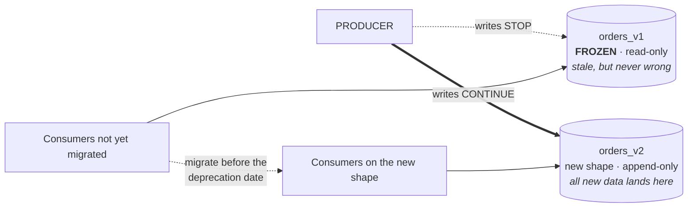
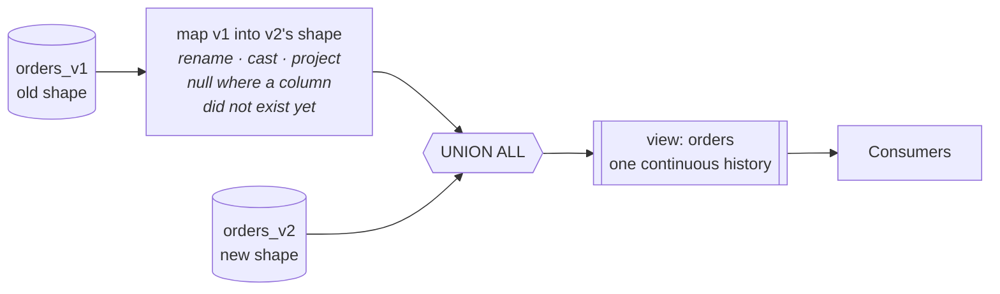
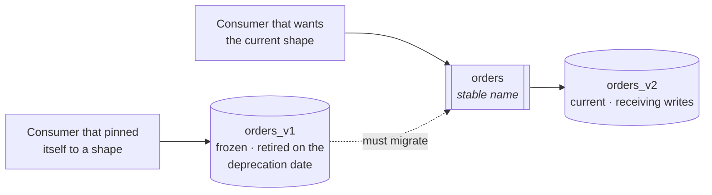

# Breaking Schema Changes in a Hybrid Hive and Iceberg Estate

> What actually counts as a breaking schema change and how that differs across Hive, Iceberg,
> Delta, Hudi and the serialization formats underneath them; what backward, forward and full
> compatibility commit you to; the freeze-fork-append pattern for versioning a table once a change
> has broken it; how to reconcile a version boundary back into one continuous table; and what it
> takes to run versions across a platform where half the estate is one format and half the other.

- **Topic:** Data Platform
- **Date:** 2026-09-04
- **Status:** draft

> *The words written here are all AI-generated, but all the content was critically reviewed
> and validated by me — the use of AI is to accelerate the knowledge searching and narrative
> building.*

## Contents

1. [What is considered a breaking schema change](#1-what-is-considered-a-breaking-schema-change)
2. [Full, backward, and forward compatibility](#2-full-backward-and-forward-compatibility)
3. [Versioning after a breaking change: freeze, fork, append](#3-versioning-after-a-breaking-change-freeze-fork-append)
4. [Reconciling versions into one materialized table](#4-reconciling-versions-into-one-materialized-table)
5. [Managing versions across the data platform](#5-managing-versions-across-the-data-platform)
6. [Counterpoints: where this study could be wrong](#6-counterpoints-where-this-study-could-be-wrong)
7. [Takeaways](#takeaways)
8. [References](#references)

## 1. What is considered a breaking schema change

A working definition, short enough to actually use:

> **A schema change is breaking if a reader or writer that worked before either stops working, or
> keeps working and silently means something different.**

The second half is the one most definitions omit, and it is where the real risk lives. A query that
fails is an incident someone opens a ticket for within the hour. A column that quietly starts
returning null, or a number that shifts because a type was reinterpreted, is an incident nobody
opens a ticket for at all — the dashboard still renders, and the wrong figure travels into
decisions until somebody happens to notice.

### It comes down to how the format identifies a field

Almost everything below follows from one design decision: **how does the format know that a column
in a data file is the same column the schema is talking about?** Iceberg answers with a stable
integer field ID, never reused. Delta with a column-mapping ID, once column mapping is enabled.
Protobuf with a numbered tag. Avro by name, with `aliases` as the escape hatch. Hudi by name, with
change tracking under full schema evolution. **Formats with a stable identity survive a rename;
those that resolve by name or position do not.**

Hive is the outlier, and not merely because it lacks stable IDs. Its resolution is *configurable*:
`parquet.column.index.access` and `orc.force.positional.evolution` change the behavior, engines
carry their own equivalents, and the ecosystem has reversed its defaults before — ORC-54 moved ORC
to name-based resolution and [HIVE-20129](https://issues.apache.org/jira/browse/HIVE-20129)
reverted Hive to positional. The practical consequence is that **on Hive, "is this rename safe?"
has no format-level answer** — it has a per-engine, per-format, per-flag answer, and the same table
can be read correctly by one engine and incorrectly by another.

### Which operations break — for the data, and for your consumers

These are two different questions and the answers routinely disagree, so the table answers both.
The format columns are about **the bytes already on disk**; the last column is about **everything
that reads them**, and it is format-independent — a name that disappears is gone in Iceberg exactly
as it is gone in Hive.

**Safe** means every existing file still returns exactly the values it held before, and the change
is metadata-only: no file is rewritten. It is a claim about the data surviving, not about the
change being harmless. The other verdicts: **Engine-dependent** — no format-level answer, it turns
on engine and config; **Breaks / Risky / Unsafe** — a reader can get wrong values or an error out
of data that was written correctly; **Rewrite** — the end state is correct but every file must be
rewritten to reach it; **Rejected** — the format refuses outright.

| Operation | Hive | Iceberg | Delta Lake | Hudi | Consumers |
|---|---|---|---|---|---|
| Add optional column at end | Safe | Safe | Safe (`mergeSchema`) | Safe | Fine |
| Add column in the middle | **Breaks** under positional resolution | Safe | Safe | Safe | Fine, unless a load maps by position |
| Rename column | **Breaks** | Safe | Safe with column mapping | Safe with full schema evolution | **Breaks everything naming the column** |
| Drop column | **Risky** — positional readers shift | Safe, ID retired | Safe with column mapping | Safe with full schema evolution | **Breaks — or returns null silently** |
| Reorder columns | **Breaks** under positional resolution | Safe | Safe | Safe | Fine, unless a load maps by position |
| Widen type | Engine-dependent | Safe, closed list | Safe, limited upcasts | Safe, limited set | Usually fine; check downstream casts |
| Narrow type | Unsafe | Rejected | Rejected | Rejected | — the change is refused |
| Change partitioning | Rewrite (full table) | **Safe** — metadata-only | Rewrite | Rewrite | Fine; performance only |

**The rename row is the one to sit with, because it is the most misread.** Iceberg renames by
changing the name attached to a stable field ID while every data file still stores its values
against that ID, so nothing is rewritten and nothing is lost. But **the field ID is internal and
the column name is the public interface.** Every query, dbt model, BI mapping and downstream load
naming `customer_id` stops resolving the moment it becomes `account_id`. Consumers reading
`SELECT *` do not fail at all — they simply start receiving a differently-named column, which is
the quiet version of the same break.

Which is the general lesson, and the reason this table matters at all. Read what Iceberg actually
guarantees ([evolution docs](https://github.com/apache/iceberg/blob/main/docs/docs/evolution.md)):
that added columns never read another column's values, that dropping or updating a column does not
change values in any other column. **Every one of those is a statement about data correctness. None
is about whether your queries still run.** So stable field identity does not eliminate breaking
changes — **it relocates them**, out of the storage layer where they corrupt data loudly, and into
the consumer layer where they may not announce themselves at all. On Hive a rename can corrupt
reads of existing data; on Iceberg it never can. **Hive breaks the data path and the consumer;
Iceberg breaks only the consumer.** §2 gives that its proper name: in Iceberg a rename is
backward-compatible by construction — the field ID does that work — and forward-incompatible by
definition. It does not generalise: in Avro, where resolution is by name, a rename without an
`alias` breaks in both directions at once.

Two rows deserve a note. **Type widening is narrower than people assume**: Iceberg permits
`int`→`long`, `float`→`double`, and `decimal(P,S)`→`decimal(P',S)` with `P' > P` — precision only,
scale fixed — with v3 adding `date`→`timestamp`. Narrowing is never allowed anywhere. And there is
a trap worth knowing: **promotion is rejected if the column feeds a partition transform whose
output would change**, so a column that is merely data can be widened while the same column used as
a partition source cannot.

**Changing partitioning** is the row with the largest operational gap. On Iceberg the partition
spec is metadata and partition values are derived through transforms rather than encoded in
directory paths, so the spec changes without rewriting a file and old and new specs coexist. On
Hive the partition values *are* the directory layout, so the same change is a full rewrite — the
difference between an `ALTER TABLE` and a maintenance window.

Underneath the table formats sit the serialization formats, worth one paragraph because §2's whole
vocabulary comes from them. **Avro** resolves a reader schema against a writer schema by name: a
field the reader does not declare is ignored, and a field the reader declares but the writer lacks
is filled from its `default` — **or fails, if there is no default.** That single rule is why "add
fields with defaults" is universal advice. **Protobuf** arrives at Iceberg's answer independently:
a numbered tag on the wire, never reused once a field is removed.

## 2. Full, backward, and forward compatibility

These three terms are borrowed from streaming, where a schema registry enforces them, and they are
the vocabulary worth adopting for tables too — because they turn "should we allow this change?"
into a question with a defensible answer.

The terms are easy to garble, because they are often taught from one side at a time: backward
explained as a consumer concern, forward as a producer concern. That framing is misleading. **Every
compatibility mode constrains one and the same thing: a reader running one schema version against
data written under another.** Producer and consumer are always both in the frame. The only variable
is *which of the two is the newer one*.

- **Backward** — the reader is new, the data is old. It protects an *already-upgraded consumer*
  from *history it did not write*.
- **Forward** — the reader is old, the data is new. It protects a *consumer that has not upgraded*
  from *the producer's change*.
- **Full** — both pairs hold at once, so neither side needs to know what the other did.

Stated so that both sides stay visible:

| Mode | The pair it constrains | The producer may | The consumer must |
|---|---|---|---|
| **Backward** | New reader ← **old** data | Add optional fields with defaults; delete fields | Upgrade **first** |
| **Forward** | Old reader ← **new** data | Add fields; delete optional fields | Nothing — it can stay put |
| **Full** | Both pairs at once | Add or delete **optional** fields with defaults | Nothing |

The "consumer must" column is a *derived consequence*, not a separate definition. It falls out of
the pair: if only the new reader is guaranteed to cope, readers have to move before writers do;
if only the old reader is guaranteed to cope, writers can move and readers can lag.

### Why the names feel backwards

Almost everyone reads these terms the wrong way round on first contact, and the reason is that
**the direction does not describe the consumer's obligation. It describes how far through time a
given schema can reach for data.** A backward-compatible schema reaches *backward* — it reads data
that has already been written. A forward-compatible schema reaches *forward* — it reads data that
will be written under a version it has never seen.

Two examples make it concrete, and they are chosen because the same kind of change lands on
opposite sides:

**Remove the `email` field in v2.**

- A v2 reader over v1 data: an extra field arrives and is ignored → **works**. Backward ✓
- A v1 reader over v2 data: `email` is gone and the reader requires it → **fails**. Forward ✗

**Add a required `country` field in v2, with no default.**

- A v2 reader over v1 data: `country` is absent and there is no default → **fails**. Backward ✗
- A v1 reader over v2 data: an unknown field arrives and is ignored → **works**. Forward ✓

So **deleting** a field is backward-compatible while **adding** one is forward-compatible — the
opposite of what intuition suggests, and the reason the allowed-changes table below reads the way
it does.

One more source of confusion is worth naming, because it is the most common one. In APIs and
software generally, "a backward-compatible change" colloquially means *it does not break existing
clients*. **That everyday sense is what a schema registry calls forward compatibility.** Anyone
arriving from application engineering carries the API meaning with them, and it is inverted here.
If you find yourself thinking "backward means everyone keeps working without doing anything," you
are holding the API definition, not this one.

Full compatibility sounds like the responsible default and is frequently the wrong one, because it
is the intersection of the other two: the only changes it allows are additions and removals of
optional fields. Teams that set full compatibility across the board often discover they have banned
most of the changes they actually need, and then route around the policy entirely.

**The transitive variants are the detail teams find out about late.** `BACKWARD`, `FORWARD` and
`FULL` check a new schema only against the **most recent** version. The `*_TRANSITIVE` variants
check it against **every** previous version. Without transitivity, a chain of individually valid
changes can leave version 3 unreadable by a consumer still sitting on version 1 — each step legal,
the sum of them broken.

### Why tables tilt the question toward forward compatibility

Streaming reads one message, written under one schema, at a time. **A table scan does not.** A
single query over an Iceberg table may touch files written years apart under half a dozen schema
versions, and it reads all of them through the *current* schema — resolving by field ID and
supplying defaults or nulls where a column did not yet exist.

That has a consequence worth stating plainly: **for a modern table format, backward compatibility is
structural.** A new reader reading old data is not a policy you adopt; it is what every scan does,
every time, and the format guarantees it. §1's whole point about stable field identity is really a
statement that Iceberg, Delta with column mapping, and Hudi give you backward compatibility for
free — and that Hive does not, which is why Hive breaks on the *backward* pair while the others
cannot.

So on a table estate, **forward compatibility is the pair actually at risk**: an unchanged
consumer — a pinned view, a dbt model, a dashboard with an explicit column list — meeting data
written after a producer's change. Adding a column is forward-compatible and passes unnoticed.
Dropping or renaming one is not, and that is exactly the silent-null failure from §1, arriving
through the one door the format does not guard.

### How this becomes a strategy

The choice of mode is, in practice, a decision about **which side of the pair you can actually
move**:

- **You can move the consumers, not the producers** → *backward*. You can upgrade readers on your
  schedule; producers will ship what they ship.
- **You can move the producers, not the consumers** → *forward*. This is the common shape for a
  published dataset with an unknown audience: you control the write side, but you cannot make every
  reader migrate.
- **You can move neither, or the consumer set is unknown** → *full*, and accept that it permits very
  little. The narrowness is the price of not knowing who is downstream.
- **You can move both, and coordinate a release** → you can afford a breaking change, provided you
  version it. That is the subject of the next section.

**One caveat that matters more in tables than in streaming: no table format enforces any of this.**
A schema registry sits in the write path and rejects an incompatible schema outright. Iceberg, Delta
and Hudi will happily let you drop a column that half your consumers depend on — the format protects
the data, not the contract. Combined with the previous subsection, that is the sharp edge of the
whole problem: **the pair these formats guarantee is the one you did not need help with, and the
pair they leave unguarded is the one that breaks.** On tables, forward compatibility is a policy you
choose and must enforce yourself, in code review and CI.

For a hybrid estate the point sharpens once more. The Hive half has neither enforcement nor stable
field identity, so it is exposed on *both* pairs — and whatever policy you set there is carried
entirely by process.

## 3. Versioning after a breaking change: freeze, fork, append

There is a default pattern, and it is simple enough to apply without deliberation:

> **When a change breaks the schema, stop writing to the current table. Freeze it as an immutable
> version, create the next version with the new shape, and append only to that one. Consumers that
> want the new data migrate to the new version.**

The reason this works is worth stating explicitly, because it is the whole argument:

**A frozen table stops being wrong and starts being stale.** Once v1 receives no more writes, it
can no longer serve a number that quietly changed meaning. It can only serve old data — which a
freshness check detects, which a consumer can reason about, and which never silently corrupts a
report. Mutating the table in place is what produces the silent-null failure from §1. Freezing
converts an undetectable failure into a detectable one, and that trade is almost always worth
making.

The three moves:

| Move | What happens | Why |
|---|---|---|
| **Freeze** | v1 stops accepting writes and becomes read-only | It can no longer produce wrong data |
| **Fork** | v2 is created with the new shape | The change lands somewhere clean |
| **Append** | All new data goes to v2 only | One writer, one shape, nothing to reconcile on write |



This is **expand-and-contract** — the same parallel-change pattern used for application databases
and APIs — applied to tables. Expand by standing up v2, run both while consumers migrate, contract
by retiring v1 on a declared date.

### What "a version" can be, mechanically

The pattern above says nothing about *how* a version is represented. There are several mechanisms,
and they are not competitors — they operate on different objects:

| Mechanism | A version is… | Covers Hive too? | Best for |
|---|---|---|---|
| **Separate table** (`orders_v1`, `orders_v2`) | A table | **Yes** | The default. Explicit, obvious, works everywhere |
| **View** over any of the below | A stable name | **Yes** | The consumer-facing interface |
| **Iceberg branch / tag** | A named pointer inside one table | No | Staging a change; pinning a point that must survive retention |
| **Iceberg snapshot** | A point in time | No | Rollback and audit — but it expires (§5) |
| **Catalog branch** (Nessie) | A commit across many tables | No | A change that must land atomically across several tables |
| **Object versioning** (lakeFS) | A commit across files | **Yes** | A hybrid estate, because it sits below the format |

**For most breaking changes, the separate table plus a view is the right answer**, and the more
sophisticated mechanisms are for narrower problems. Branches and snapshots are Iceberg-internal:
excellent for making a change safely and for undoing a bad write, but a snapshot is a point in
time rather than a published interface, so you cannot tell a consumer "read v1 for the next two
quarters" with snapshots alone. Nessie earns its place only when a single change must land across
multiple tables at once. lakeFS earns its place when the Hive half of the estate is large enough
that its total lack of native versioning is a standing risk.

That last row matters more than it looks. **Hive has no native notion of a versioned table** — no
snapshots, no branches, no time travel. Teams simulate it by copying data into timestamped
partitions or keeping backups. So on a hybrid estate, only the mechanisms in bold — separate
tables, views, and object-level versioning — work on both halves.

### The two problems this creates

Freeze-fork-append is clean at the write side and pushes two problems downstream, which are the
subjects of the next two sections:

1. **History is now split across two tables.** A consumer that needs one continuous series across
   the boundary has to reconcile them (§4).
2. **Versions accumulate.** Somebody has to name them, point consumers at them, know who still
   reads the old ones, and eventually delete them (§5).

## 4. Reconciling versions into one materialized table

A consumer that wants an unbroken history spanning v1 and v2 needs the two reconciled. Before
choosing how, answer one question, because it determines whether reconciliation is possible at all:

> **Can v2's shape be derived from the data already in v1?**

| The change | Derivable from v1? | How you reconcile |
|---|---|---|
| Rename a column | **Yes** | Alias it in the mapping |
| Widen a type | **Yes** | Cast |
| Reorder columns | **Yes** | Project in the new order |
| Drop a column | **Yes** | Project it away from v1 as well |
| **Add a column** | **No** — no historical value exists | Fill with null or a default, and label it |
| **Change a column's meaning** | **No** | **Do not union.** Keep them separate |

The last row is the one that causes real damage. If `revenue` meant net in v1 and gross in v2,
unioning the two produces a single column that is wrong across the boundary in a way no schema
check can detect — the types match, the names match, and the number is nonsense. **A semantic
change is not a reconciliation problem; it is a new metric.** Give it a new name and let both
exist.

### Three ways to materialize it

| Approach | What it is | Cost | Use when |
|---|---|---|---|
| **Union view** | A view mapping v1 into v2's shape, `UNION ALL` v2 | No copy; cost paid per query | The default — start here |
| **Backfill** | Rewrite v1's data into v2 once, then drop v1 | One full rewrite | The change is derivable and you want a single object |
| **Reconciled table** | A job materializes v1 ∪ v2 into a third table | Storage plus a scheduled job | The union view is too slow for the consumers on it |

The union view is the right default because it costs nothing to create and nothing to undo. Move
to a backfill when you are confident the mapping is correct and want to stop paying the union cost
forever; move to a materialized reconciled table only when query performance forces it.



```sql
-- v1 renamed customer_id -> account_id and gained a channel column in v2
CREATE OR REPLACE VIEW analytics.orders AS
SELECT account_id, order_ts, amount, channel        FROM warehouse.orders_v2
UNION ALL
SELECT customer_id, order_ts, amount, CAST(NULL AS STRING) FROM warehouse.orders_v1;
```

**Make the boundary explicit.** Whatever approach you choose, a consumer must be able to tell which
rows came from which shape — a `schema_version` column, or a documented cutover timestamp. Rows
where a column is null because it did not exist yet are different from rows where it is null
because the value was missing, and only an explicit boundary lets anyone tell those apart.

## 5. Managing versions across the data platform

One versioned table is a pattern. A hundred of them is an operating problem. Four things have to be
in place.

### A stable name in front of the versions

Physical tables carry the version (`orders_v1`, `orders_v2`); a **view carries the stable name**
(`orders`) and points at the current one. That gives consumers a deliberate choice:

- Point at `orders` → you always get the current shape, and you accept that it changes.
- Point at `orders_v1` → you pin yourself to a shape and accept that it stops receiving data.



Making that choice explicit is most of the value. The failure mode this prevents is the consumer
who thought they were pinned and was not, which is how a breaking change reaches a dashboard
nobody knew existed.

### Knowing who still reads the old version

**You cannot retire what you cannot see.** Before deleting v1, you need the list of everything
still reading it, and the sources are the ones you already have: query history and access logs
from the engine, plus lineage from the catalog. In practice the log is the reliable one and
lineage is the convenient one — lineage captures the jobs it can parse, the logs capture everyone,
including the analyst with a saved query.

### A deprecation clock that starts on day one

**v1 gets an end date the day v2 is created**, not the day someone remembers to ask. Without a
date, "we'll retire it once everyone migrates" resolves to never, and you accumulate frozen tables
that cost storage and confuse newcomers. The window is a business decision — a quarter is common —
but it needs to exist, be published with the version, and be enforced by whoever owns the table.

### Retention, because versioning is not free

Two costs, and the second surprises people:

- **Frozen tables cost storage** for as long as they exist. That cost is visible and easy to reason
  about.
- **Snapshot history costs query planning time.** Every write produces a snapshot, and Iceberg
  retains them all by default. Metadata grows with *commit rate*, not data volume, so streaming
  and frequently-compacted tables suffer most — and bloated metadata slows every read, including
  reads that never touch history. Practitioner guidance converges on **7–30 days of retention plus
  a minimum snapshot count**, maintained with `expire_snapshots` and manifest rewriting on a
  schedule. *(Directional; these figures come from vendor and practitioner blogs, not independent
  measurement.)*

The consequence for versioning strategy is direct: **time travel is not a compatibility promise.**
With a 30-day window you cannot offer a consumer six months to migrate by pointing at a snapshot.
That job belongs to a frozen table, a tag, or a view — all of which are deliberate, named, and
retained on purpose.

### On a hybrid estate

| | Iceberg half | Hive half |
|---|---|---|
| Versioned tables + view | Works | Works |
| Snapshots, branches, tags | Native | **None** |
| Catalog branching (Nessie) | Works | **No** |
| Object versioning (lakeFS) | Works | Works |

The practical reading: **standardize the platform-wide policy on what works everywhere** —
versioned tables behind views — and treat the Iceberg-native mechanisms as extra capability on the
half that has them, not as the policy. A policy that only half your estate can follow is not a
policy.

Two adjacent decisions follow from that:

**Catalogs.** A hybrid estate usually means two — a Hive Metastore and an Iceberg REST catalog.
The reported pattern that works is **federate first, migrate second, decommission third**: run the
REST catalog (Polaris, Unity, Nessie) alongside the existing metastore, point new tables at it, and
federate so governance and lineage are unified immediately rather than at the end. Engines accept
multiple catalogs simultaneously, so coexistence is supported configuration, not a hack.

**Migration.** Most of the complexity above is a tax on the Hive half, and Iceberg offers three
in-place migration procedures, usefully distinguished by how reversible they are: **`snapshot`**
creates an Iceberg table over the existing Hive files and leaves the original untouched — the
rehearsal; **`migrate`** replaces the Hive table in place, keeping a backup of the original
definition; **`add_files`** adds existing files into an already-existing Iceberg table. All three
are metadata-only, which is why this is far cheaper than a rewrite. One caveat from §1 applies:
migrated files carry no field IDs and rely on name mapping until rewritten, so a freshly migrated
table is not yet at Iceberg's full safety guarantees.

## 6. Counterpoints: where this study could be wrong

**The Hive picture is a configuration matrix, and I have flattened it.** Positional versus
name-based resolution varies by format, by engine, by Hive version, and by flag, and the ecosystem
has reversed its defaults before. Any statement here of the form "Hive does X" should be verified
against your specific engine and version before you act on it. The defensible claim is the weaker
one: that the behavior is *configuration-dependent rather than guaranteed*, which is itself the
operational problem.

**"Silent nulls are worse than loud failures" is a judgment, not a measurement.** I have argued
that Iceberg's failure mode is more insidious because it can go undetected. Someone could
reasonably counter that loud failures cause real outages while silent nulls are caught by
downstream data quality checks — and that an estate with good observability inverts my ranking. I
have no incident data either way; the claim rests on the reasoning that undetected wrong numbers
propagate into decisions, which loud failures do not.

**Freeze-fork-append is not free, and I have presented it as the default.** It doubles the number
of objects, splits history at every break, and pushes reconciliation onto consumers — §4 exists
only because §3 creates that problem. On a table that breaks often, or one with many small
consumers, an in-place evolution with strong governance and a deprecation process may genuinely
cost less than a proliferation of frozen versions. The pattern earns its place because it converts
an undetectable failure into a detectable one, not because it is cheap, and a team with excellent
observability could reasonably weigh that trade differently.

**Iceberg v3 may change the versioning calculus and is not accounted for here.** v3 adds row
lineage with per-row identifiers and update sequence numbers, enabling native CDC without external
tooling, along with deletion vectors and a variant type. Row-level lineage could substantially
change what "versioning" needs to mean. Adoption is genuinely uneven as of 2026 — generally
available on Snowflake and in preview on Databricks, shipped across AWS services, but not yet in
open-source Trino — so building on it today is a bet on your specific engine.

**The recommendation to lean on views assumes governed views.** Views as an indirection layer only
work if the view layer is itself managed — versioned, owned, and not proliferating. An estate where
anyone can create a view has replaced a schema-coupling problem with a view-sprawl problem, and I
have not weighed how often that trade goes badly.

## Takeaways

- **Hive breaks physically; Iceberg cannot, which is exactly why it breaks silently.** Field IDs
  eliminate positional corruption and thereby move the failure from the storage layer to the
  consumer layer. The dangerous Iceberg incident is not a crash — it is a column that quietly
  returns null while a metric keeps reporting.

- **Read Iceberg's guarantees literally.** All four are about data correctness — that remaining
  columns still hold their values. None is about whether your queries still run. "Schema evolution
  is safe" and "this schema change is safe to ship" are different statements, and treating them as
  one is the root of most incidents.

- **On Hive, "is this safe?" has no format-level answer.** It resolves per engine, per file format,
  per config flag, and the defaults have changed historically. That uncertainty — not any single
  default — is the thing that makes Hive schema changes expensive to reason about.

- **Compatibility is always one pair — a reader on one schema version against data written under
  another.** Backward is a new reader over old data; forward is an old reader over new data; full
  is both. Producer and consumer are in the frame for all three, and "who upgrades first" is a
  consequence of the pair, not a separate definition. **The names invert the API convention**: the
  everyday sense of "backward-compatible change" — it does not break existing clients — is what a
  schema registry calls *forward* compatibility, which is why deleting a field is backward-safe and
  adding one is forward-safe.

- **On tables, the format guarantees the pair you did not need help with.** Every scan reads files
  written under many schema versions through the current schema, so backward compatibility is
  structural in Iceberg, Delta with column mapping, and Hudi. Forward compatibility — an unchanged
  consumer meeting data written after a change — is the pair actually at risk, and it is the one no
  table format enforces. That is a policy you carry in review and CI.

- **When a schema breaks, freeze the table and fork it.** Stop writing to v1, create v2 with the
  new shape, append only to v2, and let consumers migrate on a published clock. A frozen table
  stops being *wrong* and becomes merely *stale* — and stale is detectable in a way that a silently
  changed number never is. That single trade is the argument for the whole pattern.

- **A semantic change is not a reconciliation problem, it is a new metric.** Renames, casts and
  reorders can be mapped across a version boundary. A column that kept its name and changed its
  meaning cannot: unioning it produces a number that passes every schema check and is wrong across
  the boundary. Give it a new name instead.

- **Only three mechanisms span a hybrid estate: versioned tables, views, and object-level
  versioning.** Snapshots, branches, tags and Nessie are Iceberg-only, and Hive has no native
  versioned-table concept at all. Standardize the platform policy on what works everywhere and
  treat the Iceberg-native mechanisms as extra capability, not as the policy — a policy half your
  estate cannot follow is not a policy.

- **You cannot retire what you cannot see, and nothing retires itself.** Deprecation needs an end
  date set the day the new version is created, and a real list of who still reads the old one —
  from query history and access logs, with catalog lineage as the convenient supplement. Without
  both, "we'll retire it once everyone migrates" resolves to never.

- **Versioning's real cost is query planning, not storage.** Metadata grows with commit rate rather
  than data volume, and bloated metadata slows every read including those that never touch history.
  With retention windows realistically at 7–30 days, time travel cannot serve as the long-term
  compatibility promise to a consumer — that job belongs to tags, views, or a parallel table.

- **Open for the next pass:** whether Iceberg v3 row lineage changes what table versioning needs to
  be once engine support is even; measured incident data comparing detection time for Hive
  positional breaks versus Iceberg silent-null breaks; and how catalog-native versioning in Polaris
  and Unity affects the case for running Nessie separately.

## References

*Links checked September 2026. The backward/forward/full definitions in §2 were verified against
two independent implementations — Confluent Schema Registry and Apache Pulsar — plus the Avro
resolution rules they both derive from; all three agree. The Apache Iceberg specification, its
evolution documentation and the cited Hive JIRA issues were fetched directly and carry every
load-bearing claim about format behavior. Retention and cost figures come from vendor and
practitioner blogs and are directional rather than audited. Vendor material is cited for
mechanism, not endorsement.*

### Format behavior (primary)

- **Iceberg evolution documentation — Apache** ([github.com](https://github.com/apache/iceberg/blob/main/docs/docs/evolution.md))
  — the five supported operations, the correctness guarantees §1 draws on, and partition and
  sort-order evolution semantics. *Supports:* §1. *Caveat:* every guarantee in that list is about
  data correctness only — which is the central reading of this study.
- **Iceberg table specification — Apache** ([github.com](https://github.com/apache/iceberg/blob/main/format/spec.md))
  — the exact type promotion set per spec version, the partition-transform restriction on
  promotion, and `schema.name-mapping.default` for files without field IDs. *Supports:* §1.
- **HIVE-16559: Parquet schema evolution for partitioned tables may break if table and partition
  serdes differ** ([issues.apache.org](https://issues.apache.org/jira/browse/HIVE-16559))
  — the `REPLACE COLUMNS` without `CASCADE` failure. *Supports:* §1.
- **HIVE-20129: Revert to position based schema evolution for orc tables** ([issues.apache.org](https://issues.apache.org/jira/browse/HIVE-20129))
  — evidence that resolution semantics have changed direction historically. *Supports:* §1's
  claim that the behavior is configuration-dependent rather than guaranteed.
- **prestodb#12212: Parquet Hive schema evolution checks based on column names** ([github.com](https://github.com/prestodb/presto/issues/12212))
  — the concrete positional-misalignment symptom across partitions. *Supports:* §1.
- **Rename and drop columns with Delta Lake column mapping — Databricks** ([docs.databricks.com](https://docs.databricks.com/aws/en/tables/features/column-mapping))
  and **Diving Into Delta Lake: Schema Enforcement & Evolution — Databricks** ([databricks.com](https://www.databricks.com/blog/2019/09/24/diving-into-delta-lake-schema-enforcement-evolution.html))
  — schema enforcement on write by default, `mergeSchema` for additive change, and column mapping
  as what makes metadata-only rename and drop possible. *Supports:* the Delta rows in §1's tables.
  *Caveat:* vendor documentation for a format the vendor originated.
- **Schema Evolution — Apache Hudi** ([hudi.apache.org](https://hudi.apache.org/docs/schema_evolution/))
  — natively supported backwards-compatible evolution, full schema evolution for rename and drop,
  and `hoodie.schema.on.read.enable` for backward-incompatible cases resolved at read time.
  *Supports:* the Hudi rows in §1. *Caveat:* the read-time resolution path is documented as
  experimental — verify against your Hudi version.
- **Apache Avro specification — schema resolution** ([avro.apache.org](https://avro.apache.org/docs/1.10.2/spec.html))
  — the two resolution rules that generate the entire compatibility model: "if the writer's record
  contains a field with a name not present in the reader's record, the writer's value for that
  field is ignored" (why adding a field is forward-safe), and "if the reader's record schema has a
  field with no default value, and writer's schema does not have a field with the same name, an
  error is signalled" (why adding a field is backward-safe *only* with a default). Also `aliases`
  for renames and the permitted promotions (`int`→`long`/`float`/`double`, `long`→`float`/`double`,
  `float`→`double`, `string`↔`bytes`). *Supports:* §1's serialization subsection and the mechanics
  underneath all of §2.

### Consumer-level breakage

- **Schema Evolution in Apache Iceberg: Valid Isn't Safe to Ship — Kastor Data** ([kastordata.io](https://kastordata.io/resources/schema-evolution-apache-iceberg-safe-to-ship))
  — the valid-versus-safe distinction and the enumeration of downstream failure modes including
  silent null degradation. *Supports:* §1. *Caveat:* vendor blog; the
  reasoning is checkable against the spec, the incident frequency claim is not.
- **Apache Iceberg Schema Evolution in Production: Best Practices and Pitfalls — LakeOps** ([lakeops.dev](https://lakeops.dev/blog/iceberg-schema-evolution-production))
  — which operations remain breaking for consumers, and validating renames against known consumers.
  *Supports:* §1. *Caveat:* vendor.

### Compatibility modes

- **Schema Evolution and Compatibility Types — Confluent** ([docs.confluent.io](https://docs.confluent.io/platform/current/schema-registry/fundamentals/schema-evolution.html))
  — the definitions of BACKWARD, FORWARD and FULL, the changes each permits, the transitive
  variants that check against all prior versions, and the upgrade-order consequence. *Supports:*
  all of §2. *Caveat:* vendor documentation, and written for streaming — the point of §2 is that
  table formats supply no equivalent enforcement.
- **Schema evolution and compatibility — Apache Pulsar** ([pulsar.apache.org](https://pulsar.apache.org/docs/schema-understand/))
  — an independent implementation of the same semantics, used here to confirm §2 against a
  non-Confluent source: BACKWARD is "consumers using schema V3 can process data written by
  producers using the last schema version V2" (add optional fields, delete fields, consumers
  upgraded first), FORWARD is "consumers using the last schema version V2 can process data written
  by producers using a new schema V3" (add fields, remove optional fields, producers upgraded
  first). *Supports:* §2's definitions, allowed-changes table and upgrade order.

### Versioning mechanisms

- **Apache Iceberg View Specification** ([iceberg.apache.org](https://iceberg.apache.org/view-spec/),
  [github.com](https://github.com/apache/iceberg/blob/main/format/view-spec.md))
  — cross-engine view metadata with immutable per-version representations. *Supports:* the view
  view row in §3's mechanism table and the stable-name layer in §5.
- **Data Lakehouse Versioning Comparison: Nessie, Apache Iceberg, lakeFS — Dremio** ([dremio.com](https://www.dremio.com/blog/data-lakehouse-versioning-comparison-nessie-apache-iceberg-lakefs/))
  — the file / table / catalog versioning distinction that §3's mechanism table is built on.
  *Supports:* §3. *Caveat:* vendor; Dremio sponsors Nessie.
- **lakeFS documentation and Iceberg integration** ([docs.lakefs.io](https://docs.lakefs.io/iceberg/),
  [lakefs.io](https://lakefs.io/blog/open-table-formats/))
  — format-agnostic object-level versioning, independent of the metastore. *Supports:* §3's
  object-versioning row
  and the hybrid-coverage table. *Caveat:* vendor.
- **Iceberg Time Travel and Versioning — lakeFS** ([lakefs.io](https://lakefs.io/blog/iceberg-time-travel/),
  [lakefs.io](https://lakefs.io/blog/iceberg-versioning/))
  — snapshots, rollback, branches and tags, and WAP as the pattern built on them. *Supports:* §3
  layers 1–2. *Caveat:* vendor with a competing product.

### Cost and maintenance

- **Iceberg Snapshot Expiration and GC Best Practices — RisingWave** ([risingwave.com](https://risingwave.com/blog/iceberg-snapshot-expiration-gc/))
  and **Avoiding Metadata Bloat with Snapshot Expiration — Data Lakehouse Hub** ([datalakehousehub.com](https://datalakehousehub.com/blog/iceberg-metadata-bloat-cleanup/))
  — metadata growth with commit rate; planning-time as the dominant cost. *Supports:* §5.
  *Caveat:* vendor/practitioner blogs; **all figures directional**.
- **Apache Iceberg Retention Policy — LakeOps** ([lakeops.dev](https://lakeops.dev/blog/iceberg-retention-policy))
  — the 7–30 day window plus minimum snapshot count. *Supports:* §5, and its conclusion that
  time travel cannot serve as a long-term compatibility promise. *Caveat:* directional.

### Migration and catalogs

- **Hive Migration — Apache Iceberg** ([iceberg.apache.org](https://iceberg.apache.org/docs/1.4.1/hive-migration/))
  and **Migrating a Hive Table to an Iceberg Table — Dremio** ([dremio.com](https://www.dremio.com/blog/migrating-a-hive-table-to-an-iceberg-table-hands-on-tutorial/))
  — `snapshot`, `migrate` and `add_files`, and the recommendation to rehearse with `snapshot`
  first. *Supports:* §5.
- **Hive metastore federation — Databricks** ([docs.databricks.com](https://docs.databricks.com/aws/en/query-federation/hms-federation-concepts))
  — governing HMS-registered tables from a modern catalog without migrating first. *Supports:*
  §5's federate-then-migrate sequencing. *Caveat:* vendor-specific implementation of a general
  pattern.

### Iceberg v3 (context for the counterpoints)

- **What's new in Apache Iceberg v3 — Google Open Source Blog** ([opensource.googleblog.com](https://opensource.googleblog.com/2025/08/whats-new-in-iceberg-v3.html))
  and **Apache Iceberg V2 vs V3 — Dremio** ([dremio.com](https://www.dremio.com/blog/apache-iceberg-v2-vs-v3-what-changed-and-what-it-means-for-your-tables/))
  — deletion vectors, row lineage, VARIANT, default values, geometry types, nanosecond timestamps.
  *Supports:* §6. *Caveat:* engine adoption is uneven; verify against your engine before relying on
  any v3 feature.

### Companion studies

- [[adopting-open-table-formats-at-scale]] — the adoption-and-rollout view of the same formats:
  what consolidated in the market and how an enterprise adopts a format broadly. This study is the
  narrower operational counterpart, about what happens to a single table when its schema changes.
- [[producer-layer-and-contract-gated-democratization]] — Movement 2 there covers the shift of
  governance to the catalog layer, which is the backdrop for §5's catalog federation discussion.
- [[data-platforms-in-2029]] — the forward-looking piece; its immutable/versioned-substrate thread
  is the long-horizon version of §3's mechanism table.
