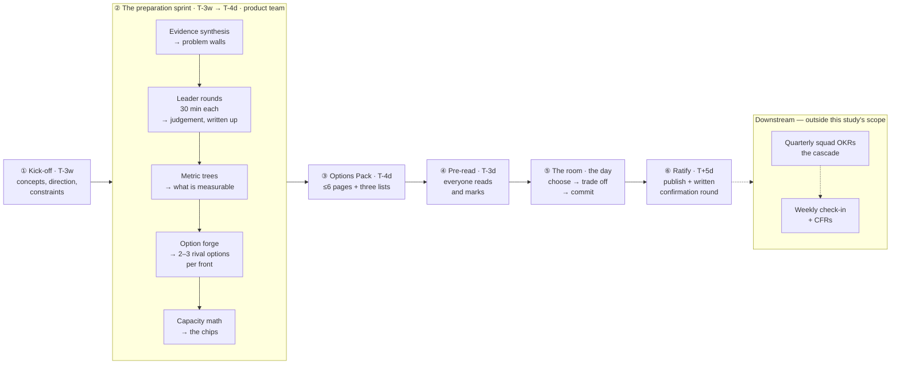
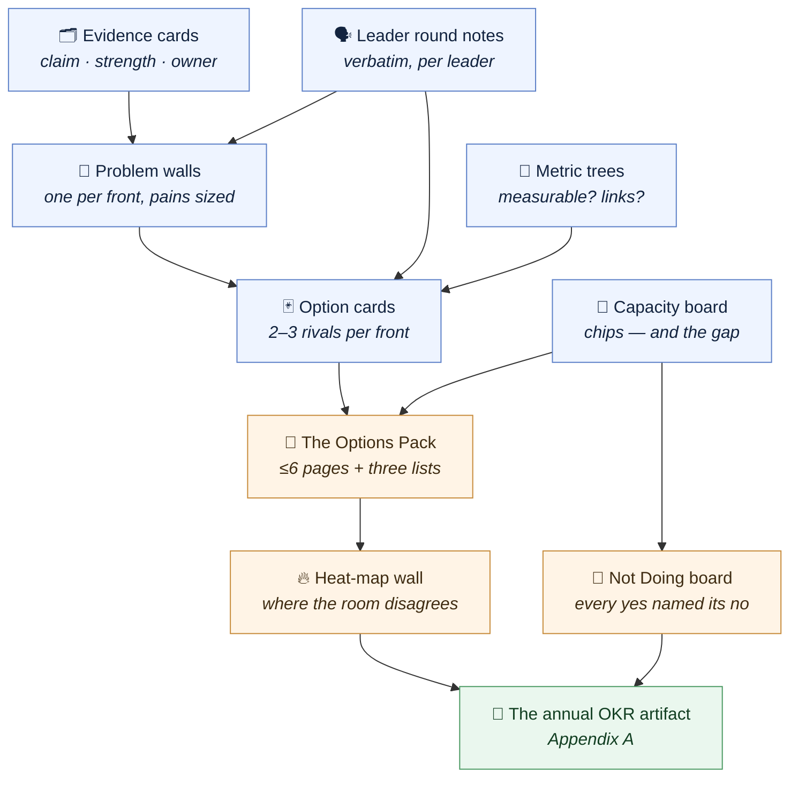

# From a Long-Term Vision to Annual OKRs

> Turning a long-term product vision — its investment fronts, North Stars and
> Three-Horizons initiatives — into a committed set of annual OKRs, through a dynamic
> built for a **single large room** of leaders: the product team prepares the options, the
> room chooses between them.

- **Topic:** Product Management
- **Date:** 2026-09-11
- **Status:** draft

> *The words written here are all AI-generated, but all the content was critically reviewed
> and validated by me — the use of AI is to accelerate the knowledge searching and narrative
> building.*

## Contents

1. [What an OKR actually is](#what-an-okr-actually-is)
2. [The bridge from North Star to Key Results](#the-bridge-from-north-star-to-key-results)
3. [Feeding the dynamic with evidence](#feeding-the-dynamic-with-evidence)
4. [Designing this for one room](#designing-this-for-one-room)
5. [The process at a glance](#the-process-at-a-glance)
6. [The preparation sprint](#the-preparation-sprint)
7. [The room: one group, one day](#the-room-one-group-one-day)
8. [After the day](#after-the-day)
9. [Open questions and next steps](#open-questions-and-next-steps)
10. [References](#references)
11. [Appendix A. Annual OKR artifact template](#appendix-a-annual-okr-artifact-template)
12. [Appendix B. The Key Result quality gate](#appendix-b-the-key-result-quality-gate)
13. [Appendix C. The leader round and the option card](#appendix-c-the-leader-round-and-the-option-card)
14. [Appendix D. Facilitator run-sheet](#appendix-d-facilitator-run-sheet)
15. [Appendix E. Kick-off presentation storyline](#appendix-e-kick-off-presentation-storyline)

## What an OKR actually is

*This section is the theory the rest of the study applies. It is written to stand alone:
a leader who has never used OKRs should be able to read only this and arrive prepared.*

### Where OKRs come from

The lineage explains the shape. Peter Drucker's **Management by Objectives** (1954)
established that people should be measured against agreed objectives rather than
activity. **Andy Grove** reworked it at Intel in the 1970s, adding the two properties
that make OKRs what they are: an objective is worthless unless paired with *measurable*
key results, and the cycle must be short enough to correct course. **John Doerr** learned
it at Intel and brought it to Google in 1999; **Google** added the public-by-default norm
and the split between *committed* and *aspirational* goals.

Two inherited properties matter for our room. From Grove: **an objective without a number
attached is a wish.** From Google: **not every objective carries the same promise** —
some you will move resources to protect, others you accept you will probably miss.

### The anatomy of an OKR

Doerr's formula is the whole thing in one line:

> **I will [OBJECTIVE] as measured by [KEY RESULTS].**

| Half | Question it answers | Nature |
| --- | --- | --- |
| **Objective** | Where are we going, and why does it matter? | Qualitative, inspiring, memorable, time-bound. **No number.** |
| **Key Results** | How will we know we got there? | Quantitative, outcome-shaped, `baseline → target`, dated, owned. |

The two halves fail in opposite directions, and both failures are common. An Objective
with no Key Results is a **slogan**. Key Results with no Objective are a **dashboard
nobody can explain the purpose of**.

### The three layers: Objective, Key Result, Initiative

This is the distinction most organizations collapse, and keeping it intact is the single
highest-value thing this dynamic does.

| Layer | Question | Nature | Example (data platform) |
| --- | --- | --- | --- |
| **Objective** | Where are we going? | Qualitative direction | *"Squads trust the platform enough to stop building their own pipelines."* |
| **Key Result** | How do we know we arrived? | Outcome metric | *"Share of new pipelines built on the platform: 38% → 75% by Dec/2027."* |
| **Initiative** | What will we try, to move it? | Work — a **bet** | *Ship self-service ingestion templates; run a migration guild; retire the legacy runner.* |

The asymmetry between the last two layers is the point: **initiatives are falsifiable
bets; Key Results are the commitment.** You can kill an initiative, swap it, or double
down on it in June without touching the OKR — that freedom is precisely what OKRs buy
you. A Key Result you cannot defend without naming a specific project is not a Key
Result.

### Writing a good Objective

An Objective should be **qualitative** (the number lives in the KRs), **significant**
(worth a year of the organization's attention), **actionable by the people in the room**
(not a wish about the market), **time-bound** to the cycle, and **memorable** enough that
a leader can repeat it to their team without reading it off a slide.

```text
  ✗  "Improve the data platform."
       → not significant, not time-bound, unfalsifiable.

  ✗  "Deliver the catalog, lineage and data-quality modules."
       → a roadmap wearing an Objective's clothes; three projects, no direction.

  ✓  "By the end of 2027, an analyst finds and trusts the data they need
      without having to ask a human."
       → qualitative, significant, memorable, dated.
```

### Writing a good Key Result

A Key Result has **five obligatory parts**. If any is missing, it is not yet a Key Result:

1. **A metric** — the thing being measured.
2. **A baseline** — where it stands today.
3. **A target** — where it must stand at the end of the cycle.
4. **A deadline** — normally the end of the cycle.
5. **An owner** — one named person, not a team name.

> **On the missing baseline.** "We don't measure that" is the most useful sentence in the
> room, and it should be welcomed rather than argued away. It has a legitimate answer:
> *establishing the baseline becomes an early-cycle outcome in its own right.* What it
> must not become is a target invented to fill the slot.

Then the **outcome test**, one question applied to every candidate:

> *Could we hit this number in full and the North Star still not have moved?*
> If yes — it is an **output**. Send it to the bet board as an initiative.

**Three legitimate types of Key Result.** Most guidance recognizes only the first; the
other two exist because rooms that are denied them smuggle the work in as fake metrics.

- **Metric KR** *(the default)* — `X from a to b`. Reach for this first, always.
- **Milestone KR** *(binary, rationed)* — legitimate only when a genuine state change
  exists that no metric yet captures, e.g. *"the regulatory data domain is certified by
  the compliance office."* **At most one per Objective**: this is the doorway through
  which the entire initiative list will try to walk in.
- **Learning KR** *(for genuinely uncertain work)* — where the measurable result is
  *validated knowledge*, e.g. *"test three chargeback models with ten internal customers
  and pick one, with evidence, by Q3."* Without this type, Horizon-3 work is either faked
  as a revenue metric or quietly dropped from the set.

### What an OKR is not

This list does more work in the room than any positive definition.

- **Not a task list.** A checklist of activities graded by completion is a project plan.
- **Not the roadmap.** The roadmap holds the *initiatives* — the bets. The OKR holds the
  *intended change*. They are different artifacts with different lifespans.
- **Not the KPI dashboard.** A KPI monitors ongoing health and has no due date; a Key
  Result commits to a change within a cycle. *"Keep availability at 99.9%"* is a KPI. A
  set made of KPIs has no ambition in it, because nothing in it has to change.
- **Not a performance-evaluation instrument.** Google says this explicitly, and the
  reason is mechanical rather than moral: tie OKRs to compensation and you have
  guaranteed sandbagging in every cycle that follows.
- **Not everything the organization will do next year.** Most of the year is
  business-as-usual and should stay invisible to the OKR set. OKRs name the **change on
  top of** the run-rate.

### How many, and how ambitious

**How many.** Google's guidance is 3–5 Objectives with about 3 Key Results each. The most
common failure mode by a distance is trying to do too much: long lists disperse attention
and no single Objective gets the depth it needs. For this dynamic the constraint is fixed
in advance and is not negotiable in the room:

> **One Objective per investment front, at most three Key Results.**
> Five fronts gives five Objectives — already at the top of the recommended range.

**How ambitious.** Three calibration devices, used together in [R5](#the-room-one-group-one-day):

- **Grading.** Google scores each KR 0–1.0, with the sweet spot at **0.6–0.7**. Hitting
  1.0 across the board is evidence the targets were too easy, not that the year went well.
- **Confidence.** Wodtke's rule of thumb: set the target at a **5-out-of-10 confidence** —
  a genuine 50/50 shot. Nine-out-of-ten is sandbagging; one-out-of-ten is fantasy.
- **Committed vs. aspirational.** A **committed** OKR is one the organization agrees will
  be delivered, and it will move schedules and resources to protect it — the expected
  score is 100%, with no partial credit. An **aspirational** OKR describes a world we
  want that we do not yet know how to reach; it is *expected* to be missed and carried
  across cycles. Mark every OKR as one or the other. An unmarked set means each leader
  silently applies their own reading, and the December conversation is a fight.

**Sandbagging** is the mirror failure of the wish list and is harder to spot, because a
sandbagged set looks healthy all year. A team that sets targets it knows it will hit does
not innovate, does not stretch, and learns nothing from the cycle.

### Cadence and follow-through

OKRs run on **nested cadences** — different rhythms for different altitudes:

| Cadence | Horizon | Who | What happens |
| --- | --- | --- | --- |
| **Strategic** | Annual | Superintendency | *This dynamic.* The OKRs that frame the year. |
| **Tactical** | Quarterly | Squads / teams | Team OKRs that serve the annual set; re-cut each quarter. |
| **Operational** | Weekly | Everyone | Check-in: confidence rating, what moved, what is blocked. |

An annual OKR that is only looked at in December is a wish with a deadline. The **weekly
check-in** is what makes it real, and Doerr's **CFRs** — Conversations, Feedback,
Recognition — are the human layer that carries the numbers between check-ins.

> **Decide up front what happens when a Key Result is obviously wrong in June.** Name the
> rule while nobody is invested in the answer. A KR may be **re-baselined** (the starting
> number turned out to be wrong), **retired** (the underlying bet was invalidated — record
> why), or **replaced** (the outcome still matters, the measure did not). What it may not
> be is quietly re-targeted downwards in December. Every such change is logged in the
> artifact's changelog, in the open.

### Bidirectional, not cascaded

The traditional model — each level restating the level above, translated down the
hierarchy — is slow, consumes weeks, and produces goals nobody feels they authored.
OKRs are meant to be set **bottom-up and top-down at the same time**.

The mechanism that makes this concrete is **catchball**, borrowed from Hoshin Kanri:
leadership throws the direction; the teams pressure-test its feasibility and throw it
back with ground truth attached; the plan adjusts; repeat until it holds. The difference
in outcome is the whole reason to spend a day on this: catchball generates **commitment**,
a cascade generates **compliance**.

**This is why the day is shaped the way it is.** The GPM opens with direction (the vision,
the North Stars, the company's 2027 objectives, and the real capacity). The room throws
back the measurable version. The GPM consolidates over lunch and throws the *conflicts*
back rather than resolving them privately. The room resolves them. Three tosses in one
day, plus one written round afterwards.

### The anti-pattern catalogue

| Symptom | Why it happens | The fix |
| --- | --- | --- |
| *"KR: launch the data catalog"* | The initiative list is right there, and delivery feels measurable | Outcome test → move to the bet board; ask what the launch is supposed to **change** |
| *"KR: keep availability at 99.9%"* | Confusing a health metric with a commitment to change | It is a **KPI**. Monitor it; do not spend a KR slot on it |
| A KR with a target but no baseline | Nobody measures it yet, and the slot had to be filled | Make *establishing the baseline* the early-cycle outcome |
| A KR nobody owns | It belongs to "the platform", i.e. to everyone | One named owner, or the KR is cut |
| Fifteen Objectives | Every leader wants their area represented | The fixed constraint: one Objective per front |
| Every KR at 90% in October | Sandbagging — targets set to be hit | Confidence calibration; grade the *set*, never the person |
| All KRs are Horizon 1 | H1 is the only horizon with clean metrics | Horizon sort + learning KRs for H3 |
| We hit everything and nothing improved | Surrogation: the metric replaced the goal | The OKR pre-mortem in [R6](#the-room-one-group-one-day) |

## The bridge from North Star to Key Results

The vision study hands over a **North Star per investment front** and stops. That North
Star is a *multi-year* outcome — by design it will not move meaningfully in twelve
months. So the bridge to an annual OKR is not "measure the North Star"; it is **"which of
its input metrics do we commit to moving this year?"**

The North Star Framework supplies the missing middle: one metric capturing the value
delivered, with **3–5 input metrics** that teams can actually move. Those input metrics
are the natural candidates for Key Results — which makes the chain from vision to
commitment mechanical rather than inspirational:

```text
  VISION (2029)              the narrative — what the platform will be
      │
      ├─ INVESTMENT FRONT    one of the five (from the vision workshop)
      │       │
      │       ├─ NORTH STAR          multi-year outcome for this front
      │       │       │
      │       │       ├─ INPUT METRICS     3–5 levers that move it
      │       │       │        │
      │       │       │        └─► KEY RESULTS   ← the ones we commit to in 2027
      │       │       │                 │           (baseline → target, owned)
      │       │       │                 │
      │       │       └─ 2027 OBJECTIVE ─┘  the qualitative half
      │       │
      │       └─ INITIATIVES (H1/H2/H3)   the bets placed under each KR
```

**Three checks make the bridge load-bearing.** Run them on every candidate KR, in this
order:

1. **Does moving this number plausibly move the North Star?** If the room cannot state
   the causal story in one sentence, the input metric is wrong — or it belongs to a
   different front.
2. **Is this the change, or the health?** A metric already at an acceptable level, that
   simply must not degrade, is a **KPI**. It belongs in the monitoring section of the
   artifact, not in a Key Result slot.
3. **Does this front actually control it?** If the number moves only when another front
   delivers, it is a **shared Key Result** — which is a legitimate answer, provided it
   gets one named owner in [R3](#the-room-one-group-one-day) rather than two hopeful
   ones.

**Candidate input-metric families for a data platform.** Useful as a prompt when a table
stalls, not as a menu to pick from:

| Family | Shape of the metric | Watch out for |
| --- | --- | --- |
| **Reach / adoption** | Share of consumers or workloads on the platform | Adoption is a *means*; it earns a KR slot only when the North Star genuinely depends on reach |
| **Time-to-X** | Lead time from request to trustworthy data | Easy to game by redefining the start of the clock |
| **Trust / quality** | Incidents per domain, contract-compliance rate, freshness SLO attainment | Needs an agreed definition *before* it becomes a KR |
| **Cost / efficiency** | Cost per query, per pipeline, per TB served | Can be improved by degrading service — pair it with a quality KPI |
| **Experience** | Internal NPS, onboarding time, cognitive-load survey | Slow-moving and noisy; strong as a leading indicator, weak as a sole KR |


## Feeding the dynamic with evidence

The design so far admits exactly **one** evidence input: the
[baseline pack](#the-preparation-sprint), whose job is narrow — settle the
`today →` half of a Key Result so the room never burns time arguing about a number.

Most organizations have more than that: **satisfaction surveys, journey maps with pain
points, operational data** (tickets, telemetry, incidents) and **qualitative interviews**.
Feeding those in changes more than adding a readout slide, because they answer a
*different* question. A baseline tells you where a number stands. A journey pain map tells
you **whether an Objective is worth having at all** — and that has to enter at a different
point, with different standing, or it gets quietly smoothed over by the people whose plans
it contradicts.

### Evidence plays three roles, not one

| Role | Question it answers | Enters at | What it is allowed to decide |
| --- | --- | --- | --- |
| **Baseline evidence** | What is the number today? | The baseline pack, T-2w | The `today →` half of a Key Result. Never re-debated in the room |
| **Problem evidence** | Which pains are real, whose, and how big? | **The evidence synthesis, at the start of the preparation sprint** | Whether an Objective deserves to exist at all |
| **Outcome evidence** | What would tell us a pain was resolved? | The metric trees and the option forge | Candidate Key Results — especially where a front's North Star has no good input metric yet |

**Evidence enters at the start of the preparation sprint, never on the day.** The research
on why insights get ignored is blunt about the timing: evidence that arrives *after* a
direction has been informally decided reads as disruptive rather than helpful, and gets
reinterpreted or deprioritized. The same literature names two other reliable killers — a long report does
not get read, and research findings routinely carry less weight in a room than a senior
leader's opinion.

All three are design problems, not communication problems, and they have design answers:
synthesize the evidence **before any option is drafted**, so nobody has a position to
defend yet; make every unit of it short enough to read; and give each one a **named owner**
who can defend it.

### The evidence card

Borrowed from **atomic research nuggets** — an observation, the evidence supporting it,
and tags — with two fields added for this purpose:

```text
   CLAIM      one falsifiable sentence
   EVIDENCE   source · n · when · method
   STRENGTH   triangulated | single-source | anecdotal
   SO WHAT    what this implies for 2027
   BEARS ON   which front(s)
   OWNER      who can be asked "what does this actually say?"
```

Two of those fields carry the weight:

- **STRENGTH**, in three tiers, with *triangulated* — converging evidence from two or more
  independent methods — at the top. State it on every card. Without a declared tier, one
  loud stakeholder's anecdote arrives with the same standing as a 400-response survey, and
  in a room of senior leaders the anecdote usually wins.
- **OWNER** — the researcher, CX lead or analyst behind the card, who **sits in the room
  for [R3](#the-room-one-group-one-day)** and can be asked directly. This is what stops a
  card being reinterpreted on the spot by whoever is defending a front.

> **Cap the pack at roughly 15–20 cards, three or four per front.** Curation *is* the
> work. An uncapped evidence pack is the 40-page report again, and it will go unread for
> exactly the same reasons.

### Journey pains: the pain-to-measure ladder

A journey map is the strongest problem evidence there is, and it converts to a Key Result
almost mechanically. NN/g's guidance is already shaped like one: every pain should connect
to an opportunity, **a metric that tells you whether it was addressed**, and someone who
owns the fix. That is a Key Result with an owner. The ladder plugs straight into the chain
from [the bridge](#the-bridge-from-north-star-to-key-results):

```text
   PAIN (from the journey map)   →   OUTCOME (what changes)   →   KEY RESULT (the measure)
   ───────────────────────────       ──────────────────────       ───────────────────────
   "analysts wait 3 days for         "access is self-served"      median time-to-access
    access approval"                                              3d → 4h by Dec/2027

   "nobody knows which dataset       "the catalog answers it"     share of dataset lookups
    is authoritative"                                             resolved without asking
                                                                  a human: 20% → 70%
```

Worth lifting one more finding: the pains sitting **in the seams between fronts** are
usually the highest-impact and lowest-politics opportunities, precisely because no single
front owns them. Those are the ones that should surface in question 4 of the
[leader rounds](#the-preparation-sprint) and as 🔵 marks on the day.

### Satisfaction: use the gap, not the score

The trap here is predictable and worth naming before anyone opens the survey. With an NPS
number available, every front will write *"raise NPS from 32 to 45"* — which manages to be
the KPI-as-KR anti-pattern, a vanity metric and surrogation all at once. Three rules:

1. **Satisfaction is lagging.** It belongs on the **KPI strip** as the check; the Key
   Results are its *drivers*. A front whose only Key Result is a satisfaction score has
   not decided anything — it has restated the hope.
2. **Segment it.** One number for a platform serving squads, risk and analysts is too
   blunt to act on — the same caveat this study already carries about a single North Star.
   Segmented satisfaction is actionable; aggregate satisfaction is a mood ring.
3. **Use it as a gap, not a level.** Evidence-Based Management frames *Unrealized Value*
   as exactly this: the gap between a beneficiary's desired outcome and their current
   experience. **The gap sizes the ambition; it does not become the Key Result.**

One legitimate exception: for an **experience front**, a segmented satisfaction measure
can be a genuine North Star input metric. Even then, the DevEx dimensions — feedback
loops, cognitive load, flow state — give better-shaped Key Result candidates than a bare
satisfaction score, because each one names something you can actually go and change.

### When the evidence does not exist

It often will not, and the honest answer matters because the tempting one is expensive:

- **Do not delay the cycle to go gather it.** An OKR set that arrives in April has already
  lost a quarter. Run with what exists.
- **Make the gap a Key Result.** *Establishing the measurement* is legitimate work with a
  real outcome, and the study already supports it through the *baseline first* tag and
  **learning KRs**.
- **Record the absence in the pack.** A card that says *"we have no evidence about how
  risk analysts experience the platform"* is genuinely useful — it tells the room which
  Objectives are being written on intuition, which is not disqualifying as long as it is
  visible.

### What this costs

Two costs, stated plainly because neither is a footnote:

- **It lengthens preparation by roughly two weeks** and adds a dependency on a research,
  CX or data function the GPM usually does not control. Book that capacity before
  announcing the dates.
- **The room gets slower before it gets better.** Evidence exists to contradict what
  people already believe, and it will. The design channels that collision rather than
  avoiding it — see the *contested* list in the Options Pack and the first-claim rule in R3 —
  but the first cycle will feel more contentious than one run on intuition alone. That is
  the mechanism working, not failing.

## Designing this for one room

*What you need in hand before starting: the [long-term vision](./long-term-product-vision.md)
dynamic already run, a set of **investment fronts** (here: five), a **North Star** for each,
and a body of **initiatives classified by the Three Horizons**.*

**The constraint that shapes every other decision is that the room cannot be split.** All
the leaders of the superintendency, one group, no parallel tables. That rules out the
standard workshop answer — one table per front, each drafting its own — and it is worth
being precise about why, because the obvious substitute is worse than either option.

**A big room is bad at producing and good at deciding.** Production in plenary is
*serial*: one person talks and everyone else waits, so throughput collapses and the three
loudest voices write the year. Deciding in plenary is *parallel*: everyone can read, mark,
vote and signal at the same time, and the decision **binds** precisely because the whole
group was there when it was made. A decision taken in a breakout has to be re-sold
afterwards to everyone who was not in it.

So the design moves **all production out of the room** and spends the room only on what a
large group does better than a small one: **challenge, trade-off and commitment.**

### Who does the producing, then?

The tempting answer is *homework for every leader* — a form each one fills in. It is also
the wrong answer, and worth saying why plainly, because it is the design most OKR guides
reach for:

- **It is slow where it should be fast.** Twenty leaders each spending 45 minutes is
  fifteen hours of senior time spent producing fragments that still have to be merged by
  somebody.
- **It arrives uneven.** Some fill it in thoughtfully, some at 23:40 the night before, some
  not at all — and the merged result silently over-weights whoever wrote the most.
- **Writing alone is the wrong instrument** for what you actually want from a leader. Their
  value is judgement about trade-offs, which comes out in conversation and dies in a form
  field.

**So the production is done by the product team, and the leaders' contribution is
collected by talking to them.** The product team spends a preparation sprint turning the
evidence into **options**; each leader gives thirty minutes of conversation instead of
forty-five of typing; and the room spends its time choosing. See
[The preparation sprint](#the-preparation-sprint).

> **This is what the whole design rests on, so the risk deserves naming: a product team
> that prepares *answers* has turned the day into a cascade with extra steps.** The
> protection is structural rather than cultural — the pack the room receives is built to
> be **deliberately incomplete**, carrying rival options rather than a draft, with the
> choices left open for exactly the people who have to live with them.

### The four-beat pattern

Every movement in the room has the same shape. It is the only pattern that scales past
roughly a dozen people without subdividing them:

```text
   ①  WRITE       everyone marks or writes at once, in silence
                  → parallel, so it costs the same at 12 people or 40

   ②  AGGREGATE   the marks go up on one wall, visibly
                  → the room watches itself think; nobody reports second-hand

   ③  SELECT      only the concentrated items earn airtime
                  → the heat map allocates voice by weight of concern, not by volume

   ④  SIGNAL      the whole room converges with a single gesture
                  → fist-to-five, or a simultaneous reveal — instant at any size
```

| Movement | Write | Aggregate | Select | Signal |
| --- | --- | --- | --- | --- |
| R1 · Silent read | three fixed marks | — | — | — |
| R2 · Heat map | — | the wall | the hot items | — |
| R3 · The gauntlet | — | — | 2–3 challenges per front | fist-to-five |
| R4 · Capacity | chip placement | the capacity wall | the overflow | fist-to-five |
| R5 · Confidence | a number on a card | — | the outliers only | simultaneous reveal |
| R6 · Pre-mortem | silent writing | live clustering | top three clusters | — |

### The single rule

The room walks in holding a **list of initiatives**, and the gravity of that list is to
become the Key Results ("deliver the catalog", "migrate 12 pipelines"). So one rule is
stated at the kick-off, printed on every option card, and enforced all day:

> ### An initiative is never a Key Result.
> An initiative is a **bet** on a Key Result. If deleting the initiative forces you to
> rewrite the Key Result, the Key Result was an initiative wearing a disguise.

### The failure modes this design has to defuse

| Failure mode | Where the design answers it |
| --- | --- |
| Initiative-as-Key-Result | The quality gate, applied in the option forge — before the room ever sees a card |
| A wish list — five fronts × N initiatives | The fixed constraint (one Objective per front, ≤3 KRs) plus the capacity confrontation in R4 |
| A cascade instead of a negotiation | Catchball: the pack is built from the **leader rounds**, and the room is handed **rival options** and the open decisions rather than an answer |
| Everything lands in Horizon 1 | The horizon tags on every option card and the balance read aloud in R3 |
| Cross-front dependencies stay informal favours | Surfaced in the leader rounds, resolved in the gauntlet with **both owners in the room** |
| Sandbagging, or fantasy targets | The simultaneous confidence reveal in R5 |
| The loudest voice writes the year | Write → aggregate → select → signal: airtime is allocated by the heat map |
| Preparation does not get done | It belongs to the product team, whose job it is — not to leaders with no accountability for it |
| The product team hands down a plan | The pack carries **rival options**, not a draft; if the room has nothing to choose, the sprint failed |
| Evidence theater — a readout that changes nothing | Evidence is synthesized *before* any option exists, and every option card must cite it or be marked as judgement |
| Cherry-picking — evidence used as ammunition for a plan already made | The 📄 mark in R1, the *unsupported* list in the pack, and evidence owners present in R3 |
| Every front writes "raise NPS" | The satisfaction rules: lagging → KPI strip, segment it, use the gap to size the ambition |
| One anecdote outweighing a 400-response survey | The **STRENGTH** tier declared on every evidence card |
| Evidence arrives too late to change anything | It is the sprint's first step, before anyone has a position to defend |

**Scope.** The dynamic ends at a ratified annual OKR set plus the cadence that keeps it
alive. The **squad-level cascade** — each squad turning these into its own quarterly OKRs
and initiatives — stays out of scope, consistent with the vision study, and is the subject
of a third study.

## The process at a glance

**Most of the work happens before the day.** That distribution *is* the design, not an
accident of scheduling: the room is the short, expensive step, so everything that does not
need every leader present has been moved off it — into a **preparation sprint run by the
product team**, not into homework spread across the leadership group.



The same path read as **input → step → output**, the version to put on a slide:

```text
 #  STEP                  WHO                WHAT COMES OUT
 ── ───────────────────── ────────────────── ──────────────────────────────────────────
 ①  Kick-off (T-3w)      all leaders        shared concepts, direction, constraints
 ②  PREPARATION SPRINT   the product team   ↓ (two weeks, part-time)
     · evidence synth.   + research/CX/data problem walls, sized and sourced
     · leader rounds     PM × each leader   judgement and friction, written up
     · metric trees      product team       what is measurable, what links
     · option forge      product team       2–3 RIVAL options per front
     · capacity math     GPM                the chips, sized so it does not fit
 ③  Options Pack (T-4d)  GPM                ≤6 pages + open / contested / unsupported
 ④  Pre-read (T-3d)      everyone           challenges written in the margin
 ⑤  The room (~4h)       all leaders        chosen OKR set, owners, Not Doing board
 ⑥  Ratify (T+5d)        GPM                published artifact (Appendix A)  ← ends here
 ┄┄ outside this study's scope ┄┄
    └→ quarterly OKRs     squads             squad-level OKRs and initiatives
    └→ weekly check-in    everyone           confidence tracking, CFRs
```

### The artifact chain

Every step hands the next one a specific, physical thing. Following the artifacts is the
fastest way to understand the dynamic — and the fastest way to tell, mid-flight, whether
it is on track:



| Colour | Who makes it | When |
| --- | --- | --- |
| **Blue** | The product team | During the preparation sprint |
| **Amber** | The room, together | On the day |
| **Green** | The GPM, from what the room decided | Within five days after |

**Why the day is only ~4 hours.** Because the production already happened. If you have a
full day available, do not spend the surplus generating more material — spend it on a
second pass through the gauntlet *after* the capacity confrontation, when the room knows
what it can actually afford.

## The preparation sprint

*Who: the **product team** — the GPM, the product manager for each front, plus
research/CX/data. When: roughly two weeks of part-time work before the day, with two
working sessions. This is the step that replaces both the breakouts and the per-leader
homework.*

> **The sprint's output is an Options Pack, not a draft.** Everything *analytical* is
> finished; every *choice* is left open. The test is blunt: if a leader reads the pack and
> finds nothing left to decide, the sprint failed and the day will be a presentation.

### What the sprint finishes, and what it must leave open

| The product team finishes | The room decides |
| --- | --- |
| The evidence synthesis — pains clustered, sized and sourced | Which pains matter most next year |
| The metric tree per front — which input metrics exist, which are measurable today | Which metric we commit to |
| 2–3 **rival** candidate Objectives with their Key Results, gated and traced to evidence | Which option, and why |
| The target **ranges** the data supports | The target |
| Horizon tags and the capacity arithmetic | What we stop doing to fund it |
| The dependencies each option implies | Who owns each shared outcome |

The left column is analysis: the product team does it faster, and far more consistently,
than a room of leaders ever could. The right column is judgement with consequences
attached, and it belongs to the people who will carry them.

### Step 1 · Evidence synthesis

*Product team + research/CX/data, ~half a day.*

Cluster everything available — satisfaction data, journey pains, ticket and telemetry
data, interviews — into a **small number of problem statements per front**, each backed by
[evidence cards](#feeding-the-dynamic-with-evidence). The artifact is one wall per front:

```text
   FRONT: Self-service ingestion            ── PROBLEM WALL ──────────────
   ┌──────────────────────────────────────────────────────────────────────┐
   │ P1  Squads rebuild the same pipeline because they can't find or      │
   │     trust what exists.                                               │
   │     ■ E-03 catalog lookups abandoned 61%   (telemetry · strong)      │
   │     ■ E-07 "I assume it's stale"  9/12 interviews (qual · strong)    │
   │     ■ E-11 journey map: step 2 of 6 is where they give up            │
   │     → TRIANGULATED · affects: all squads · getting worse             │
   ├──────────────────────────────────────────────────────────────────────┤
   │ P2  Onboarding a new source takes 9 days, most of it waiting.        │
   │     ■ E-04 median 9d, p90 21d  (ticket data · strong)                │
   │     → SINGLE-SOURCE · affects: new squads · flat                     │
   ├──────────────────────────────────────────────────────────────────────┤
   │ P3  Risk analysts say the platform "isn't for them".                 │
   │     ■ E-09 one steering-committee comment                            │
   │     → ANECDOTAL · we have no research with risk analysts at all      │
   │     → this absence is itself the finding                             │
   └──────────────────────────────────────────────────────────────────────┘
```

Sizing and strength go on the wall, not in a footnote. A problem nobody can size is not
disqualified — it is *labelled*, so the room knows which of its choices rest on evidence
and which rest on instinct.

### Step 2 · Leader rounds — the replacement for homework

*Each front's product manager, 30 minutes per leader, booked as a meeting.*

This is where the leaders' judgement enters, and it enters **as conversation, written up by
the product team**. Five questions, asked out loud, always in this order:

```text
   1.  Of these pains, which will hurt most by [year]?   … and which is overrated?
   2.  If we could move exactly one number for this front next year, which one?
   3.  Which of our current initiatives would you drop?
   4.  What do you need from another front — and what happens if you don't get it?
   5.  What would you defend hardest if I tried to cut it?
```

**Why this beats a form**, which is the design most OKR guides reach for:

- **It costs the leader less and yields more.** Thirty minutes of talking produces more
  than forty-five minutes of typing, because people explain themselves out loud and
  compress themselves in writing.
- **The product team does the writing**, so the material arrives already normalized
  instead of in twenty different shapes that somebody still has to merge.
- **You can ask "why".** That follow-up is where the trade-off reasoning lives, and it is
  exactly what a form field loses.
- **Completion is enforced by a calendar invite**, which is a far stronger mechanism than
  a deadline and a reminder.

Two halves of this round do work that nothing else in the design does. **Question 1's
"which is overrated"** and **question 4** harvest the cross-front friction — and with no
breakouts, a conversation is the only place that friction can surface before the day.

> **The cost of the interview format is interpretation drift:** the product manager is now
> a narrator, and narrators shade. Two protections, both cheap. Keep the **question list
> fixed** so every leader is asked the same thing. And **record verbatim quotes** for
> anything that will appear in the pack as somebody's position — a paraphrased position is
> the one thing a leader will spend the room's time disputing.

### Step 3 · Metric trees

*Product team, ~half a day.* For each front, derive the North Star's input metrics and mark
what is actually measurable today. This is the artifact that makes the whole bridge visible
in one glance:

```text
   NORTH STAR  Squads build on the platform instead of around it
               ("share of data workloads served by the platform")
                        │
        ┌───────────────┼────────────────┬─────────────────────┐
        │               │                │                     │
   reach            speed            trust                 cost
   % new pipelines  time-to-first-   incidents per        cost per
   on-platform      trusted-dataset  1k pipeline-runs     TB served
   ✅ 38% measured  ✅ 9d measured   ⚠️ partial            ✅ measured
                                     (only P1 domains)
        │               │                │                     │
      strong          strong          weak link            no link to
      link            link            to North Star        North Star
                                                            → KPI, not KR
```

The two annotations are the point. **Measurability** (✅ / ⚠️ / ❌) tells you which
candidates can carry a baseline in time. **Link strength** tells you which ones actually
move the North Star — and a metric with no link is a **KPI**, which is how "cost per TB"
gets onto the monitoring strip instead of eating a Key Result slot.

### Step 4 · The option forge

*Product team working session, ~3 hours. The heart of the sprint.*

For each front, build **two or three rival options** — not one draft with variations. Four
rules make an option set worth a room's time:

- **The options must be genuinely rival**: different theories of what matters, not the same
  plan at three ambition levels. *Fast / medium / slow* is one option wearing three hats,
  and a room presented with it will pick the middle every time.
- **Include the status quo as a competing option** wherever it is plausible — *keep funding
  the run-rate, change nothing structural*. Forcing it to compete is what stops it winning
  by default.
- **Every option names what it gives up.** An option with no cost is a wish, and it will
  beat the honest options for exactly that reason.
- **Every option traces to evidence, or is marked as judgement.** Both are legitimate;
  being unable to tell them apart is not.

```text
   FRONT: Self-service ingestion                    ── OPTION CARD A ─────
   ┌──────────────────────────────────────────────────────────────────────┐
   │ THEORY   The bottleneck is trust, not speed. Squads rebuild because  │
   │          they don't believe what's there.                            │
   │ ATTACKS  P1 (triangulated)                                           │
   │                                                                      │
   │ OBJECTIVE  "A squad finds an existing dataset and trusts it enough   │
   │             to build on it the same day."                            │
   │                                                                      │
   │ KR1  catalog lookups ending in adoption   18% → 50–60%    H1   ✅    │
   │ KR2  certified domains                     4  → 12–15     H1   ✅    │
   │ KR3  "I trust platform data" (squad survey) 31% → 55%     H2   ⚠️    │
   │                                                                      │
   │ BETS   contract tests · certification pipeline · catalog UX pass     │
   │ COSTS  ~2.5 squad-quarters                                           │
   │ GIVES UP  the 9-day onboarding problem stays at 9 days this year     │
   └──────────────────────────────────────────────────────────────────────┘

   ┌─ OPTION B ── theory: the bottleneck is speed → attacks P2 ───────────┐
   ┌─ OPTION C ── theory: run-rate only, no structural change (status quo)┐
```

Targets arrive as **ranges**, not points. The range is what the data supports; picking the
point inside it is the room's job in [R3](#the-room-one-group-one-day) and, for ambition,
in R5.

### Step 5 · Capacity arithmetic and the chips

*GPM, ~2 hours.* Convert the real capacity available for **change** work — run-rate already
deducted — into chips the room can physically move:

```text
   ── CAPACITY BOARD ────────────────────────────────────────────────────
   Total change capacity [year]:  14 squad-quarters   ●●●●●●●●●●●●●●
   Already committed (regulatory, contractual):        −3   ●●●
   ─────────────────────────────────────────────────────────────────────
   AVAILABLE TO ALLOCATE:                              11   ●●●●●●●●●●●

   If every front took its most ambitious option:      19   ← does not fit
   ─────────────────────────────────────────────────────────────────────
   Front 1  ●●●          Front 2  ●●            Front 3  ●●●●
   Front 4  ●●           Front 5  ●
```

> **Size the chips so the pack does not fit.** If the capacity happens to accommodate every
> front's preferred option, the GPM has quietly pre-resolved the trade-off and removed the
> room's only real decision. The mismatch on the board is the agenda.

### Step 6 · Assemble the Options Pack

*GPM, ~half a day.* One document, **six pages maximum** — it has to be readable in half an
hour by someone seeing it for the first time, because that is exactly what happens in R1.

```text
   ── THE OPTIONS PACK ──────────────────────────────────────────────────
   p1   How to read this + the rules of the day
   p2   The problem walls, one strip per front (P1…Pn, with strength)
   p3   Metric trees, one per front
   p4   Option cards A/B/C per front, with costs and what each gives up
   p5   The capacity board — and the gap
   p6   THE THREE LISTS
        ├ OPEN DECISIONS   what we deliberately did not decide (5–8)
        ├ CONTESTED        (a) front vs front   (b) evidence vs the draft
        └ UNSUPPORTED      options resting on judgement, not evidence
   ─────────────────────────────────────────────────────────────────────
   separate document → THE EVIDENCE PACK (15–20 cards, each with an owner)
```

The three lists matter more than the options. **Open decisions** is the room's agenda in
list form; aim for five to eight, roughly one per front plus a few cross-front trade-offs.
**Contested** carries two kinds: where two fronts disagree, and — the one that needs its own
heading — **where the evidence disagrees with the pack**, because that is the collision
that otherwise gets resolved quietly in the pack's favour. **Unsupported** marks what rests
on judgement; being on that list is not a verdict, since some of the best bets in a
platform's history were made ahead of the data. The list exists so the room *knows* which
ones those are.

The **evidence pack stays a separate document**. That is what keeps the Options Pack inside
six pages: only cards bearing on a contested or unsupported item get pulled in, and the rest
stay one click away with their owners' names on them.

### Sending it out

The pack goes to everyone three days ahead with one instruction: *come having read it, with
your challenges written in the margin.* Borrow Amazon's realism along with its practice —
the reason they read the memo **inside** the meeting is that executives do not reliably read
beforehand. So R1 opens with a silent read regardless, and the pre-read is a bonus rather
than a dependency.

### What this costs, and what it buys

**The cost is concentrated on the product team:** roughly two weeks of part-time work for
the PMs, plus a dependency on research/CX/data that has to be booked in advance. The leader
rounds add up too — one 30-minute conversation per leader, which for a large group is
several days of a product manager's calendar.

**What it buys is that the load-bearing dependency sits on people whose job this is.** In a
homework design, the whole day rests on many busy leaders each returning a form on time,
with no real accountability if they do not. Here it rests on a small team that owns the
process and can be held to it. That is a far safer bet, and it is the main reason to prefer
this shape.

**The risk it introduces** is that the room reads the pack as a decision already taken. Four
things push back, and all four are structural rather than exhortation: the pack carries
**rival options** instead of a draft; the **open-decisions list** is the agenda; the **📄
mark** lets anyone say an option rests on nothing; and the GPM says out loud at R0 that the
pack was **built to be broken**. If the room still treats it as settled, the options were
not genuinely rival — go back to Step 4.

## The room: one group, one day

*~4 hours. One room, the whole leadership group, no subdivision. **Everyone works on the
same thing at the same time** — that single constraint is what the whole choreography
protects.*

### The rules of the room

State these at the start and hold them all day. They are what make a large room decide
rather than discuss.

- **Written first, always.** Nothing gets discussed until the room has marked it.
- **One front at a time.** The whole room stays together on the same front; there are no
  parallel tracks, ever.
- **The front owner speaks for their front.** Challenges come from the floor, by name,
  read off the card that raised them.
- **One artifact, projected, edited live.** There is a single version of the truth and
  everyone watches it change.
- **What is not open today:** the vision, the fronts, and the capacity. A room that can
  reopen anything decides nothing — say this out loud in R0.
- **The evidence owners are in the room, and they answer for the evidence.** They do not
  defend fronts and they do not vote. Their entire role is to answer *"what does this card
  actually say?"* when asked.

### R0 · Frame (10 min)

Re-anchor on the vision and the five North Stars in ninety seconds — the room lived that
workshop and lingering reads as distrust of their memory. Then: the single rule, the shape
of the Options Pack, the open-decisions list, and the four rules above. Say explicitly that the
morning's job is to *break* the draft, and that a page nobody marks is a page nobody read.

### R1 · Silent read (30 min)

The study hall. Everyone reads the Options Pack in silence, pen in hand, marking with **four
symbols and nothing else**:

```text
   🔴  OUTPUT           this Key Result is an initiative in disguise
   🔵  DEPENDENCY       this needs another front and doesn't say so
   ❓  DON'T BELIEVE IT  the baseline or the target is wrong
   📄  UNSUPPORTED      I see no evidence behind this
```

**Why a fixed, short list.** A large room producing free-form comments generates an
unprocessable pile, and the facilitator ends up triaging it live while everyone watches.
Fixed categories make the aggregation mechanical, make the wall readable at a glance, and
— most usefully — make every mark **actionable**, because each type maps to a specific
fix: an output goes to the bet list, a dependency goes to its other owner, a disputed
number goes to the baseline pack, an unsupported item goes to the evidence pack or to an
explicit decision to back it on judgement.

**📄 is the sharpest of the four, and the only one that attacks an *Objective* rather than
a metric.** That makes it the most politically loaded mark in the room: 🔴 says *you
measured the wrong thing*, 📄 says *I don't think this belongs in the year at all*. It is
also the only defence against cherry-picking, which is what evidence gets used for when
nobody is allowed to say a plan has none. Decide attribution deliberately — the same
decision as the "which is overrated" half of the leader rounds — and if the room is new to
this, run the first cycle unattributed.

Say plainly that marking is the assignment, not criticism. The quiet half of the room
contributes here on exactly equal terms with the loud half, which is the entire reason
this movement exists.

### R2 · Heat map (15 min)

Everyone posts their marks on one wall: a five-column grid, one column per front, one row
per Key Result. No talking while posting. Then the GPM reads **only the pattern** aloud —
which Key Results are hot, which are clean, which mark type dominates each one.

```text
   THE HEAT-MAP WALL
   ──────────────────────────────────────────────────────────────────────
             FRONT 1        FRONT 2        FRONT 3      FRONT 4   FRONT 5
   KR1       🔴🔴🔴🔴🔴      ❓❓            ·            🔵🔵🔵🔵   ❓
   KR2       ❓             🔴🔴🔴🔴🔴🔴      🔵           ·         🔴🔴
   KR3       🔵🔵           ·              ❓❓❓❓❓      🔴        ·
   OBJ       ·              📄📄📄📄        ·            ·         📄
   ──────────────────────────────────────────────────────────────────────
   HOT  → F2·OBJ (unsupported)  F1·KR1 (output)  F2·KR2 (output)
          F3·KR3 (numbers)      F4·KR1 (dependency)
   CLEAN, approved by silence → F2·KR3, F4·KR2, F5·KR3
```

Note the extra row: **Objectives get marked too**, and only by 📄. A front whose Objective
collects unsupported marks has a bigger problem than any of its Key Results, and it should
be handled first when that front reaches the gauntlet.

**This is the movement that replaces breakout discussion.** Out of ~15 Key Results it
typically leaves five or six that genuinely need the room's voice, and it allocates that
voice **by weight of concern rather than by who speaks first**. A Key Result nobody marked
is approved by silence — a legitimate outcome, and the thing that buys back the time the
hot ones need.

### R3 · The gauntlet (75 min — about 15 min per front)

Serialization is the whole trick: instead of one table per front working in parallel, the
room works every front in sequence, together. **And the question per front is a choice, not
a review** — the pack arrived with rival options, so the room is picking one rather than
approving a draft. For each front, in order:

1. **The front's product manager lays out the options (90 sec).** Option A's theory,
   option B's theory, what each gives up, and the evidence each rests on — cited by card.
   No slides, no context-setting, no preamble. Citing evidence costs nothing extra: it is a
   constraint on airtime already allocated, and it is a quietly effective forcing function,
   because an option whose card cannot be named in front of everyone has just answered the
   room's question for it.
2. **The front's leader states their lean, and why (30 sec).** A lean, not a decision —
   the room has not spoken yet. Making the leader go *before* the challenge round is
   deliberate: a lean stated early can be changed without losing face, while a position
   defended for ten minutes cannot.
3. **The GPM reads that front's hot marks** — the concentrated ones only.
4. **Challenge, timeboxed (~3 min each, two or three per front).** The person who *wrote*
   the mark speaks first, named from the card. Naming has two effects worth the awkwardness:
   the challenge cannot be quietly dropped, and someone who would never grab the floor gets
   it by virtue of having written something. The owner answers.
   **When the mark is a 🔵, the other front's owner is in the room and answers on the
   spot** — the single clearest advantage this format has over breakouts, where that
   conversation would have happened later, or not at all. **When it is a 📄, the evidence
   owner is also in the room** and is asked directly: *what does the evidence actually
   say?* That question is answered by the person who gathered the data, not by whoever is
   defending the front.

   **Evidence-versus-draft collisions get first claim on the slots**, ahead of preference
   disagreements. A front has only two or three challenge slots, so this ordering is the
   difference between the evidence being confronted and the evidence being crowded out by
   whoever felt most strongly.
5. **Choose, with a fist-to-five on the leading option.** Three or above carries. Below
   three, the choice goes to the open-decisions list for R4, or the front runs a
   **vanishing-options test**: *suppose none of these options were available — what would
   we do instead?* That question reliably produces the option the pack missed, and it takes
   about ninety seconds.
6. **Write the choice live** on the projected artifact — the chosen Objective, its Key
   Results, and a target picked from the range the pack proposed. Or tag it explicitly
   *unresolved*. Nothing gets remembered as "we sort of agreed".

Before moving to the next front, **read that front's horizon balance aloud**. A front that
came out entirely Horizon 1 has decided not to fund its own future, and should have to say
so in front of everyone.

*Break (15 min).*

### R4 · Capacity confrontation (35 min)

**The one conversation that is genuinely better in a big room than in breakouts**, because
the trade-off is cross-front by nature — a breakout is structurally incapable of having it.

Capacity goes on one wall, in units the room recognizes (squad-quarters, not story points).
Each front owner places their chips against their Key Results, in front of everyone. The
chips run out. Then the room resolves the overflow together, and **every yes names its no**:
whatever loses its funding goes onto the **Not Doing board**, written live in sentences a
leader can repeat to their own team without apologising. The leader rounds are the seed:
every leader has already named, in private, an initiative they would drop.

```text
   ── THE NOT DOING BOARD ───────────────────────────────────────────────
   Written live, in sentences a leader can repeat without apologising.

   ✗ We are not rebuilding the ingestion UI in [year].
     Because → the trust problem (P1) outranks the speed problem (P2).
     Cost we accept → onboarding stays at ~9 days for another year.
     Who will ask about this → the three squads onboarding in Q2.

   ✗ We are not extending the platform to risk analysts yet.
     Because → we have no research with them at all (E-09 is one comment).
     Cost we accept → another year of "the platform isn't for us".
     Who will ask about this → the risk director, in the Q1 forum.
   ─────────────────────────────────────────────────────────────────────
```

The fourth line is the one that makes this board useful in month seven. A *no* without a
named asker is a decision nobody has to deliver; writing down who will come knocking turns
it into something the leader has actually agreed to say out loud.

> **Going in short is deliberate.** If the capacity exactly fits the pack, the GPM has
> pre-resolved the trade-off and stolen the room's only real decision. Size the chips so
> the options do not all fit.

### R5 · Confidence reveal (20 min)

Planning-poker mechanics, for the same reason planning poker uses them. Every Key Result
owner writes a confidence from 1 to 10 on a card. On a count of three, **everyone reveals
at once.** The simultaneous reveal is the whole point: a sequential round lets the first
number spoken set the range for everyone after it, and the calibration is lost before it
starts.

```text
   ── CONFIDENCE REVEAL ─────────────────────────────────────────────────
   KR                                    owner    conf   verdict
   ────────────────────────────────────────────── ───── ─────────────────
   catalog lookups → adoption 18%→55%    @ana       5    ✓ leave it
   certified domains 4→14                @bruno     9    ⚠ sandbagging
                                                         → raise to 18
   time-to-trusted-dataset 9d→2d         @carla     2    ⚠ fantasy
                                                         → 9d→4d, or split
   chargeback model validated            @dani      5    ✓ leave it
   squad trust survey 31%→55%            @ana       7    ~ acceptable
   ─────────────────────────────────────────────────────────────────────
   committed ●  aspirational ○   → ●●○●○
```

Then discuss **only the outliers**:

- **9–10** → sandbagging. Raise the target, or admit it is run-rate work and cut it.
- **1–2** → fantasy. Lower it, split it, or convert it into an H3 learning KR.
- **around 5** → leave it alone. That is the target.

Close by classifying each OKR **committed** or **aspirational** by show of hands, and say
aloud what each classification obliges: a committed OKR means resources move to protect
it; an aspirational one is expected to be missed.

### R6 · Pre-mortem, written (20 min)

> *"It is December 2027. We hit every single Key Result — and the platform is no better.
> What did we measure wrong?"*

**When you have satisfaction data, sharpen it to the version that bites:** *"It is December
2027. We hit every Key Result — and satisfaction did not move."* The generic question
invites abstract answers; this one forces the room to name the specific gap between the
numbers it chose and the experience it claims to be improving, which is precisely what
surrogation looks like from the inside.

Silent writing (5 min) → everyone posts → **the GPM clusters live, in front of the room**
(3 min) → the top three clusters are addressed (12 min). Clustering in the open is
deliberate: a room that watches its own concerns being grouped trusts the grouping, and
nobody leaves believing their card was quietly binned.

This is the surrogation check — the last chance to catch a vanity metric before it becomes
a year of work. Anything it surfaces goes straight back into the wording of the Key Result.

### R7 · Commitment round (15 min)

Only the five front owners speak: one sentence each — what the front owns, and the one
thing it will not do. Everyone else signs the wall. In a room this size, restraint about
who speaks in plenary is exactly what left enough time for the work.

## After the day

- **Ratify and publish (within 5 working days).** The GPM writes the artifact
  ([Appendix A](#appendix-a-annual-okr-artifact-template)). Anything the room left
  ambiguous is written as the GPM's best reading and marked as such.
- **The written confirmation round.** Catchball's final toss, async: each front owner
  confirms their Objective, Key Results, owners, and their line on the Not Doing board.
  **Silence is not consent** — chase the non-responders. This round routinely catches one
  or two Key Results that sounded agreed in the room and were not.
- **Set the cadence before anyone disperses.** The weekly check-in slot, the quarterly
  re-cut dates, and the rule for changing a Key Result mid-year (re-baseline / retire /
  replace, always logged in the changelog). A cadence agreed in January is a cadence; one
  improvised in April is a meeting.
- **Publish two numbers.** How many options the room changed or rejected, and how many
  Key Results left the room different from how they entered it. A room that accepted
  everything did not deliberate — it was presented to, and next cycle's options need to be
  genuinely more rival.
- **Hand off to the squads.** The quarterly cascade is where this study stops.

## Open questions and next steps

- **Whether the options stay genuinely rival is the whole bet.** A product team knows
  which option it prefers, and that preference leaks into how the alternatives are written.
  The failure is quiet — the room agrees with everything and nobody notices it never
  really chose. Track how many options the room rejects; a cycle where it rejects none is
  evidence the set was decorative, not evidence of good preparation.
- **The leader rounds scale linearly, and that is a real limit.** One 30-minute
  conversation per leader is manageable for a group of a dozen or two; past that it
  consumes weeks of product-manager calendar. Beyond some size the rounds have to be
  sampled rather than exhaustive — and sampling changes who feels authorship of the
  result, which is the thing the rounds exist to create.
- **Does the 1:1 round scale past five fronts?** Five 45-minute sessions is a manageable
  week for a GPM; eight fronts is not. Beyond roughly six, the 1:1s would have to be
  delegated — and then the person running the gate is no longer the person assembling
  the pack, which is where the consistency comes from.
- **The pack's six-page limit is a hard constraint, and an unproven one.** Problem walls,
  metric trees, two or three option cards per front, the capacity board and three lists is
  a lot for six pages. If it cannot be done, the honest options are to cut option cards or
  to lengthen the silent read — not to hope people read beforehand.
- **Naming the challenger in R3 assumes a safe room.** It is what gives quiet people the
  floor, and in a low-trust organization it is what stops prompt 5 from being answered
  honestly at all. Decide attribution deliberately, and if in doubt run the first cycle
  unattributed and see what the marks look like.
- **Who owns a shared Key Result when the DRI's own front is missing its targets?** The
  gauntlet names an owner but does not settle the priority conflict that follows.
- **The squad cascade** — the third study in this sequence, completing the path from
  vision to the work a squad picks up on a Monday.
## References

Grouped by the role each source plays. Each entry has a link, what it says, how it shaped
this dynamic, and — where it applies — a caveat on fit.

> *Note on sourcing:* this session's network egress blocked direct page fetches, so entries
> were assembled from verified search results and published summaries rather than from a
> personal read of each page. Titles and URLs are accurate; quoted figures are worth
> re-checking against the source before you put them on a slide.

### OKR fundamentals and quality

- **Measure What Matters — John Doerr** ([Goodreads](https://www.goodreads.com/book/show/39286958-measure-what-matters), [whatmatters.com](https://www.whatmatters.com/))
  — the canonical account: the formula *"I will [Objective] as measured by [Key
  Results]"*, the four superpowers (Focus, Align, Track, Stretch), and **CFRs**
  (Conversations, Feedback, Recognition) as the human layer under the numbers.
  *Inspires:* the anatomy section, and the insistence that the cadence — not the
  planning day — is what makes an OKR real.

- **Set goals with OKRs — Google re:Work** ([rework.withgoogle.com](https://rework.withgoogle.com/intl/en/guides/set-goals-with-okrs))
  — the operational criteria: 3–5 Objectives with ~3 Key Results each, grading 0–1.0 with
  a **0.6–0.7 sweet spot**, public by default, and an explicit warning that OKRs are
  **not** a performance-evaluation tool.
  *Inspires:* the "how many" constraint, the grading calibration in M9, and the
  strongest line in [What an OKR is not](#what-an-okr-actually-is).

- **Committed and Aspirational OKRs — Google's OKR Playbook / What Matters** ([whatmatters.com](https://www.whatmatters.com/okrs-explained/committed-and-aspirational-okrs), [playbook PDF](https://www.whatmatters.com/resources/google-okr-playbook))
  — committed OKRs are expected at 100% with no partial credit and resources move to
  protect them; aspirational OKRs are expected to be missed and carried across cycles.
  *Inspires:* the explicit classification step in M9 — the cheapest way to prevent the
  December argument about what "70%" meant.

- **The Art of the OKR / Radical Focus — Christina Wodtke** ([cwodtke.com](https://cwodtke.com/the-art-of-the-okr/), [confidence ratings](https://eleganthack.com/harnessing-confidence-ratings-for-effective-okrs/), [Radical Focus 2.0 excerpt](https://www.mindtheproduct.com/radical-focus-2-0-an-excerpt-from-christina-wodtke/))
  — Objectives qualitative and inspiring, Key Results measurable, and the **5-out-of-10
  confidence** rule as the practical definition of a stretch goal.
  *Inspires:* the confidence calibration in M9 and the sandbagging/fantasy thresholds.

- **Output, Outcomes, Impact and KPIs — Jeff Gothelf** ([jeffgothelf.com](https://jeffgothelf.com/blog/output-outcomes-impact-and-kpis/), [sandbagging anti-pattern](https://jeffgothelf.com/blog/sandbagging-okr-antipattern/))
  — the output trap in its clearest form: *"launch the mobile app"* is a thing you do, not
  a change in behaviour; Key Results should measure the behaviour that indicates value
  landed.
  *Inspires:* the **outcome test** and, with it, the single rule the whole day enforces.

- **Felipe Castro — OKR guide and the OKR Journey** ([felipecastro.com](https://www.felipecastro.com/), [The OKR Journey](https://medium.com/the-alignment-shop/the-okr-journey-a-guide-for-okr-adoption-beb775ca2a5a))
  — a Brazilian practitioner's guide: OKRs are set **bottom-up and top-down
  simultaneously** rather than cascaded, and run on **nested cadences** (strategic
  annual / tactical quarterly / operational weekly).
  *Inspires:* the cadence table and the bidirectional argument that justifies the whole
  catchball shape of the day.

- **Framework de OKR / glossário — PM3** ([framework](https://conteudo.cursospm3.com.br/framework-okr-pm3), [glossário](https://pm3.com.br/glossario/okr-objective-and-key-result/))
  — a PT-BR framing and template of the same fundamentals, from the source family the
  vision study already draws on.
  *Inspires:* useful when translating the concepts for the kick-off — the room will
  discuss this in Portuguese even if the study is written in English.

### Alignment and facilitation

- **Hoshin Kanri: catchball** ([businessmap.io](https://businessmap.io/lean-management/hoshin-kanri/what-is-catchball))
  — bidirectional goal negotiation: leadership sets direction, teams pressure-test
  feasibility and throw it back, repeated until it holds. It "generates commitment rather
  than mere compliance."
  *Inspires:* the backbone of the design — three tosses in the day plus a written fourth,
  and the decision to return from lunch with *conflicts* rather than answers.

- **1-2-4-All — Liberating Structures** ([liberatingstructures.com](https://www.liberatingstructures.com/1-2-4-all/))
  — solo → pair → foursome → whole; everyone active, sharing compressed, power imbalances
  shrink.
  *Inspires:* the principle underneath the whole room design — **everyone writes before
  anyone speaks** — which is what the silent read and the written pre-mortem implement.
  *Caveat:* its pair and foursome steps are a form of subdivision this design deliberately
  avoids. What carries over is the write-first principle, not the structure itself.

- **25/10 Crowd Sourcing — Liberating Structures** ([liberatingstructures.com](https://www.liberatingstructures.com/25-10-crowdsourcing))
  — generate bold ideas and sift a large group's top ten in under thirty minutes, through
  circulation and repeated scoring rather than discussion.
  *Inspires:* evidence that a large group can converge fast **without splitting up**, using
  circulation and scoring instead of discussion — the same logic the heat map in R2 runs on.
  *Caveat:* designed for generating and ranking *ideas*. For Key Result selection it ranks
  popularity rather than measurability, so the quality gate must still run afterwards.

- **OKR Alignment — OKR Institute** ([okrinstitute.org](https://okrinstitute.org/okr-alignment/), [alignment examples](https://okrinstitute.org/okr-alignment-examples/))
  — vertical vs. horizontal alignment; **shared OKRs** and joint commitments as the tools
  for interdependent teams, each with one directly responsible individual.
  *Inspires:* the dependency market in M7 and its three-state resolution.

- **Strategy, OKRs and KPIs — Perdoo** ([perdoo.com](https://www.perdoo.com/resources/blog/difference-strategy-okrs-and-kpis), [strategic pillars](https://support.perdoo.com/en/articles/4725666-strategic-pillars))
  — *Strategic Pillars* (3–5 of them) sit under an Ultimate Goal and are measured by
  **KPIs**, which have no due date; **OKRs** are what breaks the status quo within a
  cycle.
  *Inspires:* the KPI-versus-KR distinction — the second bridge check, and the KPI strip
  that keeps healthy metrics off the commitment wall. The pillar/front mapping is a close
  analogue of our investment fronts.

- **Performing a Project Pre-mortem — Gary Klein** ([HBR](https://hbr.org/2007/09/performing-a-project-premortem))
  — imagine it has already failed, then explain why.
  *Inspires:* M10, inverted — *we hit everything and nothing improved* — as the
  surrogation check. The room already knows the mechanic from the vision workshop.

- **OKR workshop agendas — Workpath, Mooncamp, Christian Strunk** ([Workpath](https://www.workpath.com/en/magazine/goal-setting-workshop), [Mooncamp](https://mooncamp.com/blog/okr-workshop), [Strunk](https://www.christianstrunk.com/blog/okr-workshop-template))
  — published run-sheets; the useful shared claims are that drafts should arrive as
  pre-work rather than be generated cold, that **planning and alignment are two distinct
  workshops**, and that most OKR workshops fail on facilitation rather than on goal
  quality.
  *Inspires:* the insistence that drafts arrive prepared rather than being generated cold,
  and the separation of planning (the preparation sprint) from alignment (the room).
  *Caveat:* these are written for single teams of 6–12, and they all assume breakouts. The
  single-room adaptations here — a silent read of the Options Pack, the heat map as an airtime
  allocator, serialized fronts — are extrapolation from large-group facilitation practice,
  not established OKR practice.

### Facilitating one large room

*The sources behind the choice to keep a large group together rather than split it.*

- **The Amazon six-page narrative and its silent read** ([CNBC](https://www.cnbc.com/2018/04/23/what-jeff-bezos-learned-from-requiring-6-page-memos-at-amazon.html))
  — meetings open with 20–30 minutes of silent reading of a written narrative, so everyone
  engages with the full argument before anyone speaks. Bezos's stated reason is bluntly
  practical: otherwise executives "will try to bluff their way through a meeting."
  *Inspires:* R1, the six-page ceiling on the Options Pack, and the decision to read **inside**
  the room rather than trust the pre-read.
  *Caveat:* Amazon's memos are prose narratives; the Options Pack is closer to a structured
  set of choices. The read-in-the-room mechanic transfers; the six-pager writing discipline is a
  separate skill you should not assume the GPM has on the first cycle.

- **Brainwriting and silent meetings** ([SI Labs](https://www.si-labs.com/en/articles/brainwriting/), [Slido](https://blog.slido.com/silentmeetings/))
  — everyone writes simultaneously, so contribution **scales with group size** instead of
  competing for airtime, and quieter people contribute on equal terms. The recommended
  shape is hybrid: silent generation, then structured discussion of what surfaced.
  *Inspires:* the write → aggregate → select → signal pattern, and specifically the written
  pre-mortem in R6.
  *Caveat:* the best-known variant (6-3-5) is built for 4–8 people passing sheets; in a
  large room the workable form is a card pool posted to a shared wall, which is what R2
  does.

- **Dot voting and heat-map voting** ([NN/g](https://www.nngroup.com/articles/dot-voting/), [Learning Loop](https://learningloop.io/plays/workshop-exercise/heatmap-voting))
  — after voting, the wall reads as a heat map showing where attention concentrates;
  clarifying the voting criteria beforehand is what separates a useful heat map from a
  popularity contest.
  *Inspires:* R2 — and the decision to fix **three mark types** rather than let people
  write free-form comments, so the wall stays readable and every mark maps to a fix.

- **Fist-to-five voting** ([Civic Canopy](https://www.civiccanopy.org/fist-to-five/), [Lucid Meetings](https://www.lucidmeetings.com/glossary/fist-five), [Mountain Goat](https://www.mountaingoatsoftware.com/blog/four-quick-ways-to-gain-or-assess-team-consensus))
  — a graded consensus signal: everyone raises 0–5 fingers at once; three or above means
  "I can live with this". More nuanced than a thumbs up/down, and instant at any group size.
  *Inspires:* the convergence step of the gauntlet in R3 and of the capacity confrontation
  in R4.

- **Planning poker and the simultaneous reveal** ([Mountain Goat](https://www.mountaingoatsoftware.com/agile/story-points/planning-poker), [Wikipedia](https://en.wikipedia.org/wiki/Planning_poker), [Parabol](https://www.parabol.co/resources/planning-poker-guide/))
  — estimates are chosen privately and revealed **simultaneously**, specifically to defeat
  anchoring: the first number spoken aloud otherwise sets the range for everyone after it.
  Only the outliers are then discussed.
  *Inspires:* R5 wholesale — the private write, the count-of-three reveal, and discussing
  only the 9–10s and the 1–2s.

### Evidence and discovery

*The sources behind [Feeding the dynamic with evidence](#feeding-the-dynamic-with-evidence).*

- **Evidence-Based Management — Scrum.org** ([EBM](https://www.scrum.org/resources/evidence-based-management), [EBM Guide](https://www.scrum.org/resources/online-evidence-based-management-guide))
  — four key value areas (Current Value, **Unrealized Value**, Ability to Innovate, Time to
  Market), with Unrealized Value defined as *the satisfaction gap between a beneficiary's
  desired outcome and their current experience*.
  *Inspires:* the rule that satisfaction data is used as a **gap that sizes the ambition**,
  never as the Key Result itself.
  *Caveat:* EBM deliberately defines no specific measures, so it gives you the frame and
  not the metric — you still have to choose what to measure.

- **Atomic research nuggets** ([User Interviews field guide](https://www.userinterviews.com/ux-research-field-guide-chapter/atomic-research-nuggets), [Maze](https://maze.co/collections/user-research/atomic-research/), [Pidcock](https://medium.com/@danielpidcock/the-difference-between-atomic-research-and-atomic-research-22d2cb0227a8))
  — research broken into its smallest units: a tagged observation plus the evidence
  supporting it, stored so it can be found and reused.
  *Inspires:* the **evidence card** format directly — claim, evidence, tags — with strength
  and owner added for a decision-making room rather than a repository.

- **Insights Aren't Outcomes: Research Recommendation Breakage — NN/g** ([nngroup.com](https://www.nngroup.com/articles/research-recommendation-breakage/))
  — why sound research fails to change anything: long reports go unread, findings that
  contradict existing beliefs meet cognitive resistance, and evidence arriving *after* a
  direction is informally set reads as disruptive rather than useful.
  *Inspires:* the three structural choices that follow — evidence ships **before** the
  any option is drafted, every unit is a card rather than a report, and the collision with
  the pack gets its own named place on the contested list.

- **Journey Mapping 101 and 7 Ways to Analyze a Journey Map — NN/g** ([101](https://www.nngroup.com/articles/journey-mapping-101/), [analysis](https://www.nngroup.com/articles/analyze-customer-journey-map/), [pain points & opportunities](https://www.smaply.com/blog/pain-point-and-opportunity-management-with-journey-maps))
  — each pain should connect to an opportunity, **a metric that tells you whether it was
  addressed**, and someone who owns the fix; the pains in the seams between departments are
  often the highest-impact and lowest-politics opportunities.
  *Inspires:* the **pain-to-measure ladder**, and the reading of seam pains as the natural
  content of question 4 in the leader rounds, and of the 🔵 marks on the day.

- **Opportunity Solution Tree — Teresa Torres** ([producttalk.org](https://www.producttalk.org/opportunity-solution-trees/))
  — outcome → opportunities → solutions → experiments, each level informed by evidence;
  the named failure mode is *starving the tree* — a tree is only as honest as the customer
  evidence feeding its opportunity space.
  *Inspires:* the discipline that an Objective with no evidence under it is a known risk
  rather than a normal state — which is what the **unsupported list** makes visible.
  *Caveat:* its native habitat is continuous discovery for one team against one outcome;
  borrowed here as a principle, not as the instrument.

- **SPACE and DevEx** ([Pragmatic Engineer on DevEx](https://newsletter.pragmaticengineer.com/p/developer-productivity-a-new-framework), [SPACE vs DevEx](https://www.travis-ci.com/blog/understanding-devops-metrics-dora-metrics-space-framework-and-devex/), [survey pitfalls](https://www.usehaystack.io/blog/on-space-and-devex-the-pitfalls-of-using-surveys-to-measure-software-engineering))
  — satisfaction is one dimension among several, and DevEx's three — **feedback loops,
  cognitive load, flow state** — name things you can change, with cognitive load the
  highest-leverage of them.
  *Inspires:* better-shaped satisfaction Key Results for an experience front than a bare
  NPS delta.
  *Caveat:* these are survey instruments, and the critique that subjective survey metrics
  can drift from source-of-truth data is a live one — triangulate them.

- **Triangulation in mixed-methods research** ([Scribbr](https://www.scribbr.com/methodology/triangulation/), [ATLAS.ti](https://atlasti.com/guides/the-guide-to-mixed-methods-research/triangulation-in-mixed-methods-research))
  — multiple methods or sources on the same question, assessed for whether they converge,
  complement, or contradict each other.
  *Inspires:* the three **strength tiers** on the evidence card, with *triangulated* at the
  top — and the reminder that contradiction between sources is itself a finding worth a
  card, not a problem to resolve before the room sees it.

- **Goodhart's law and surrogation** ([Splunk explainer](https://www.splunk.com/en_us/blog/learn/goodharts-law.html), [ModelThinkers](https://modelthinkers.com/mental-model/goodharts-law))
  — a measure used for control stops being a good measure; surrogation is the step beyond,
  where the metric quietly replaces the goal in people's minds.
  *Inspires:* the sharpened pre-mortem in R6 — *we hit every Key Result and satisfaction
  did not move* — and the refusal to let a satisfaction score become the commitment.

### Choosing between options

- **Decisive / the WRAP process — Chip & Dan Heath** ([Goodreads](https://www.goodreads.com/book/show/15798078-decisive), [WRAP summary](https://modelthinkers.com/mental-model/wrap-decision-process))
  — **W**iden your options, **R**eality-test your assumptions, **A**ttain distance, **P**repare
  to be wrong. *Narrow framing* — considering a decision out of context, as a
  whether-or-not — is the first villain; **multitracking**, considering several options at
  once, is the antidote.
  *Inspires:* the decision to hand the room **rival options** rather than a draft. A draft
  asks *"do we approve this?"*, which is the narrowest possible frame; an option set asks
  *"which of these?"*, which is a decision.

- **Decision architecture — The Uncertainty Project** ([theuncertaintyproject.org](https://www.theuncertaintyproject.org/threads/using-a-decision-architecture))
  — for strategic decisions, lay out **different paths** rather than over-specified
  alternative plans, and include the **status quo as a competing option** to counter
  status-quo bias; techniques for widening the set include a devil's advocate role and the
  **vanishing-options test**.
  *Inspires:* three rules of the option forge — options carry different *theories*, the
  status quo competes explicitly, and the vanishing-options test is the fallback in R3 when
  a front cannot choose.
  *Caveat:* more options is not strictly better — past three or four per front the room
  spends its time comparing rather than deciding.

### Portfolio and horizons

- **The Three Horizons of Growth — Baghai, Coley & White (McKinsey)** ([mckinsey.com](https://www.mckinsey.com/capabilities/strategy-and-corporate-finance/our-insights/enduring-ideas-the-three-horizons-of-growth))
  — manage near, mid and far horizons in parallel; H1 is today's core, H3 the long-term
  bets.
  *Inspires:* the horizon sort in M4 — and it is the lens the initiatives already carry
  out of the vision exercise, so it costs the room nothing to apply.

- **Three Horizons and the Innovation Ambition Matrix** ([ITONICS](https://www.itonics-innovation.com/blog/the-three-horizons-model), [Wellspring comparison](https://www.wellspring.com/blog/three-horizons-or-innovation-ambition))
  — the commonly cited portfolio balance is roughly **70 / 20 / 10** across H1 / H2 / H3,
  with different metric types per horizon: discovery metrics in H3, scaling metrics in H2,
  operational metrics in H1.
  *Inspires:* the balance read-aloud, and the rule that **H3 gets a learning KR** rather
  than a revenue metric.
  *Caveat:* 70/20/10 is a benchmark, not a target; treat a front's deviation as a
  question to answer, not a number to hit.

- **Capacity allocation in portfolios — Scaled Agile** ([framework.scaledagile.com](https://framework.scaledagile.com/building-the-right-things-at-the-right-time-capacity-allocation-in-safe-portfolios))
  — allocating capacity explicitly is a *leadership behaviour*, not a planning chore:
  every yes to one investment is a visible no to another.
  *Inspires:* the betting table in M8 and the Not Doing board.
  *Caveat:* SAFe as a framework is contested and heavy; borrow the "every yes names a no"
  principle and the fixed-capacity device, not the apparatus around them.

### Measuring a platform

- **North Star Framework — Amplitude / John Cutler** ([amplitude.com/north-star](https://amplitude.com/north-star))
  — one metric capturing delivered value, with **3–5 input metrics** teams can move.
  *Inspires:* the spine of this study. The input metrics are the bridge from the vision's
  North Star to an annual Key Result, and they are what makes the handoff between the two
  studies mechanical rather than a leap.
  *Caveat:* carried over from the vision study — a single North Star is blunt for a
  platform serving many consumer types; a small metric tree per front works better.

- **Platform engineering metrics — Datadog** ([datadoghq.com](https://www.datadoghq.com/blog/platform-engineering-metrics/))
  — four measurement dimensions for a platform: delivery performance (DORA), developer
  experience, **adoption** (active users / total developers), and business impact.
  *Inspires:* the candidate input-metric families table — concrete KR starting points for
  a data platform when a table stalls.
  *Caveat:* **adoption is a means, not the outcome.** It earns a Key Result slot only when
  the front's North Star genuinely depends on reach; otherwise it is a leading indicator
  to monitor.

## Appendix A. Annual OKR artifact template

The **output artifact** of the dynamic. It is deliberately a *separate* document from the
long-term vision: the vision changes every two or three years, this one is rewritten every
year. It nests under the vision artifact — each front here points back to its North Star
there.

> Conventions
> - Replace every `[ … ]` placeholder.
> - **One Objective per investment front, at most three Key Results.** If a front needs a
>   fourth, something else has to go.
> - Every Key Result carries all five parts: **metric, baseline, target, deadline,
>   owner**. An owner is a person, never a team.
> - **Initiatives are bets, listed under the Key Result they serve.** They may be changed
>   at any point in the year without touching the Key Result — that is the whole purpose
>   of listing them separately.
> - The **Not Doing** and **Dependencies** sections are not optional. They are the two
>   pages people actually re-read in month seven.
> - **This template is what the day produces, not what it starts from.** The
>   [Options Pack](#the-preparation-sprint) carries rival options and three working lists
>   — open decisions, contested, unsupported — which are resolved on the day and do not
>   survive into this artifact. What lands here is the option the room chose, with the
>   target it set and the owner it named.

```markdown
# [Superintendency] — Annual OKRs [year]

> Status: draft | in-review | committed
> Owners: [GPM] · [Engineering lead]
> Long-term vision: [link to the vision artifact]
> Last updated: [YYYY-MM-DD] (see Appendix #1 — Changelog)

## 1) How to read this

These OKRs are the [year] commitment derived from our long-term vision. Each investment
front carries one Objective; each Objective is measured by up to three Key Results, which
are the input metrics of that front's North Star. Initiatives listed under a Key Result
are bets — they may change during the year; the Key Results may not, except under the
rules in §6.

## 2) Objectives by investment front

### Front [N]: [Front name]
- **North Star (from the vision):** [multi-year outcome] — baseline [x], ambition [y].
- **Objective [year]:** [qualitative, inspiring, dated. No numbers.]
- **Classification:** committed | aspirational

| # | Key Result | Baseline | Target | Horizon | Owner | Confidence |
|---|------------|----------|--------|---------|-------|------------|
| KR1 | [metric] | [today] | [by Dec/year] | H1/H2/H3 | [person] | [1–10] |
| KR2 | … | | | | | |
| KR3 | … | | | | | |

**Initiatives (bets), by Key Result**
- *KR1:* [initiative] · [initiative]
- *KR2:* [initiative]
- *KR3:* [initiative]

**KPIs we monitor for this front (not committed):** [metric @ level] · [metric @ level]

<!-- Repeat per investment front. -->

## 3) Shared Key Results and dependencies

| Outcome | Fronts involved | DRI | Type | Status |
|---------|-----------------|-----|------|--------|
| [KR or deliverable] | [A] + [B] | [person] | shared KR / joint commitment | agreed / **at risk** |

Anything marked **at risk** has no owner on the supplying side. Record which Key Result
depends on it.

## 4) What we are not doing in [year]

Each line is written to be repeated to a team without apology.

- **[Not doing]:** [what we give up] · *Because:* [what it funds instead] ·
  *Cost accepted:* [the debt or opportunity cost].

## 5) Portfolio balance

| Horizon | Share of committed capacity | Key Results |
|---------|------------------------------|-------------|
| H1 — core | [%] | [KR refs] |
| H2 — scaling | [%] | [KR refs] |
| H3 — exploration | [%] | [KR refs] |

## 6) Cadence and the rules for changing a Key Result

- **Weekly:** [day/time] check-in — confidence rating per KR, blockers.
- **Quarterly:** squad OKRs re-cut; annual set reviewed, not rewritten.
- **A Key Result may be:** re-baselined (the starting number was wrong) · retired (the
  bet was invalidated — record why) · replaced (the outcome stands, the measure did not).
- **A Key Result may not be** quietly re-targeted downward. Every change is logged below,
  with a date and a reason.

## 7) Appendices

### Appendix #1 — Changelog

| Date | Editor | Change | Reason |
|------|--------|--------|--------|
| [YYYY-MM-DD] | [author] | [initial commitment] | [ratified on the OKR day] |
```


### A.1 · One front, filled in

What the template looks like once the room has chosen — the end of the artifact chain, and
the thing to show people who ask what all this produces.

```markdown
### Front 2: Self-service ingestion
- **North Star (from the vision):** share of data workloads served by the platform
  — baseline 38%, ambition 80% by 2029.
- **Objective 2027:** "A squad finds an existing dataset and trusts it enough to
  build on it the same day."
- **Chosen from:** option A (trust) · rejected B (speed) and C (status quo)
- **Why this one:** P1 is triangulated and worsening; P2 is real but single-source
  and flat. Recorded dissent: @bruno held out for B — see changelog.
- **Classification:** committed

| # | Key Result | Baseline | Target | Horizon | Owner | Confidence |
|---|------------|----------|--------|---------|-------|------------|
| KR1 | catalog lookups ending in adoption | 18% | 55% | H1 | @ana | 5 |
| KR2 | certified data domains | 4 | 18 | H1 | @bruno | 6 |
| KR3 | "I trust platform data" (squad survey) | 31% | 55% | H2 | @ana | 5 |

**Initiatives (bets), by Key Result**
- *KR1:* catalog UX pass · relevance ranking · deprecation sweep
- *KR2:* certification pipeline · contract tests · domain-owner onboarding
- *KR3:* quality SLOs published per domain

**KPIs we monitor for this front (not committed):**
availability 99.9% · cost per TB served · time-to-onboard a source (~9d)

**Evidence:** E-03, E-07, E-11 (problem) · E-04 (the rejected option B)
```

Three things in that page are worth copying even if nothing else is. **"Chosen from"**
records that a decision happened and what lost, so next year's cycle starts from a real
history instead of from folklore. **Recorded dissent** names who disagreed — a leader whose
objection is written down argues once, while one whose objection vanishes argues all year.
And **time-to-onboard sitting in the KPI strip** is the rejected option still being watched:
the room decided not to attack it, not to stop looking at it.

## Appendix B. The Key Result quality gate

*The gate runs at three separate moments, and that repetition is deliberate — each pass
catches what the previous one let through.*

| When | Who runs it | What it catches |
| --- | --- | --- |
| **In the option forge** | The product team, on every candidate | The obvious outputs, before a card is ever written |
| **In the pack review** | The GPM, out loud, before the pack ships | Everything else. This is the real gate |
| **In the silent read** | The whole room at once | What the product team talked itself into — including Objectives no evidence backs (📄) |

```text
   ┌──────────────────────────────────────────────────────────────────┐
   │  THE FIVE PARTS — does the card have all of them?                │
   │   1. metric   2. baseline   3. target   4. deadline   5. owner   │
   │   Missing the baseline? → tag "baseline first", keep it.         │
   │   Missing an owner?     → it does not reach the Options Pack.    │
   ├──────────────────────────────────────────────────────────────────┤
   │  THE OUTCOME TEST — ask it out loud:                             │
   │   "Could we hit this number in full, and the North Star still    │
   │    not have moved?"                                              │
   │        YES → it is an OUTPUT. → the bet list, under the Key      │
   │              Result it is a bet on. Nothing is lost.             │
   │        NO  → it stays.                                           │
   ├──────────────────────────────────────────────────────────────────┤
   │  THE KPI TEST                                                    │
   │   "Is this already at an acceptable level, and we just need it   │
   │    not to get worse?"   → YES: it is a KPI. → KPI strip.         │
   ├──────────────────────────────────────────────────────────────────┤
   │  THE OWNERSHIP TEST                                              │
   │   "Does this number move only when another front delivers?"      │
   │        → YES: it is a shared KR. Flag it 🔵 in the pack so       │
   │          the gauntlet resolves it with both owners present.      │
   ├──────────────────────────────────────────────────────────────────┤
   │  THE EVIDENCE TEST     (only once an evidence pack exists)       │
   │   "Which card supports this?"                                    │
   │        → a card → note its id next to the KR.                    │
   │        → none   → it is NOT cut. Flag it 📄 so the pack's        │
   │          unsupported list carries it and the room decides        │
   │          whether to back it on judgement.                        │
   └──────────────────────────────────────────────────────────────────┘
```

**Saying "that's an output" without deflating anyone.** Worth rehearsing before the first
1:1, because the instinctive wording lands as a rejection:

> ✗ *"That's not a Key Result."*
> ✓ *"Good — that's one of our strongest bets. Let's list it under the result it's meant
> to move. Now: **what changes** if we ship it?"*

The second version keeps the contribution, keeps the person, and extracts the actual Key
Result in the same breath.

**The anti-pattern cheat sheet:**

| What you see on the card | What it really is | Where it goes |
| --- | --- | --- |
| A verb of delivery: *launch, migrate, implement, deliver* | An initiative | The bet list |
| A number that must merely stay where it is | A KPI | KPI strip |
| A target with no baseline | A research task | Keep, tag *baseline first* |
| *"Improve X"* with no number | An Objective fragment | Fold into the Objective |
| A percentage nobody can source | A guess | Tag *baseline first* |
| Owned by "the platform team" | Unowned | Name a person or cut it |
| Confidence 9–10 from the author | Sandbagging | Raise it in R5 |
| A satisfaction score as the only Key Result | A lagging KPI standing in for a decision | KPI strip; the KRs are its drivers |
| A card cited that says something narrower than claimed | Cherry-picking | Ask the evidence owner, in R3 |

## Appendix C. The leader round and the option card

*The two templates the preparation sprint runs on: the script the product manager uses in
each 30-minute conversation, and the card the option forge produces from them.*

### C.1 · The leader round script

Booked as a meeting, not sent as a form. The product manager writes; the leader talks.

```markdown
LEADER ROUND — [front] · [leader] · [date] · [PM taking notes]

Before you start, 2 min: show them the front's PROBLEM WALL and its North Star.
Everything below is asked against that wall. Do not send it in advance — you want
their reaction to the evidence, not a prepared statement about it.

1. Looking at this wall: which of these pains will hurt us most by [year]?
   → ______________
   And which one do you think is OVERRATED?
   → ______________                          ← the question nobody volunteers

2. If we could move exactly ONE number for this front next year, which?
   → ______________
   (probe) What would have to be true for that to move?
   (probe) How would you know it moved — what would you look at?

3. Which of our current initiatives would you DROP?
   → ______________
   (probe) Why that one and not the next one down?

4. What do you need from ANOTHER front?
   → need: ______________  from: ______________
   (probe) What happens if you don't get it?

5. What would you defend hardest if I tried to cut it?
   → ______________
   (probe) Defend it to me now — in outcomes, not in work.

CLOSING: "Anything I should have asked and didn't?"

PM writes up within 24h. Mark every entry:
  [E] traceable to an evidence card (which one)   [J] judgement   [Q] verbatim quote
Verbatim is mandatory for anything that will appear in the pack as this person's
position — a paraphrased position is what a leader will spend the room's time disputing.
```

**Notes on running it.**

- **The probes are the point.** The first answer to question 2 is usually a metric they
  have heard in a meeting; the second and third answers are the real ones. A form gets only
  the first.
- **Question 1's second half is the highest-value thing in the script.** *"Which is
  overrated?"* is how cross-front friction surfaces in a design with no breakouts, and
  almost nobody volunteers it unasked.
- **Question 5 doubles as a rehearsal.** A leader who cannot defend something in outcome
  terms in a private conversation will not manage it in front of the whole room — and
  finding that out during the sprint is the entire reason to hold these rounds early.
- **Round completion is the sprint's real deadline.** Book every conversation before the
  sprint starts. Unlike a homework deadline, a calendar invite defends itself.

### C.2 · The option card

What the option forge produces — two or three of these per front, genuinely rival.

```markdown
FRONT: [name]                                           OPTION [A/B/C]

THEORY      [One sentence: what we believe the real bottleneck is.
             Two options with the same theory are not two options.]
ATTACKS     [Which problem(s) from the wall] · [strength of that evidence]

OBJECTIVE   [Qualitative, inspiring, dated. No numbers.]

| # | Key Result | Baseline | Target RANGE | Horizon | Measurable? |
|---|-----------|----------|--------------|---------|-------------|
| KR1 | [metric] | [today]  | [x – y]      | H1/H2/H3| ✅ / ⚠️ / ❌ |
| KR2 | …        |          |              |         |             |

BETS        [the initiatives that sit under these KRs — changeable all year]
COSTS       [squad-quarters]
GIVES UP    [what this option consciously does not address]
EVIDENCE    [card ids]   or   [ ] judgement — no card supports this
```

**What makes an option set worth the room's time:**

| Rule | Why | The failure it prevents |
| --- | --- | --- |
| Options carry **different theories** | A room can only choose between genuinely different bets | *Fast / medium / slow* — one option wearing three hats, and the room picks the middle |
| Include the **status quo** where plausible | It has to compete rather than win by default | Status-quo bias, which is invisible precisely because nobody proposes it |
| Every option names **what it gives up** | An option with no cost beats honest options for that reason alone | A pack where one option is obviously "right" |
| Targets are **ranges** | The data supports a range; picking the point is a judgement with consequences | The product team quietly setting the year's ambition |
| Evidence cited **or marked as judgement** | Both are legitimate | Being unable to tell which is which |

> **The test for the whole set:** hand it to someone outside the front and ask which option
> they would pick. If the answer is obvious, you have written a draft with decoration, not
> an option set — go back and make the rejected options genuinely defensible.

## Appendix D. Facilitator run-sheet

*Everything the GPM needs, on one page.*

### Timeline

| When | What | Who | Output |
| --- | --- | --- | --- |
| **T-5 weeks** | Brief research/CX/data and book their capacity for the evidence pack | GPM + research/CX/data | An agreed set of questions the pack must answer |
| **T-4 weeks** | Assemble the baseline pack with data/BI; confirm the capacity numbers per front | GPM + data | Every number the room might argue about, sourced |
| **T-3 weeks** | Kick-off (~45 min) | All leaders | Shared concepts, direction, constraints, leader rounds booked |
| **T-2 weeks** | Evidence pack finalized — 15–20 cards, each with strength and a named owner | research/CX/data + GPM | The problem evidence, curated |
| **T-2 weeks** | Evidence synthesis session | Product team + research/CX/data | One **problem wall** per front |
| **T-2 weeks → T-1 week** | **Leader rounds** — 30 min per leader, booked as meetings | Each front's PM | Judgement and cross-front friction, written up |
| **T-1 week** | Metric trees | Product team | What is measurable, and what actually links to the North Star |
| **T-1 week** | **Option forge** (~3h working session) | Product team | 2–3 **rival** options per front, gated |
| **T-5 days** | Capacity arithmetic | GPM | The chips — sized so the options do not all fit |
| **T-4 days** | Options Pack assembled | GPM | ≤6 pages: rival options + open decisions + contested + unsupported |
| **T-3 days** | Pre-read distributed | Everyone | Challenges written in the margin |
| **The day** | The room (~4h) | All leaders | Committed OKR set, owners, Not Doing board |
| **T+5 days** | Publish + written confirmation round | GPM | Ratified artifact (Appendix A) |

### The day

```text
 09:00  R0   Frame — the rules, the single rule, what is NOT open today      10'
 09:10  R1   Silent read of the Options Pack — four marks only             30'
 09:40  R2   Heat map — post, then read the pattern aloud                    15'
 09:55  R3   The gauntlet — five fronts in sequence, ~15' each               75'
 11:10       ── break ──                                                     15'
 11:25  R4   Capacity confrontation — chips, overflow, Not Doing board       35'
 12:00  R5   Confidence reveal — simultaneous, outliers only                 20'
 12:20  R6   Pre-mortem, written — cluster live, top three                   20'
 12:40  R7   Commitment round — five owners speak, everyone signs            15'
 12:55       close                            3h55 door to door, break included
```

> **The sprint's two hard deadlines are the leader rounds and the option forge.** Everything
> else can slip a day. If the rounds are not finished, the forge has nothing but the product
> team's own opinions to work with — which is exactly the failure this design exists to
> avoid.

### Room and materials

- **One room, one wall, everyone facing it.** No table groupings that imply breakouts —
  people should be seated so that standing up to post on the wall is trivial.
- **The heat-map wall:** a five-column grid, one column per front, one row per Key Result,
  built before anyone arrives.
- **Per person:** a printed Options Pack, a pen, and four sticker types (🔴 🔵 ❓ 📄) —
  roughly six of each. Rationing the stickers is what forces people to mark what actually
  matters.
- **The evidence pack**, printed and on the wall as a card gallery people can walk, plus a
  digital copy. It is a separate document from the Options Pack and stays readable on its own.
- **Central:** the projected artifact (edited live by a scribe, not by the GPM — the GPM
  cannot facilitate and type), the capacity wall, the chips, the **Not Doing board**, and a
  visible countdown clock. In a room this size the clock does more facilitation than the
  facilitator.
- **Roles:** GPM facilitates; one scribe edits the artifact live; the five front owners
  each defend their page; the **evidence owners** answer for their cards and nothing else.
  That is the entire role list — no co-facilitators, because there are no groups to
  facilitate.

### Failure signals to watch for

| Signal | What it means | Intervention |
| --- | --- | --- |
| Very few marks go up in R2 | People didn't read, or didn't believe marking was safe | Extend R1 by 10 minutes and say again that an unmarked page means an unread page |
| Marks are spread evenly across everything | The stickers weren't rationed, or the criteria weren't clear | Re-state the three mark meanings and ask for the *top* concern only |
| A challenge in R3 turns into a debate | The timebox slipped | Cut to fist-to-five; below three, it goes to the open-decisions list |
| One person is answering for several fronts | The front owners aren't owning their pages | Hand the page back, literally, to its owner |
| The chips fit in R4 | The capacity was sized too generously | You have lost the day's main trade-off; force it by removing a chip per front |
| All confidences cluster at 7–8 in R5 | The room is avoiding calibration | Ask which single Key Result they'd bet their own quarter on, and work outward |
| R6 produces nothing | The room is tired, or too agreeable | Ask the question in the first person: *"which of these numbers would* ***you*** *game?"* |
| No 📄 marks anywhere | Either the pack is genuinely comprehensive, or nobody dares mark an Objective | Ask directly whether anyone sees an option resting on nothing; if the silence holds, move on |
| The room accepts every leading option | The options were not genuinely rival | Run the vanishing-options test on the next front and watch what surfaces |
| Every 📄 lands on the same front | That front's Objective was written on intuition | Handle it first in R3; it is a bigger question than any of its Key Results |
| An evidence owner is being argued with rather than asked | The room is treating evidence as an opinion | Restate the rule: they answer *what the card says*, they do not defend a position |

## Appendix E. Kick-off presentation storyline

*For slide generation.* A narrative arc for the T-3 week kick-off, written as a story
rather than bullet points — paste into an AI slide generator or build it by hand. Each beat
≈ one slide: a *headline*, the *story beat*, and a *speaker note*. Replace every `[ … ]`.
~9 slides, ~20 min, leaving 25 minutes for the concepts and questions.

> Conventions: this room already built the vision — **do not re-sell it, re-anchor and
> move**. The energy belongs in the concepts and in explaining how the day will work,
> because what you are really asking for here is thirty minutes of each leader's time for a
> conversation. Be concrete about the constraints: people commit more honestly when they
> know the capacity before they hear the ambition.

**Slides 1–2 — Where we are**

1. **Headline: "We built the vision. Now we price it."**
   *Beat:* one slide recalling the vision, the five fronts and their North Stars — as a
   reminder, not a re-pitch. Then the turn: a vision names the destination, an OKR names
   what changes *this year*.
   *Note:* ninety seconds maximum. The room lived it; lingering reads as distrust of their
   memory.
2. **Headline: "A North Star doesn't move in twelve months."**
   *Beat:* the honest problem. Our North Stars are multi-year by construction, so we cannot
   simply "measure the North Star" next year. Show the chain — North Star → input metrics →
   the ones we commit to in 2027 — using the diagram from
   [the bridge](#the-bridge-from-north-star-to-key-results).
   *Note:* the intellectual hook of the meeting. It reframes the task from *"set goals"* to
   *"choose which levers we pull this year"*, which is a much better question to carry into
   the leader rounds. If you have satisfaction data, land the ambition here as a **gap** — the
   distance between what our internal customers say they need and what they get today —
   rather than as a score to raise. The gap sizes the year; the score does not.

**Slides 3–5 — The concepts**

3. **Headline: "Objective, Key Result, Initiative — three layers, not one."**
   *Beat:* the three-layer table with a worked example from *our* platform. Land the
   asymmetry: initiatives are bets we can change in June; Key Results are the commitment.
   *Note:* the most important slide in the deck. If the room leaves with only this, the
   leader rounds still come back usable.
4. **Headline: "An initiative is never a Key Result."**
   *Beat:* the single rule, stated plainly, with two examples from our own initiative list
   rewritten live from output into outcome. Promise in the same breath that every
   initiative gets listed as a **bet** — nothing is thrown away.
   *Note:* name the reason honestly: we walk in holding a list of initiatives, and the path
   of least resistance is to relabel it. We are choosing not to.
5. **Headline: "What an OKR is not."**
   *Beat:* not a task list · not the roadmap · not the KPI dashboard · not a performance
   review · not everything we will do next year. On-screen, one line worth quoting:
   > OKRs "should not be considered as an individual or team performance evaluation tool."
   > — Google re:Work ([Set goals with OKRs](https://rework.withgoogle.com/intl/en/guides/set-goals-with-okrs))
   *Note:* say the performance-review line out loud and mean it. Until people believe it,
   every target they write will be sandbagged and you will never find out.

**Slides 6–7 — The constraints**

6. **Headline: "Where the company is going in 2027"**
   *Beat:* the [2–3] company objectives, unedited. This is the top-down half of the
   negotiation — the direction, not the answer.
   *Note:* frame it explicitly as one half of a catchball: here is the direction, you bring
   back what is actually movable.
7. **Headline: "And here is the capacity we actually have"**
   *Beat:* squads, headcount and committed run-rate per front — the real number available
   for *change* work in 2027. Say the uncomfortable part: it is smaller than the ambition,
   and that is precisely what we are meeting about.
   *Note:* sharing capacity *before* people write ambitions turns the capacity
   confrontation into a negotiation instead of a disappointment. Do not soften it.

**Slides 8–9 — How this works, and the ask**

8. **Headline: "You will not be asked to fill in a form."**
   *Beat:* how the day gets prepared. The **product team** does the analysis — synthesizing
   the evidence, building the metric trees, drafting **two or three rival options per
   front**. Each leader gives **one 30-minute conversation**, and the product team writes it
   up. Then everyone spends the day in one room choosing.
   *Note:* say plainly why it is built this way, because the room has sat through the other
   version: twenty people each filling in a form produces fragments somebody still has to
   merge, and a leader's real value is judgement about trade-offs, which comes out in
   conversation and dies in a form field. This slide buys you the calendar slots — do not
   rush it.
9. **Headline: "What you'll get, and what we'll need from you"**
   *Beat:* show a real **option card** (Appendix C.2) so the shape is concrete — two rival
   theories, what each gives up, the evidence under each, targets as ranges. Then the ask:
   thirty minutes in the next two weeks, and a promise that **the options arrive unchosen**.
   Introduce the **evidence pack** briefly: who produced each card and what the strength
   tiers mean.
   *Note:* land the commitment that makes the day work — *we are bringing you choices, not
   a plan, and the choosing is yours.* Then land the other half: the evidence is there to be
   **argued with**, not agreed with. A pack nobody contradicts was a pack nobody read.
   Close on the date, the room, and the promise that they leave with a set they chose.
