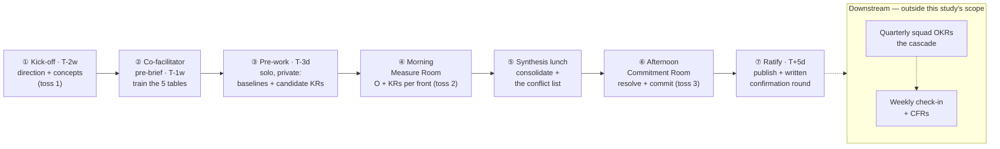

# From a Long-Term Vision to Annual OKRs

> A one-day dynamic for a large leadership group (25+) that turns a long-term product
> vision — its investment fronts, North Stars and Three-Horizons initiatives — into a
> committed set of annual OKRs, *negotiated* rather than cascaded.

- **Topic:** Product Management
- **Date:** 2026-09-11
- **Status:** draft

> *The words written here are all AI-generated, but all the content was critically reviewed
> and validated by me — the use of AI is to accelerate the knowledge searching and narrative
> building.*

## Contents

1. [Context](#context)
2. [What an OKR actually is](#what-an-okr-actually-is)
3. [The bridge from North Star to Key Results](#the-bridge-from-north-star-to-key-results)
4. [The process at a glance](#the-process-at-a-glance)
5. [Before the day](#before-the-day)
6. [Morning: the Measure Room](#morning-the-measure-room)
7. [The synthesis lunch](#the-synthesis-lunch)
8. [Afternoon: the Commitment Room](#afternoon-the-commitment-room)
9. [After the day](#after-the-day)
10. [Open questions and next steps](#open-questions-and-next-steps)
11. [References](#references)
12. [Appendix A. Annual OKR artifact template](#appendix-a-annual-okr-artifact-template)
13. [Appendix B. The Key Result quality gate](#appendix-b-the-key-result-quality-gate)
14. [Appendix C. Facilitator run-sheet](#appendix-c-facilitator-run-sheet)
15. [Appendix D. Kick-off presentation storyline](#appendix-d-kick-off-presentation-storyline)

## Context

The [long-term product vision](./long-term-product-vision.md) study deliberately stops at
**"the vision + a North Star per investment area"**, and lists what comes next as out of
scope:

> 1. **Define next-year OKRs from the investment areas.**
> 2. **Squads define their initiatives.**

This study writes step 1. It assumes the vision dynamic has already been run and that the
organization now holds three things: a set of **investment fronts** (here: five), a
**North Star per front**, and a body of **initiatives classified by McKinsey's Three
Horizons**. The question it answers is narrow and practical:

> *How does a GPM get 25+ leaders of a superintendency, in a single day, to co-create the
> annual OKRs that turn that vision into a commitment — without the day collapsing into
> either a top-down cascade or a re-reading of the initiative backlog?*

**What makes this hard is not the OKR format — it is what the room walks in holding.**
They arrive with a list of initiatives. The gravitational pull of that list is to become
the Key Results ("deliver the catalog", "migrate 12 pipelines"), which is exactly the
output/outcome trap. So the whole dynamic is organized around one rule, stated at the
start and enforced all day — the structural twin of the vision workshop's *"no solution
before the problem is on the wall"*:

> ### An initiative is never a Key Result.
> An initiative is a **bet** on a Key Result. If deleting the initiative forces you to
> rewrite the Key Result, the Key Result was an initiative wearing a disguise.

Six failure modes shape the design, each answered by a specific movement rather than by
exhortation:

| Failure mode | Where the design answers it |
| --- | --- |
| Initiative-as-Key-Result (the output trap) | The KR forge's quality gate ([Appendix B](#appendix-b-the-key-result-quality-gate)) and the **bet board** |
| A wish list — 5 fronts × N initiatives | One Objective per front, ≤3 KRs; the **capacity chips** |
| A cascade instead of a negotiation | The **catchball** shape: direction → toss → toss-back |
| Everything lands in Horizon 1, because only H1 is measurable | The **horizon sort** and **learning KRs** for H3 |
| Cross-front dependencies stay informal favours | The **dependency market**: shared KRs with a named owner |
| Sandbagging, or fantasy targets | **Confidence calibration** and the committed/aspirational split |

**Scope.** The dynamic ends at a ratified, superintendency-level annual OKR set plus the
cadence that keeps it alive. The **squad-level cascade** — each squad turning these into
its own quarterly OKRs and initiatives — stays out of scope, consistent with the vision
study, and is the natural subject of a third study.

## What an OKR actually is

*This section is the theory the rest of the study applies. It is written to stand alone:
a leader who has never used OKRs should be able to read only this and arrive prepared.*

### Where OKRs come from

The lineage explains the shape. Peter Drucker's **Management by Objectives** (1954)
established that people should be measured against agreed objectives rather than
activity. **Andy Grove** reworked it at Intel in the 1970s, adding the two properties
that make OKRs what they are: an objective is worthless unless paired with *measurable*
key results, and the cycle must be short enough to correct course. **John Doerr** learned
it at Intel and brought it to Google in 1999; **Google** added the public-by-default norm
and the split between *committed* and *aspirational* goals.

Two inherited properties matter for our room. From Grove: **an objective without a number
attached is a wish.** From Google: **not every objective carries the same promise** —
some you will move resources to protect, others you accept you will probably miss.

### The anatomy of an OKR

Doerr's formula is the whole thing in one line:

> **I will [OBJECTIVE] as measured by [KEY RESULTS].**

| Half | Question it answers | Nature |
| --- | --- | --- |
| **Objective** | Where are we going, and why does it matter? | Qualitative, inspiring, memorable, time-bound. **No number.** |
| **Key Results** | How will we know we got there? | Quantitative, outcome-shaped, `baseline → target`, dated, owned. |

The two halves fail in opposite directions, and both failures are common. An Objective
with no Key Results is a **slogan**. Key Results with no Objective are a **dashboard
nobody can explain the purpose of**.

### The three layers: Objective, Key Result, Initiative

This is the distinction most organizations collapse, and keeping it intact is the single
highest-value thing this dynamic does.

| Layer | Question | Nature | Example (data platform) |
| --- | --- | --- | --- |
| **Objective** | Where are we going? | Qualitative direction | *"Squads trust the platform enough to stop building their own pipelines."* |
| **Key Result** | How do we know we arrived? | Outcome metric | *"Share of new pipelines built on the platform: 38% → 75% by Dec/2027."* |
| **Initiative** | What will we try, to move it? | Work — a **bet** | *Ship self-service ingestion templates; run a migration guild; retire the legacy runner.* |

The asymmetry between the last two layers is the point: **initiatives are falsifiable
bets; Key Results are the commitment.** You can kill an initiative, swap it, or double
down on it in June without touching the OKR — that freedom is precisely what OKRs buy
you. A Key Result you cannot defend without naming a specific project is not a Key
Result.

### Writing a good Objective

An Objective should be **qualitative** (the number lives in the KRs), **significant**
(worth a year of the organization's attention), **actionable by the people in the room**
(not a wish about the market), **time-bound** to the cycle, and **memorable** enough that
a leader can repeat it to their team without reading it off a slide.

```text
  ✗  "Improve the data platform."
       → not significant, not time-bound, unfalsifiable.

  ✗  "Deliver the catalog, lineage and data-quality modules."
       → a roadmap wearing an Objective's clothes; three projects, no direction.

  ✓  "By the end of 2027, an analyst finds and trusts the data they need
      without having to ask a human."
       → qualitative, significant, memorable, dated.
```

### Writing a good Key Result

A Key Result has **five obligatory parts**. If any is missing, it is not yet a Key Result:

1. **A metric** — the thing being measured.
2. **A baseline** — where it stands today.
3. **A target** — where it must stand at the end of the cycle.
4. **A deadline** — normally the end of the cycle.
5. **An owner** — one named person, not a team name.

> **On the missing baseline.** "We don't measure that" is the most useful sentence in the
> room, and it should be welcomed rather than argued away. It has a legitimate answer:
> *establishing the baseline becomes an early-cycle outcome in its own right.* What it
> must not become is a target invented to fill the slot.

Then the **outcome test**, one question applied to every candidate:

> *Could we hit this number in full and the North Star still not have moved?*
> If yes — it is an **output**. Send it to the bet board as an initiative.

**Three legitimate types of Key Result.** Most guidance recognizes only the first; the
other two exist because rooms that are denied them smuggle the work in as fake metrics.

- **Metric KR** *(the default)* — `X from a to b`. Reach for this first, always.
- **Milestone KR** *(binary, rationed)* — legitimate only when a genuine state change
  exists that no metric yet captures, e.g. *"the regulatory data domain is certified by
  the compliance office."* **At most one per Objective**: this is the doorway through
  which the entire initiative list will try to walk in.
- **Learning KR** *(for genuinely uncertain work)* — where the measurable result is
  *validated knowledge*, e.g. *"test three chargeback models with ten internal customers
  and pick one, with evidence, by Q3."* Without this type, Horizon-3 work is either faked
  as a revenue metric or quietly dropped from the set.

### What an OKR is not

This list does more work in the room than any positive definition.

- **Not a task list.** A checklist of activities graded by completion is a project plan.
- **Not the roadmap.** The roadmap holds the *initiatives* — the bets. The OKR holds the
  *intended change*. They are different artifacts with different lifespans.
- **Not the KPI dashboard.** A KPI monitors ongoing health and has no due date; a Key
  Result commits to a change within a cycle. *"Keep availability at 99.9%"* is a KPI. A
  set made of KPIs has no ambition in it, because nothing in it has to change.
- **Not a performance-evaluation instrument.** Google says this explicitly, and the
  reason is mechanical rather than moral: tie OKRs to compensation and you have
  guaranteed sandbagging in every cycle that follows.
- **Not everything the organization will do next year.** Most of the year is
  business-as-usual and should stay invisible to the OKR set. OKRs name the **change on
  top of** the run-rate.

### How many, and how ambitious

**How many.** Google's guidance is 3–5 Objectives with about 3 Key Results each. The most
common failure mode by a distance is trying to do too much: long lists disperse attention
and no single Objective gets the depth it needs. For this dynamic the constraint is fixed
in advance and is not negotiable in the room:

> **One Objective per investment front, at most three Key Results.**
> Five fronts gives five Objectives — already at the top of the recommended range.

**How ambitious.** Three calibration devices, used together in [M9](#afternoon-the-commitment-room):

- **Grading.** Google scores each KR 0–1.0, with the sweet spot at **0.6–0.7**. Hitting
  1.0 across the board is evidence the targets were too easy, not that the year went well.
- **Confidence.** Wodtke's rule of thumb: set the target at a **5-out-of-10 confidence** —
  a genuine 50/50 shot. Nine-out-of-ten is sandbagging; one-out-of-ten is fantasy.
- **Committed vs. aspirational.** A **committed** OKR is one the organization agrees will
  be delivered, and it will move schedules and resources to protect it — the expected
  score is 100%, with no partial credit. An **aspirational** OKR describes a world we
  want that we do not yet know how to reach; it is *expected* to be missed and carried
  across cycles. Mark every OKR as one or the other. An unmarked set means each leader
  silently applies their own reading, and the December conversation is a fight.

**Sandbagging** is the mirror failure of the wish list and is harder to spot, because a
sandbagged set looks healthy all year. A team that sets targets it knows it will hit does
not innovate, does not stretch, and learns nothing from the cycle.

### Cadence and follow-through

OKRs run on **nested cadences** — different rhythms for different altitudes:

| Cadence | Horizon | Who | What happens |
| --- | --- | --- | --- |
| **Strategic** | Annual | Superintendency | *This dynamic.* The OKRs that frame the year. |
| **Tactical** | Quarterly | Squads / teams | Team OKRs that serve the annual set; re-cut each quarter. |
| **Operational** | Weekly | Everyone | Check-in: confidence rating, what moved, what is blocked. |

An annual OKR that is only looked at in December is a wish with a deadline. The **weekly
check-in** is what makes it real, and Doerr's **CFRs** — Conversations, Feedback,
Recognition — are the human layer that carries the numbers between check-ins.

> **Decide up front what happens when a Key Result is obviously wrong in June.** Name the
> rule while nobody is invested in the answer. A KR may be **re-baselined** (the starting
> number turned out to be wrong), **retired** (the underlying bet was invalidated — record
> why), or **replaced** (the outcome still matters, the measure did not). What it may not
> be is quietly re-targeted downwards in December. Every such change is logged in the
> artifact's changelog, in the open.

### Bidirectional, not cascaded

The traditional model — each level restating the level above, translated down the
hierarchy — is slow, consumes weeks, and produces goals nobody feels they authored.
OKRs are meant to be set **bottom-up and top-down at the same time**.

The mechanism that makes this concrete is **catchball**, borrowed from Hoshin Kanri:
leadership throws the direction; the teams pressure-test its feasibility and throw it
back with ground truth attached; the plan adjusts; repeat until it holds. The difference
in outcome is the whole reason to spend a day on this: catchball generates **commitment**,
a cascade generates **compliance**.

**This is why the day is shaped the way it is.** The GPM opens with direction (the vision,
the North Stars, the company's 2027 objectives, and the real capacity). The room throws
back the measurable version. The GPM consolidates over lunch and throws the *conflicts*
back rather than resolving them privately. The room resolves them. Three tosses in one
day, plus one written round afterwards.

### The anti-pattern catalogue

| Symptom | Why it happens | The fix |
| --- | --- | --- |
| *"KR: launch the data catalog"* | The initiative list is right there, and delivery feels measurable | Outcome test → move to the bet board; ask what the launch is supposed to **change** |
| *"KR: keep availability at 99.9%"* | Confusing a health metric with a commitment to change | It is a **KPI**. Monitor it; do not spend a KR slot on it |
| A KR with a target but no baseline | Nobody measures it yet, and the slot had to be filled | Make *establishing the baseline* the early-cycle outcome |
| A KR nobody owns | It belongs to "the platform", i.e. to everyone | One named owner, or the KR is cut |
| Fifteen Objectives | Every leader wants their area represented | The fixed constraint: one Objective per front |
| Every KR at 90% in October | Sandbagging — targets set to be hit | Confidence calibration; grade the *set*, never the person |
| All KRs are Horizon 1 | H1 is the only horizon with clean metrics | Horizon sort + learning KRs for H3 |
| We hit everything and nothing improved | Surrogation: the metric replaced the goal | The OKR pre-mortem in [M10](#afternoon-the-commitment-room) |

## The bridge from North Star to Key Results

The vision study hands over a **North Star per investment front** and stops. That North
Star is a *multi-year* outcome — by design it will not move meaningfully in twelve
months. So the bridge to an annual OKR is not "measure the North Star"; it is **"which of
its input metrics do we commit to moving this year?"**

The North Star Framework supplies the missing middle: one metric capturing the value
delivered, with **3–5 input metrics** that teams can actually move. Those input metrics
are the natural candidates for Key Results — which makes the chain from vision to
commitment mechanical rather than inspirational:

```text
  VISION (2029)              the narrative — what the platform will be
      │
      ├─ INVESTMENT FRONT    one of the five (from the vision workshop)
      │       │
      │       ├─ NORTH STAR          multi-year outcome for this front
      │       │       │
      │       │       ├─ INPUT METRICS     3–5 levers that move it
      │       │       │        │
      │       │       │        └─► KEY RESULTS   ← the ones we commit to in 2027
      │       │       │                 │           (baseline → target, owned)
      │       │       │                 │
      │       │       └─ 2027 OBJECTIVE ─┘  the qualitative half
      │       │
      │       └─ INITIATIVES (H1/H2/H3)   the bets placed under each KR
```

**Three checks make the bridge load-bearing.** Run them on every candidate KR, in this
order:

1. **Does moving this number plausibly move the North Star?** If the room cannot state
   the causal story in one sentence, the input metric is wrong — or it belongs to a
   different front.
2. **Is this the change, or the health?** A metric already at an acceptable level, that
   simply must not degrade, is a **KPI**. It belongs in the monitoring section of the
   artifact, not in a Key Result slot.
3. **Does this front actually control it?** If the number moves only when another front
   delivers, it is a **shared Key Result** — which is a legitimate answer, provided it
   gets one named owner in [M7](#afternoon-the-commitment-room) rather than two hopeful
   ones.

**Candidate input-metric families for a data platform.** Useful as a prompt when a table
stalls, not as a menu to pick from:

| Family | Shape of the metric | Watch out for |
| --- | --- | --- |
| **Reach / adoption** | Share of consumers or workloads on the platform | Adoption is a *means*; it earns a KR slot only when the North Star genuinely depends on reach |
| **Time-to-X** | Lead time from request to trustworthy data | Easy to game by redefining the start of the clock |
| **Trust / quality** | Incidents per domain, contract-compliance rate, freshness SLO attainment | Needs an agreed definition *before* it becomes a KR |
| **Cost / efficiency** | Cost per query, per pipeline, per TB served | Can be improved by degrading service — pair it with a quality KPI |
| **Experience** | Internal NPS, onboarding time, cognitive-load survey | Slow-moving and noisy; strong as a leading indicator, weak as a sole KR |

## The process at a glance

**One day, three catchball tosses, plus a written round afterwards.** The day is not a
workshop that happens to produce OKRs — it is a *negotiation* with a synthesis step
deliberately placed in the middle, because the toss-back is where an over-sized set dies.



The same path read as **input → step → output**, the version to put on a slide:

```text
 #  STEP                  WHO                    WHAT COMES OUT
 ── ───────────────────── ────────────────────── ──────────────────────────────────────
 ①  Kick-off (T-2w)      all leaders            shared concepts + the direction
 ②  Pre-brief (T-1w)     GPM + 5 co-facilitators trained tables, prepared walls
 ③  Pre-work (T-3d)      each leader, solo       baselines + candidate KRs (private)
 ④  Morning              5 front tables          1 Objective + ≤3 candidate KRs per front
 ⑤  Synthesis lunch      GPM + co-facilitators   consolidated draft + the conflict list
 ⑥  Afternoon            mixed groups            committed OKR set, owners, Not Doing board
 ⑦  Ratify (T+5d)        GPM                     published artifact (Appendix A)   ← ends here
 ┄┄ outside this study's scope ┄┄
    └→ quarterly OKRs     squads                 squad-level OKRs and initiatives
    └→ weekly check-in    everyone               confidence tracking, CFRs
```

## Before the day

Three quarters of whether the day works is decided before anyone enters the room. With
25+ leaders there is no slack to recover from a cold start.

### Kick-off (T-2 weeks, ~45 min, all leaders)

Its job is *direction and concepts*, not content. The room already lived the vision
workshop, so **do not re-sell the vision** — re-anchor on it and move on.

- **Re-anchor (10 min).** The vision narrative, the five fronts, the North Star for each.
- **Teach the concepts (20 min).** The compressed version of
  [What an OKR actually is](#what-an-okr-actually-is): the three layers, the outcome test,
  committed vs. aspirational, and the "what an OKR is *not*" list. This is the single
  highest-leverage 20 minutes of the whole process — every minute skipped here is
  reclaimed at triple cost during the KR forge.
- **State the single rule.** *An initiative is never a Key Result.* Say it, put it on the
  wall, and promise the bet board so nobody fears their initiative will be lost.
- **Give the two constraints (10 min).** The **company's 2027 objectives** (the top-down
  half of the catchball) and the **real capacity** — squads, headcount, and committed
  run-rate work per front. Sharing capacity *before* the room writes ambitions is what
  makes the afternoon's betting table a negotiation rather than a disappointment.
- **Assign the pre-work**, with the deadline and a named nudge per person.

> The full slide storyline is in
> [Appendix D](#appendix-d-kick-off-presentation-storyline).

### Co-facilitator pre-brief (T-1 week, ~60 min, GPM + 5 co-facilitators + 5 scribes)

**This step exists because the room is 25+.** One facilitator cannot hold five tables;
past roughly twelve people, plenary discussion stops converging and the day is decided at
the tables. Recruit one co-facilitator per front — a leader with standing in that front,
who is *not* the person with the strongest opinion about its OKRs — plus a scribe each.

The pre-brief covers: the run-sheet and its timeboxes; how to run the KR forge and read
the quality gate aloud ([Appendix B](#appendix-b-the-key-result-quality-gate)); how to
work the bet board without making people feel censored; and the one instruction that most
needs rehearsing — **how to say "that's an output" without deflating the person who said
it.** Have each co-facilitator practise it once, out loud.

### Pre-work (due T-3 days, solo, ~40 min each)

Individual, and **private until the day** — the same anchoring antidote the vision study
uses. For the front each leader belongs to, four prompts:

- **(a)** Given this front's North Star, what would have to be **measurably different** by
  December 2027 for us to say the front moved? Write it as `metric: today → target`.
- **(b)** What is the **baseline today**? Bring the number. *"We don't measure this"* is a
  complete and welcome answer — flag it as such.
- **(c)** Which of our existing initiatives are the **strongest bets** on that change, and
  which would you **drop**? Naming a drop is part of the assignment, not an optional extra.
- **(d)** One **dependency** you have on another front.

### Wall prep (T-1 day, GPM + co-facilitators)

Each front gets a wall, pre-loaded before anyone arrives: the front's **North Star**, the
**baseline data pack** the GPM could assemble centrally, and the front's pre-work cards
**merged, de-duplicated and lightly clustered**. Contradictory submissions are posted side
by side on purpose — a visible disagreement about a baseline is the fastest possible start
to the morning.

## Morning: the Measure Room

*~3h. Five front tables of 5–6 people, each with a co-facilitator and a scribe. Every
table is seeded with 1–2 leaders from an **adjacent front** — this is how silos break
without spending plenary time on it.*

**The morning's job is to produce candidate material, not decisions.** Say so at the
start: nothing agreed before lunch is final, which is what lets people write an ambitious
number without feeling they have signed for it.

> **The bet board.** Beside each front's wall, a second board. The moment someone names an
> initiative — and they will, constantly — the co-facilitator says *"good, that's a bet"*
> and posts it on the bet board **under the Key Result it is a bet on**. Nothing is lost
> and nobody is corrected. Unlike the vision workshop's parking lot, this board is not a
> holding pen: its contents become the **Initiatives** section of the final artifact.

- **M0 · Orient (15 min, plenary).** Re-anchor on the vision and the five North Stars.
  State the single rule. Read the quality gate aloud once, so the room hears the exact
  words its co-facilitators will use all morning. Show the day's shape, including the
  toss-back after lunch — people cooperate with a convergence step they can see coming.
- **M1 · Baseline wall (20 min, tables).** Before any ambition: *what do we measure today
  for this North Star, what is the number, and what would we have to start measuring?*
  Three columns — **measured / measurable but not measured / not measurable yet**.
  Surfacing the third column at 09:30 is what prevents fantasy Key Results at 11:00.
- **M2 · Objective drafting, 1-2-4-All (30 min, tables).** Solo → pairs → the table, to
  one Objective for the front: qualitative, inspiring, dated to the end of 2027,
  traceable to the North Star. The escalating format keeps the most senior voice at the
  table from setting the anchor.
- **M3 · KR forge (50 min, tables).** The core of the morning.
  1. **Silent writing (10 min).** Each person writes 2–3 candidate KRs, using the pre-work
     and the baseline wall. Silence matters: this is the last moment of genuinely
     independent thought in the day.
  2. **Gate each one (25 min).** Cards go up one at a time; the co-facilitator reads the
     quality gate aloud against each. Failures are not discarded — an output goes to the
     bet board, a missing baseline gets a *"baseline first"* tag, a health metric moves to
     the KPI strip.
  3. **Converge to ≤3 (15 min).** Dot-vote, then write the survivors properly: metric,
     baseline, target, deadline, owner. **A KR without a named owner does not survive the
     morning.**
- *Break (15 min).*
- **M4 · Horizon sort (25 min, tables).** Tag each surviving KR **H1 / H2 / H3**, reusing
  the classification the initiatives already carry from the vision exercise. Two rules
  make this more than labelling:
  - **H3 gets a learning KR**, never a revenue or adoption metric. If the front's H3 work
    cannot be expressed as validated knowledge by December, it does not belong in the
    annual set at all.
  - **Read the balance aloud.** The commonly cited portfolio split is roughly **70 / 20 /
    10** across H1 / H2 / H3. Use it as a conversation anchor, not a rule — but a front
    that emerges 100% H1 has quietly decided not to fund its own future, and should have
    to say so out loud.
- **M5 · Rotation gallery (35 min).** Two rotations of ~15 min: each table moves to the
  next front's wall and leaves **two sticker types only** —
  **red = "that's an output"**, **blue = "we depend on this"**. No talking, no defending;
  the owners read their stickers when they return. This replaces the plenary read-out that
  a 25+ room cannot afford, and it generates the raw material for both the afternoon's
  dependency market and the lunch conflict list.

```text
   FRONT WALL (end of morning)
   ─────────────────────────────────────────────────────────────────
   OBJECTIVE   "An analyst finds and trusts the data they need
                without asking a human."                    [2027]
   ─────────────────────────────────────────────────────────────────
   KR1  pipelines on the platform   38% → 75%   @ana     H1   ●●●●
   KR2  time-to-trusted-dataset     9d  → 2d    @bruno   H1   ●●●
   KR3  chargeback model validated with 10 teams @carla  H3   ●●
        (learning KR — evidence, not delivery)
   ─────────────────────────────────────────────────────────────────
   KPI strip (monitor, do not commit):  availability 99.9% · cost/TB
   ─────────────────────────────────────────────────────────────────
   BET BOARD   under KR1: self-service templates · migration guild
               under KR2: contract tests · freshness SLOs
   ─────────────────────────────────────────────────────────────────
   🔴 "that's an output" × 2      🔵 "we depend on this" × 3
```

## The synthesis lunch

*~60 min. GPM + the five co-facilitators. The leaders eat and talk; this crew works.*

This is the catchball's return throw, and it is the reason the dynamic fits in one day.
With 25+ participants the morning generates more raw material than one person can
consolidate — which is why the co-facilitators, who watched their own walls being built,
do it together.

Three outputs, and only three:

1. **The consolidated draft.** Five Objectives, up to fifteen KRs, de-duplicated. Merge
   the cases where two fronts wrote *the same number* from different sides; that merge is
   usually the day's first real strategic decision.
2. **The conflict list.** Explicitly *not* resolved — named:
   - **over-capacity**: fronts whose KRs plainly exceed their squads;
   - **duplicates**: one outcome claimed by two fronts;
   - **unmeasurable**: KRs that arrived without a baseline and without a "baseline first" plan;
   - **orphan dependencies**: blue stickers with no owner on the other side;
   - **horizon imbalance**: a front that came out entirely H1.
3. **The capacity chips.** A physical allocation device for the afternoon: a fixed number
   of chips per front, representing the squad capacity genuinely available for *change*
   work in 2027 — run-rate already deducted. The GPM prepares the totals before the day;
   lunch only distributes them.

> **Resist the temptation to arrive with the conflicts solved.** A crew that returns with
> answers has converted the day back into a cascade. Return with the *questions*, sharply
> framed — that is what the afternoon is for.

## Afternoon: the Commitment Room

*~2h45. **Mixed groups, not front tables** — the morning's job was depth per front; the
afternoon's is everything that only exists between fronts.*

- **M6 · Toss-back (15 min, plenary).** The GPM presents the consolidated draft **and the
  conflict list**. This is the moment that earns the room's trust: they see their own
  material returned intact, with the problems named rather than quietly fixed over
  sandwiches.
- **M7 · Dependency market (30 min).** Every blue sticker gets resolved into exactly one
  of three states, and the third is a legitimate outcome:
  - a **shared Key Result** — one outcome, jointly owned, **one named DRI**;
  - a **joint commitment** — front A commits a specific deliverable to front B's KR;
  - **at risk** — nobody will own it, said out loud, and recorded against the KR that
    depends on it. An unclaimed dependency is a finding, not an omission.
- **M8 · The betting table (40 min).** The capacity chips come out. Each front allocates
  its chips across its KRs and the initiatives on its bet board; the constraint is that
  chips are finite and visible to the whole room.
  **Every yes names its no.** Whatever loses its funding goes on the **Not Doing board**,
  written as a sentence a leader can repeat to their team without apologising. That board
  is a deliverable: it feeds the *critical trade-offs* section of the vision artifact, and
  it is the single most useful page of the year for a manager fielding requests.
- *Break (10 min).*
- **M9 · Confidence calibration (25 min).** Each KR owner states a confidence from 1 to 10,
  in front of the room. Then the calibration rules bite:
  - **9–10** → sandbagging. Raise the target, or admit it is run-rate and cut it.
  - **5** → the sweet spot. Leave it.
  - **1–2** → fantasy. Lower it, split it, or convert it into an H3 learning KR.
  Then classify each OKR **committed** or **aspirational**, and say aloud what the
  classification obliges: a committed OKR means resources move to protect it; an
  aspirational one is expected to be missed.
- **M10 · OKR pre-mortem (20 min).** The room already knows this mechanic from the vision
  workshop, which is why it needs no set-up:
  > *"It is December 2027. We hit every single Key Result — and the platform is no better."
  > What did we measure wrong?"*
  This is the surrogation check, and it is the last chance to catch a vanity metric before
  it becomes a year of work. Anything it surfaces goes straight back into the KR wording.
- **M11 · Commitment round (15 min).** Only the five front owners speak: one sentence each
  on what their front owns and what it will not do. Everyone else signs the wall.
  At 25+, restraint about who speaks in plenary is what leaves time for the work.

## After the day

- **Ratify and publish (within 5 working days).** The GPM writes the artifact
  ([Appendix A](#appendix-a-annual-okr-artifact-template)). Anything the room left
  ambiguous is written as the GPM's best reading, clearly marked as such.
- **The written confirmation round.** The fourth and final catchball toss, async: each
  front owner confirms their Objective, KRs, owners, and their line on the Not Doing
  board. Silence is **not** consent — chase the non-responders. This round routinely
  catches one or two KRs that sounded agreed in the room and were not.
- **Set the cadence before anyone disperses.** Weekly check-in slot, quarterly re-cut
  dates, and the rule for changing a KR mid-year (re-baseline / retire / replace, always
  in the changelog). A cadence agreed in January is a cadence; one improvised in April is
  a meeting.
- **Hand off to the squads.** The quarterly cascade — each squad turning the annual set
  into its own OKRs and initiatives — is where this study stops, and is the subject of the
  next one.

## Open questions and next steps

- **Does one Objective per front hold when the fronts are unequal?** Five equal Objectives
  imply five equal fronts, which is rarely true. A front in pure H3 exploration may
  deserve a single learning KR rather than a full Objective — worth testing in the first
  run and adjusting for the next cycle.
- **Annual KRs versus quarterly reality.** An annual Key Result can drift for three
  quarters and still look plausible. The weekly confidence rating is the intended defence,
  but whether it is *enough* at superintendency altitude is unproven — a mid-year re-cut
  checkpoint may need to be formalized rather than left to the "obviously wrong in June"
  rule.
- **Who owns a shared Key Result when the DRI's front misses its own?** The dependency
  market names an owner but does not settle the priority conflict that follows. Worth
  making explicit in the artifact.
- **The squad cascade** — the third study in this sequence, completing the path from
  vision to the work a squad actually picks up on a Monday.

## References

Grouped by the role each source plays. Each entry has a link, what it says, how it shaped
this dynamic, and — where it applies — a caveat on fit.

> *Note on sourcing:* this session's network egress blocked direct page fetches, so entries
> were assembled from verified search results and published summaries rather than from a
> personal read of each page. Titles and URLs are accurate; quoted figures are worth
> re-checking against the source before you put them on a slide.

### OKR fundamentals and quality

- **Measure What Matters — John Doerr** ([Goodreads](https://www.goodreads.com/book/show/39286958-measure-what-matters), [whatmatters.com](https://www.whatmatters.com/))
  — the canonical account: the formula *"I will [Objective] as measured by [Key
  Results]"*, the four superpowers (Focus, Align, Track, Stretch), and **CFRs**
  (Conversations, Feedback, Recognition) as the human layer under the numbers.
  *Inspires:* the anatomy section, and the insistence that the cadence — not the
  planning day — is what makes an OKR real.

- **Set goals with OKRs — Google re:Work** ([rework.withgoogle.com](https://rework.withgoogle.com/intl/en/guides/set-goals-with-okrs))
  — the operational criteria: 3–5 Objectives with ~3 Key Results each, grading 0–1.0 with
  a **0.6–0.7 sweet spot**, public by default, and an explicit warning that OKRs are
  **not** a performance-evaluation tool.
  *Inspires:* the "how many" constraint, the grading calibration in M9, and the
  strongest line in [What an OKR is not](#what-an-okr-actually-is).

- **Committed and Aspirational OKRs — Google's OKR Playbook / What Matters** ([whatmatters.com](https://www.whatmatters.com/okrs-explained/committed-and-aspirational-okrs), [playbook PDF](https://www.whatmatters.com/resources/google-okr-playbook))
  — committed OKRs are expected at 100% with no partial credit and resources move to
  protect them; aspirational OKRs are expected to be missed and carried across cycles.
  *Inspires:* the explicit classification step in M9 — the cheapest way to prevent the
  December argument about what "70%" meant.

- **The Art of the OKR / Radical Focus — Christina Wodtke** ([cwodtke.com](https://cwodtke.com/the-art-of-the-okr/), [confidence ratings](https://eleganthack.com/harnessing-confidence-ratings-for-effective-okrs/), [Radical Focus 2.0 excerpt](https://www.mindtheproduct.com/radical-focus-2-0-an-excerpt-from-christina-wodtke/))
  — Objectives qualitative and inspiring, Key Results measurable, and the **5-out-of-10
  confidence** rule as the practical definition of a stretch goal.
  *Inspires:* the confidence calibration in M9 and the sandbagging/fantasy thresholds.

- **Output, Outcomes, Impact and KPIs — Jeff Gothelf** ([jeffgothelf.com](https://jeffgothelf.com/blog/output-outcomes-impact-and-kpis/), [sandbagging anti-pattern](https://jeffgothelf.com/blog/sandbagging-okr-antipattern/))
  — the output trap in its clearest form: *"launch the mobile app"* is a thing you do, not
  a change in behaviour; Key Results should measure the behaviour that indicates value
  landed.
  *Inspires:* the **outcome test** and, with it, the single rule the whole day enforces.

- **Felipe Castro — OKR guide and the OKR Journey** ([felipecastro.com](https://www.felipecastro.com/), [The OKR Journey](https://medium.com/the-alignment-shop/the-okr-journey-a-guide-for-okr-adoption-beb775ca2a5a))
  — a Brazilian practitioner's guide: OKRs are set **bottom-up and top-down
  simultaneously** rather than cascaded, and run on **nested cadences** (strategic
  annual / tactical quarterly / operational weekly).
  *Inspires:* the cadence table and the bidirectional argument that justifies the whole
  catchball shape of the day.

- **Framework de OKR / glossário — PM3** ([framework](https://conteudo.cursospm3.com.br/framework-okr-pm3), [glossário](https://pm3.com.br/glossario/okr-objective-and-key-result/))
  — a PT-BR framing and template of the same fundamentals, from the source family the
  vision study already draws on.
  *Inspires:* useful when translating the concepts for the kick-off — the room will
  discuss this in Portuguese even if the study is written in English.

### Alignment and facilitation

- **Hoshin Kanri: catchball** ([businessmap.io](https://businessmap.io/lean-management/hoshin-kanri/what-is-catchball))
  — bidirectional goal negotiation: leadership sets direction, teams pressure-test
  feasibility and throw it back, repeated until it holds. It "generates commitment rather
  than mere compliance."
  *Inspires:* the backbone of the design — three tosses in the day plus a written fourth,
  and the decision to return from lunch with *conflicts* rather than answers.

- **1-2-4-All — Liberating Structures** ([liberatingstructures.com](https://www.liberatingstructures.com/1-2-4-all/))
  — solo → pair → foursome → whole; everyone active, power imbalances shrink.
  *Inspires:* M2's Objective drafting, and the silent-writing opening of the KR forge.

- **25/10 Crowd Sourcing — Liberating Structures** ([liberatingstructures.com](https://www.liberatingstructures.com/25-10-crowdsourcing))
  — generate bold ideas and sift a large group's top ten in under thirty minutes, through
  circulation and repeated scoring rather than discussion.
  *Inspires:* the convergence mechanics for a 25+ room; a ready substitute if the M5
  rotation gallery proves too slow at the top of the size range.
  *Caveat:* designed for generating and ranking *ideas* — for KR selection it ranks
  popularity, not measurability, so the quality gate must still run afterwards.

- **OKR Alignment — OKR Institute** ([okrinstitute.org](https://okrinstitute.org/okr-alignment/), [alignment examples](https://okrinstitute.org/okr-alignment-examples/))
  — vertical vs. horizontal alignment; **shared OKRs** and joint commitments as the tools
  for interdependent teams, each with one directly responsible individual.
  *Inspires:* the dependency market in M7 and its three-state resolution.

- **Strategy, OKRs and KPIs — Perdoo** ([perdoo.com](https://www.perdoo.com/resources/blog/difference-strategy-okrs-and-kpis), [strategic pillars](https://support.perdoo.com/en/articles/4725666-strategic-pillars))
  — *Strategic Pillars* (3–5 of them) sit under an Ultimate Goal and are measured by
  **KPIs**, which have no due date; **OKRs** are what breaks the status quo within a
  cycle.
  *Inspires:* the KPI-versus-KR distinction — the second bridge check, and the KPI strip
  that keeps healthy metrics off the commitment wall. The pillar/front mapping is a close
  analogue of our investment fronts.

- **Performing a Project Pre-mortem — Gary Klein** ([HBR](https://hbr.org/2007/09/performing-a-project-premortem))
  — imagine it has already failed, then explain why.
  *Inspires:* M10, inverted — *we hit everything and nothing improved* — as the
  surrogation check. The room already knows the mechanic from the vision workshop.

- **OKR workshop agendas — Workpath, Mooncamp, Christian Strunk** ([Workpath](https://www.workpath.com/en/magazine/goal-setting-workshop), [Mooncamp](https://mooncamp.com/blog/okr-workshop), [Strunk](https://www.christianstrunk.com/blog/okr-workshop-template))
  — published run-sheets; the useful shared claims are that drafts should arrive as
  pre-work rather than be generated cold, that **planning and alignment are two distinct
  workshops**, and that most OKR workshops fail on facilitation rather than on goal
  quality.
  *Inspires:* the pre-work step, the morning/afternoon split (planning then alignment),
  and the decision to invest a whole session in training co-facilitators.
  *Caveat:* these are written for single teams of 6–12; the 25+ adaptations here —
  distributed tables, rotation instead of read-outs, a synthesis crew — are extrapolation,
  not established practice.

### Portfolio and horizons

- **The Three Horizons of Growth — Baghai, Coley & White (McKinsey)** ([mckinsey.com](https://www.mckinsey.com/capabilities/strategy-and-corporate-finance/our-insights/enduring-ideas-the-three-horizons-of-growth))
  — manage near, mid and far horizons in parallel; H1 is today's core, H3 the long-term
  bets.
  *Inspires:* the horizon sort in M4 — and it is the lens the initiatives already carry
  out of the vision exercise, so it costs the room nothing to apply.

- **Three Horizons and the Innovation Ambition Matrix** ([ITONICS](https://www.itonics-innovation.com/blog/the-three-horizons-model), [Wellspring comparison](https://www.wellspring.com/blog/three-horizons-or-innovation-ambition))
  — the commonly cited portfolio balance is roughly **70 / 20 / 10** across H1 / H2 / H3,
  with different metric types per horizon: discovery metrics in H3, scaling metrics in H2,
  operational metrics in H1.
  *Inspires:* the balance read-aloud, and the rule that **H3 gets a learning KR** rather
  than a revenue metric.
  *Caveat:* 70/20/10 is a benchmark, not a target; treat a front's deviation as a
  question to answer, not a number to hit.

- **Capacity allocation in portfolios — Scaled Agile** ([framework.scaledagile.com](https://framework.scaledagile.com/building-the-right-things-at-the-right-time-capacity-allocation-in-safe-portfolios))
  — allocating capacity explicitly is a *leadership behaviour*, not a planning chore:
  every yes to one investment is a visible no to another.
  *Inspires:* the betting table in M8 and the Not Doing board.
  *Caveat:* SAFe as a framework is contested and heavy; borrow the "every yes names a no"
  principle and the fixed-capacity device, not the apparatus around them.

### Measuring a platform

- **North Star Framework — Amplitude / John Cutler** ([amplitude.com/north-star](https://amplitude.com/north-star))
  — one metric capturing delivered value, with **3–5 input metrics** teams can move.
  *Inspires:* the spine of this study. The input metrics are the bridge from the vision's
  North Star to an annual Key Result, and they are what makes the handoff between the two
  studies mechanical rather than a leap.
  *Caveat:* carried over from the vision study — a single North Star is blunt for a
  platform serving many consumer types; a small metric tree per front works better.

- **Platform engineering metrics — Datadog** ([datadoghq.com](https://www.datadoghq.com/blog/platform-engineering-metrics/))
  — four measurement dimensions for a platform: delivery performance (DORA), developer
  experience, **adoption** (active users / total developers), and business impact.
  *Inspires:* the candidate input-metric families table — concrete KR starting points for
  a data platform when a table stalls.
  *Caveat:* **adoption is a means, not the outcome.** It earns a Key Result slot only when
  the front's North Star genuinely depends on reach; otherwise it is a leading indicator
  to monitor.

## Appendix A. Annual OKR artifact template

The **output artifact** of the dynamic. It is deliberately a *separate* document from the
long-term vision: the vision changes every two or three years, this one is rewritten every
year. It nests under the vision artifact — each front here points back to its North Star
there.

> Conventions
> - Replace every `[ … ]` placeholder.
> - **One Objective per investment front, at most three Key Results.** If a front needs a
>   fourth, something else has to go.
> - Every Key Result carries all five parts: **metric, baseline, target, deadline,
>   owner**. An owner is a person, never a team.
> - **Initiatives are bets, listed under the Key Result they serve.** They may be changed
>   at any point in the year without touching the Key Result — that is the whole purpose
>   of listing them separately.
> - The **Not Doing** and **Dependencies** sections are not optional. They are the two
>   pages people actually re-read in month seven.

```markdown
# [Superintendency] — Annual OKRs [year]

> Status: draft | in-review | committed
> Owners: [GPM] · [Engineering lead]
> Long-term vision: [link to the vision artifact]
> Last updated: [YYYY-MM-DD] (see Appendix #1 — Changelog)

## 1) How to read this

These OKRs are the [year] commitment derived from our long-term vision. Each investment
front carries one Objective; each Objective is measured by up to three Key Results, which
are the input metrics of that front's North Star. Initiatives listed under a Key Result
are bets — they may change during the year; the Key Results may not, except under the
rules in §6.

## 2) Objectives by investment front

### Front [N]: [Front name]
- **North Star (from the vision):** [multi-year outcome] — baseline [x], ambition [y].
- **Objective [year]:** [qualitative, inspiring, dated. No numbers.]
- **Classification:** committed | aspirational

| # | Key Result | Baseline | Target | Horizon | Owner | Confidence |
|---|------------|----------|--------|---------|-------|------------|
| KR1 | [metric] | [today] | [by Dec/year] | H1/H2/H3 | [person] | [1–10] |
| KR2 | … | | | | | |
| KR3 | … | | | | | |

**Initiatives (bets), by Key Result**
- *KR1:* [initiative] · [initiative]
- *KR2:* [initiative]
- *KR3:* [initiative]

**KPIs we monitor for this front (not committed):** [metric @ level] · [metric @ level]

<!-- Repeat per investment front. -->

## 3) Shared Key Results and dependencies

| Outcome | Fronts involved | DRI | Type | Status |
|---------|-----------------|-----|------|--------|
| [KR or deliverable] | [A] + [B] | [person] | shared KR / joint commitment | agreed / **at risk** |

Anything marked **at risk** has no owner on the supplying side. Record which Key Result
depends on it.

## 4) What we are not doing in [year]

Each line is written to be repeated to a team without apology.

- **[Not doing]:** [what we give up] · *Because:* [what it funds instead] ·
  *Cost accepted:* [the debt or opportunity cost].

## 5) Portfolio balance

| Horizon | Share of committed capacity | Key Results |
|---------|------------------------------|-------------|
| H1 — core | [%] | [KR refs] |
| H2 — scaling | [%] | [KR refs] |
| H3 — exploration | [%] | [KR refs] |

## 6) Cadence and the rules for changing a Key Result

- **Weekly:** [day/time] check-in — confidence rating per KR, blockers.
- **Quarterly:** squad OKRs re-cut; annual set reviewed, not rewritten.
- **A Key Result may be:** re-baselined (the starting number was wrong) · retired (the
  bet was invalidated — record why) · replaced (the outcome stands, the measure did not).
- **A Key Result may not be** quietly re-targeted downward. Every change is logged below,
  with a date and a reason.

## 7) Appendices

### Appendix #1 — Changelog

| Date | Editor | Change | Reason |
|------|--------|--------|--------|
| [YYYY-MM-DD] | [author] | [initial commitment] | [ratified on the OKR day] |
```

## Appendix B. The Key Result quality gate

*The card each co-facilitator holds during the KR forge. Read aloud, against every
candidate, in this order. It takes about forty seconds per card once the table finds its
rhythm.*

```text
   ┌──────────────────────────────────────────────────────────────────┐
   │  THE FIVE PARTS — does the card have all of them?                │
   │   1. metric   2. baseline   3. target   4. deadline   5. owner   │
   │   Missing the baseline? → tag "baseline first", keep it.         │
   │   Missing an owner?     → it does not survive the morning.       │
   ├──────────────────────────────────────────────────────────────────┤
   │  THE OUTCOME TEST — ask it out loud:                             │
   │   "Could we hit this number in full, and the North Star still    │
   │    not have moved?"                                              │
   │        YES → it is an OUTPUT. → bet board, under the KR it       │
   │              is a bet on. Nothing is lost.                       │
   │        NO  → it stays.                                           │
   ├──────────────────────────────────────────────────────────────────┤
   │  THE KPI TEST                                                    │
   │   "Is this already at an acceptable level, and we just need it   │
   │    not to get worse?"   → YES: it is a KPI. → KPI strip.         │
   ├──────────────────────────────────────────────────────────────────┤
   │  THE OWNERSHIP TEST                                              │
   │   "Does this number move only when another front delivers?"      │
   │        → YES: flag it blue. It is a shared KR — resolved in M7.  │
   └──────────────────────────────────────────────────────────────────┘
```

**Saying "that's an output" without deflating anyone.** The phrase to rehearse at the
pre-brief, because the instinctive wording sounds like a rejection:

> ✗ *"That's not a Key Result."*
> ✓ *"Good — that's one of our strongest bets. Let's put it on the bet board under the
> result it's meant to move. Now: **what changes** if we ship it?"*

The second version keeps the contribution, keeps the person, and extracts the actual Key
Result from the same breath.

**The anti-pattern cheat sheet**, for the reverse of the card:

| What you see on the card | What it really is | Where it goes |
| --- | --- | --- |
| A verb of delivery: *launch, migrate, implement, deliver* | An initiative | Bet board |
| A number that must merely stay where it is | A KPI | KPI strip |
| A target with no baseline | A research task | Keep, tag *baseline first* |
| *"Improve X"* with no number | An Objective fragment | Fold into the Objective |
| A percentage nobody can source | A guess | Tag *baseline first* |
| Owned by "the platform team" | Unowned | Name a person or cut it |
| Confidence 9–10 from the author | Sandbagging | Raise it in M9 |

## Appendix C. Facilitator run-sheet

*Everything the GPM needs to run the day, on one page.*

### Timeline

| When | What | Who | Output |
| --- | --- | --- | --- |
| **T-3 weeks** | Pick the five co-facilitators and scribes; assemble the baseline data pack | GPM | Named roles, capacity numbers per front |
| **T-2 weeks** | Kick-off (~45 min) | All leaders | Shared concepts, the two constraints, pre-work assigned |
| **T-1 week** | Co-facilitator pre-brief (~60 min) | GPM + 10 | Trained tables, rehearsed quality gate |
| **T-3 days** | Pre-work due | Each leader | Private cards: baselines, candidate KRs, drops, dependencies |
| **T-1 day** | Wall prep | GPM + co-facilitators | Five pre-loaded walls, capacity chips counted |
| **The day** | Measure Room → synthesis lunch → Commitment Room | Everyone | Committed OKR set |
| **T+5 days** | Publish + written confirmation round | GPM | Ratified artifact (Appendix A) |

### The day

```text
 09:00  M0   Orient — vision, the single rule, the gate, the shape of the day   15'  plenary
 09:15  M1   Baseline wall — measured / measurable / not yet                    20'  tables
 09:35  M2   Objective drafting — 1-2-4-All                                     30'  tables
 10:05  M3   KR forge — silent write → gate → converge to ≤3                    50'  tables
 10:55       ── break ──                                                        15'
 11:10  M4   Horizon sort — H1/H2/H3, learning KR for H3, read the balance      25'  tables
 11:35  M5   Rotation gallery — 🔴 output / 🔵 dependency, two rotations        35'  rotating
 12:10       ── LUNCH + synthesis (GPM + co-facilitators work) ──               60'
 13:10  M6   Toss-back — consolidated draft + the conflict list                 15'  plenary
 13:25  M7   Dependency market — shared KR / joint commitment / at risk         30'  mixed
 13:55  M8   Betting table — capacity chips, the Not Doing board                40'  mixed
 14:35       ── break ──                                                        10'
 14:45  M9   Confidence calibration + committed vs aspirational                 25'  plenary
 15:10  M10  OKR pre-mortem — "we hit everything and nothing improved"          20'  mixed
 15:30  M11  Commitment round — five owners speak, everyone signs               15'  plenary
 15:45       close
```

### Room and materials for 25+

- **Five wall stations**, far enough apart that two tables cannot overhear each other —
  at this size, ambient noise is the main cause of tables drifting into plenary mode.
- Per station: the pre-loaded wall, a **bet board**, a **KPI strip**, cards in two
  colours, markers, red and blue sticker sheets, dots for voting.
- **Central:** the conflict-list flipchart, the **Not Doing board**, the capacity chips,
  and a visible countdown clock. At 25+ the clock does more facilitation than the
  facilitator.
- **Roles:** GPM facilitates the room and never a table; one co-facilitator and one scribe
  per front; the scribe's only job is to keep the wall legible and photograph it before
  lunch.

### Co-facilitator pre-brief agenda (60 min)

| Min | Topic |
| --- | --- |
| 0–10 | Why the day is a negotiation, not a cascade — the catchball shape |
| 10–25 | The concepts your table will get wrong: the three layers, output vs. outcome, KPI vs. KR |
| 25–40 | **Rehearse the quality gate** on real cards from last year's goals — each co-facilitator runs one out loud |
| 40–50 | Rehearse *"that's an output"* without deflating the person. Everyone says it once |
| 50–60 | Timeboxes, the bet board, what to escalate to the GPM rather than resolve at the table |

### Failure signals to watch for during the day

| Signal | What it means | Intervention |
| --- | --- | --- |
| A table finishes M3 early | They wrote initiatives, not Key Results | Re-run the outcome test on every card |
| A table is still arguing about the baseline at M3 | The data pack was insufficient | Tag them all *baseline first* and move on — do not let it eat the forge |
| The same person has spoken for ten minutes | The table reverted to a meeting | Switch to silent writing immediately |
| Nobody flags a blue dependency in M5 | Fronts are being polite, not independent | Ask each table to name one out loud before lunch |
| All confidences land at 7–8 in M9 | The room is avoiding the calibration | Ask for the *one* KR they would bet their quarter on, and work outward |

## Appendix D. Kick-off presentation storyline

*For slide generation.* A narrative arc for the T-2 week kick-off, written as a story
rather than bullet points — paste into an AI slide generator or build it by hand. Each
beat ≈ one slide: a *headline*, the *story beat*, and a *speaker note*. Replace every
`[ … ]`. ~9 slides, ~20 min, leaving 25 minutes for concepts and questions.

> Conventions: this room already built the vision — **do not re-sell it, re-anchor on it
> and move**. The energy of this meeting should go into the concepts, because every
> concept skipped here costs triple during the KR forge. Be concrete about the
> constraints: people commit more honestly when they know the capacity before they write
> the ambition.

**Slides 1–2 — Where we are**

1. **Headline: "We built the vision. Now we price it."**
   *Beat:* one slide recalling the vision, the five fronts and their North Stars — as a
   reminder, not a re-pitch. Then the turn: a vision names the destination, an OKR names
   what changes *this year*. Today we start converting one into the other.
   *Note:* ninety seconds on this slide, maximum. The room lived it; lingering reads as
   distrust of their memory.
2. **Headline: "A North Star doesn't move in twelve months."**
   *Beat:* the honest problem. Our North Stars are multi-year by construction, so we
   cannot simply "measure the North Star" next year. Show the chain — North Star → input
   metrics → the ones we commit to in 2027 — using the diagram from
   [the bridge](#the-bridge-from-north-star-to-key-results).
   *Note:* this is the intellectual hook of the meeting. It reframes the task from
   *"set goals"* to *"choose which levers we pull this year"*, which is a far better
   question to take into the pre-work.

**Slides 3–5 — The concepts**

3. **Headline: "Objective, Key Result, Initiative — three layers, not one."**
   *Beat:* the three-layer table with a worked example from *our* platform. Land the
   asymmetry: initiatives are bets we can change in June; Key Results are the commitment.
   *Note:* the most important slide in the deck. If the room leaves with only this, the
   workshop still works.
4. **Headline: "An initiative is never a Key Result."**
   *Beat:* the single rule, stated plainly, with two examples from our own initiative
   list rewritten live from output into outcome. Promise the **bet board** in the same
   breath — every initiative gets a home, nothing is thrown away.
   *Note:* name the reason honestly: we walk in holding a list of initiatives, and the
   path of least resistance is to relabel it. We are choosing not to.
5. **Headline: "What an OKR is not."**
   *Beat:* not a task list · not the roadmap · not the KPI dashboard · not a performance
   review · not everything we will do next year. On-screen, one line worth quoting:
   > OKRs "should not be considered as an individual or team performance evaluation tool."
   > — Google re:Work ([Set goals with OKRs](https://rework.withgoogle.com/intl/en/guides/set-goals-with-okrs))
   *Note:* say the performance-review line out loud and mean it. Until people believe it,
   every target they write will be sandbagged, and you will never find out.

**Slides 6–7 — The constraints**

6. **Headline: "Where the company is going in 2027"**
   *Beat:* the [2–3] company objectives, unedited. This is the top-down half of the
   negotiation — the direction, not the answer.
   *Note:* frame explicitly as *one half of a catchball*: here is the direction; you bring
   back what is actually movable. That framing is what earns honest numbers.
7. **Headline: "And here is the capacity we actually have"**
   *Beat:* squads, headcount and committed run-rate per front — the real number for
   *change* work in 2027. Say the uncomfortable part: it is smaller than the ambition, and
   that is the point of meeting.
   *Note:* sharing capacity *before* people write ambitions is what turns the betting
   table into a negotiation instead of a disappointment. Do not soften it.

**Slides 8–9 — How the day works, and the ask**

8. **Headline: "One day, three tosses"**
   *Beat:* the process diagram from
   [the process at a glance](#the-process-at-a-glance). Emphasize the two things people
   need to hear: the morning produces *candidates*, nothing is final before lunch; and the
   conflicts come back to the room after lunch rather than being settled privately.
   *Note:* naming the convergence step in advance is what buys cooperation with it. People
   fight a surprise consolidation; they work with one they were promised.
9. **Headline: "Your part: bring the numbers, including the ones we don't have"**
   *Beat:* the four pre-work prompts, the deadline, and explicit permission for the answer
   *"we don't measure this"* — which is a finding we need, not a gap to hide. Remind them
   that naming what they would **drop** is part of the assignment.
   *Note:* submissions stay private until the day. Close on the date, the room, and the
   promise that they will leave with a set they authored.
