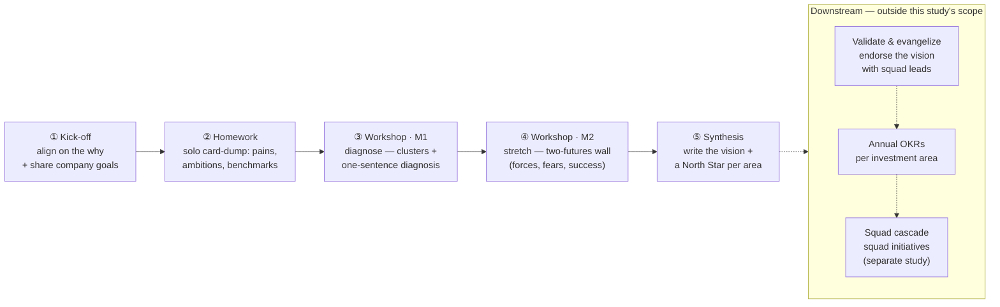

# Long-Term Product Vision for a Data Platform

> Exploring techniques to collaboratively build a long-term (2–3 year) product vision
> for platforms — Engineering and Product together — producing the vision and a North
> Star per investment area. Annual OKRs and the squad-level cascade are downstream.

- **Topic:** Product Management
- **Date:** 2026-06-18
- **Status:** draft

## Contents

1. [Context](#context)
2. [Why a shared vision](#why-a-shared-vision)
3. [The process at a glance](#the-process-at-a-glance)
4. [Kick-off meeting](#kick-off-meeting)
5. [Pre-work](#pre-work)
6. [The workshop (Movements 1 and 2)](#the-workshop-movements-1-and-2)
7. [Product synthesis (after the room)](#product-synthesis-after-the-room)
8. [Open questions and next steps](#open-questions-and-next-steps)
9. [References](#references)
10. [Appendix A. Long-term vision template](#appendix-a-long-term-vision-template)
11. [Appendix B. Kick-off presentation storyline](#appendix-b-kick-off-presentation-storyline)

## Context

This study explores better techniques to **collaboratively create a long-term product
vision for platforms**, with Engineering and Product working together rather than in
isolation. The central question: how do you run a process that produces a genuine
2–3 year vision — one strong enough to steer many autonomous squads toward annual OKRs
— while keeping the conversation out of short-term, service-activation mode and still
surfacing the real pains and concerns of the people in the room?

## Why a shared vision

Three ideas underpin this study. The [kick-off](#kick-off-meeting) *sells* them to the
room; this section is the substance behind them.

**1. A platform needs *one* vision — not one per squad.** When every squad sets its own
direction, the platform optimizes locally and pulls apart: duplicated effort, conflicting
bets, and a result that feels like a *pile of services* rather than a product. A single,
shared long-term vision is what lets autonomous squads stay autonomous *and* still see how
their piece serves the whole ([Cagan, Vision vs. Strategy](https://www.svpg.com/vision-vs-strategy/)).

**2. The North Star is the shared point of reference.** A north star is the metric that
captures the value the platform delivers, so that "no matter what team you're on, you can
see and follow it." For a platform serving many consumer types (squads, risk, analysts), a
single number may be too blunt — a small *metric tree* can serve better (see the North Star
Framework in [References](#references)).

**3. Mission ≠ Vision ≠ Strategy.** Keeping these distinct stops the room from talking past
each other ([Cagan, Vision vs. Mission](https://www.svpg.com/product-vision-vs-mission/)):

| Term | Question it answers | Horizon |
| --- | --- | --- |
| **Mission** | *What* are we here to do? | Enduring |
| **Vision** | *What future* will we create? | 2–3 years, inspiring |
| **Strategy** | *How* will we get there? | The intentional choices |

A mission statement is **not** a vision.

**4. A vision *inspires*; the *path* is strategy.** A good vision shows a compelling
future, not a plan — collapsing the two produces a roadmap dressed up as a vision, the
most common mistake. Cagan's analogy captures it: vision *inspires* (like leadership),
strategy is *intentional* (like management). The path is carried by the elements *around*
the vision: the **diagnosis + coherent actions** (Rumelt's kernel), the **investment
areas** (their *later* prioritization and sequencing is downstream strategy, not part of
this exercise), and — if you use a PR/FAQ — the **FAQ** that answers "how, and what's
hard." The *artifact as a whole* shows the path; the *vision statement* stays inspiring.

**So this dynamic delivers both the vision and the *starting point for strategy*.**
Defining the investment areas is already early strategy work — they're the seed of
Rumelt's guiding policy. The room produces the vision's raw material, the diagnosis, and
the prioritized investment areas (the *strategic skeleton*); the fuller strategy —
per-area OKRs, sequencing, and the squad-level cascade — is elaborated downstream in
[Product synthesis](#product-synthesis-after-the-room) and beyond.

## The process at a glance

**In-person by default — the only async step is an individual card-dump.** Focus is
fragile and group homework rarely gets done, so *all synthesis and decisions happen in
the room*. The one exception is a solo, private brain-dump before the session (see
[Pre-work](#pre-work)): it's individual and bounded, so it doesn't suffer the failure mode
of async group work, and it buys ~30 min of room time for the parts that need the room.
Where independent thinking matters (to avoid anchoring on the most senior voice), we
protect it by keeping those submissions private until the room and by having the room
actively re-shape the facilitator's draft clusters.

**Designed for flow, not stations.** The cross-functional room is **2 continuous
movements** that build on a *single growing wall*, instead of a sequence of cold-start
sessions. The room's job is to *surface and align* — diagnosis, fears/ambitions, and
candidate investment areas; **forming the vision and positioning the clusters is a
separate Product-team step afterward** (see [Product synthesis](#product-synthesis-after-the-room)).
The energy mechanics matter as much as the content:

- **1‑2‑4‑All** ([Liberating Structures](https://www.liberatingstructures.com/1-2-4-all/))
  replaces round-robin read-outs — everyone is always active; sharing is compressed.
- **Gallery walk + silent dot-voting** replaces verbal read-outs — people stand, move,
  read, and vote with dots. Movement is energy, and it converges faster.
- **One evolving artifact** — the same wall is enriched movement after movement, so the
  room sees momentum rather than restarting.
- **Mixed Product+Engineering** in every pair and foursome — collaboration is the point.

**Format:** the cross-functional room is short (~1.5–2h: M1 + M2, plus the pre-work);
the Product-team synthesis happens separately afterward. Use a single sitting, or split
if there's political tension or many divergent Product/Engineering views. Group: the key
Product and Engineering leaders. One confident facilitator + one scribe. **The single
rule, stated up front and enforced all day:** *no solution may be named until the problem
behind it is on the wall.*

**The journey — who owns each step and what it produces.** This is also the slide to
present at the kick-off: it makes the path from a private card-dump to a shared vision
feel concrete.



Steps ①–⑤ are this study's scope, ending at the **vision + a North Star per area**.
Everything in the *Downstream* box — **validate & evangelize → annual OKRs → squad
cascade** — is outside this study's scope; the dynamic stops at the North Star.

The same path, read as **input → step → output** (a table version for slides):

```text
 #  STEP                  WHO               WHAT COMES OUT
 ── ───────────────────── ───────────────── ──────────────────────────────────
 ①  Kick-off             everyone          shared "why" + company goals
 ②  Homework (solo)      each person       cards: pains, ambitions, benchmarks
 ③  Workshop M1          Product + Eng     diagnosis + candidate investment areas
 ④  Workshop M2          Product + Eng     two-futures wall (fears / success)
 ⑤  Synthesis           Product team      Vision + North Star per area (Appendix A)  ← in scope
 ┄┄ outside this study's scope ┄┄
    └→ validate/evangelize Product + leads  endorsed vision
    └→ annual OKRs         Product / staff  OKRs per area
    └→ squad cascade       (separate study) squad initiatives
```

The two movements (③–④) are the cross-functional workshop in the room. Everything from
*Synthesis* onward happens *after* and is not facilitated live.

## Kick-off meeting

*Live, ~45–60 min, before the homework. Its job is buy-in and shared framing, not content
generation.* It does four things:

- **Make the case for a long-term vision now.** Name the cost of *not* having one:
  many squads each rowing in their own direction, duplicated effort, a platform that
  feels like a pile of services rather than a product. (The substance is in
  [Why a shared vision](#why-a-shared-vision).)
- **Argue for *one* shared north star, not one per squad,** and clarify the vocabulary —
  **mission vs. vision vs. strategy** — so no one conflates them
  ([Cagan, Vision vs. Strategy](https://www.svpg.com/vision-vs-strategy/);
  [Vision vs. Mission](https://www.svpg.com/product-vision-vs-mission/)).
- **Walk the journey, homework → artifacts.** Present the process visual from
  [The process at a glance](#the-process-at-a-glance) so everyone knows **who does what,
  when, and what comes out of each step** — this is the slide people remember. Set
  expectations for the workshop too: there will be **dedicated space to explain your
  views and debate**, and a **solutions parking lot** — we hold solutions until the
  problems are clear, but no idea gets lost.
- **Share the company's business objectives** as the backdrop, and frame them as a
  *lens for the homework*: "as you do your card-dump, hold these company goals in mind."
  This plants top-down context without doing the diagnosis top-down.

> The full slide storyline for this meeting is in
> [Appendix B](#appendix-b-kick-off-presentation-storyline) (written to paste into an AI
> slide generator).

## Pre-work

*Individual card-dump (async, after the kick-off).*

- Each participant **individually** submits cards via a form/Miro on four prompts:
  *(a)* how an internal customer (squad, risk, analyst) would describe the platform in
  its ideal state 3 years out; *(b)* the biggest pains today that will *get worse* if we
  don't act; *(c)* one external data platform they admire, benchmark; *(d)* where today's
  platform most *helps or blocks* the company goals shared at the kick-off. Deadline + a
  personal nudge so it actually gets done.
- **Submissions stay private** (not visible to peers) until the room — this preserves
  independent thinking and prevents people anchoring on each other in advance.
- Facilitator + scribe then **merge duplicates, normalize wording, and arrange the cards
  into 5–8 draft "starter clusters"** with deliberately neutral names. Outliers and
  dissent are parked visibly, never discarded.

## The workshop (Movements 1 and 2)

### Movement 1 — React, refine, diagnose (≈60 min)

The room walks in to a **pre-clustered wall** and spends its energy on judgment, not
generation. The starter clusters are framed as *a draft to be broken*.

> **Solutions parking lot.** Put a visible board to the side. Teams *will* jump to
> solutions — instead of fighting it, channel it: the moment someone proposes a fix, the
> facilitator says *"great — park it,"* writes it on the parking lot, and moves on. The
> person feels heard, the no-solutions rule holds without feeling repressive, and the
> parked ideas are handed to Product synthesis later. This is what makes the rule
> enforceable.

- **Orient + set the tone (5 min).** Show the starter clusters as *a draft the room is
  expected to challenge*. **Set the pace explicitly: challenges are welcome and part of
  the dynamic** — we contest *ideas, not people*, seniority doesn't win an argument, and
  the best result is a draft that gets pulled apart and rebuilt. Then the one rule:
  *no solution before the problem is on the wall* (→ parking lot), with a dedicated space
  later to make your case.
- **Challenge & refine — foursomes + gallery walk (20 min).** Move mis-grouped cards,
  rename clusters, and **add anything missing** (this also covers anyone who skipped the
  pre-work). Talking only to resolve overlaps. This active re-shaping is the anchoring
  antidote — the room owns the clusters, not the facilitator's draft. The result is the
  set of **candidate investment areas** (aim for 4–6).
- **Speak from the wall — advocate & debate (15 min).** The deliberate space for people
  to *really explain their thinking*. Anyone may step to the wall and advocate for **the
  one card or theme they feel strongest about — and *why it matters over the long
  term***. ~90 seconds each, standing at the wall (movement keeps energy). After each, a
  **short challenge exchange** — one or two clarifying/contesting questions — and capture
  the *underlying belief* on a new card. Facilitator referees one line: *explain the
  problem and why it matters, not the fix* (fixes → parking lot). Asking "why it matters
  long-term" is also what pulls out long-horizon concerns.
- **Dot-vote (10 min).** The room walks the wall and dot-votes the themes that will hurt
  most over the long run — now informed by the debate. The facilitator reads the dot
  pattern aloud.
- **Diagnosis (10 min).** From the top-voted themes, the room writes *one sentence*: the
  single biggest obstacle between us and the 3-year ideal (the **Rumelt kernel**).
  Everything later must trace back to it; the clusters on the wall are the trace-back,
  so no separate gate is needed.

### Movement 2 — Stretch to two futures (≈60 min)

The pre-mortem, run as one storytelling beat that feeds the same wall. The pre-mortem is
great at surfacing *unspoken fears*, but on its own it skews **short-term**: "why did it
fail?" recruits today's most visible pain (availability bias), and a stated "it's 2029"
doesn't *force* anyone to reason about forces that unfold over three years. So we bracket
it with long-horizon scaffolding — a forces warm-up before, and a long-term laddering +
structural/operational sort after.

- **Forces of 2029 — warm-up (10 min).** Before any story, solo→pairs name external,
  *structural* forces that will be true in ~3 years **regardless of what we do**: GenAI
  demand and "is our data even AI-ready", cost/efficiency pressure, regulation, new
  consumer types, talent & skills, build-vs-buy shifts. Post them on a **"Forces" strip**
  above the wall — this seeds long-horizon content (driving forces, à la Schwartz; for
  the local data market, the *State of Data* report is a ready input). Keep it to forces
  that plausibly hit *our* platform, not a general macro essay.
- **Set the scene (3 min).** "It's 2029. Two stories of this same platform — one where it
  failed, one where it won — and both must reckon with those Forces."
- **Pairs write both futures, anchored to a Force (22 min).** Each mixed pair writes the
  *failure* headline + its top 3 causes, then the *success* story **as the [2029] launch
  press release** (working-backwards — the customer-outcome, future-state lens). *Rule:
  each story must reference at least one Force on the strip — not just today's pain.*
- **Ladder the short-term pains (8 min).** Any "today" grievance that surfaces gets
  laddered — *"so what, by 2029? what does this compound into?"* — converting an
  operational annoyance into its long-term consequence. Convert, don't discard.
- **Sort & link (17 min).** Tag every cause/condition **structural/long-term (□)** vs
  **operational/short-term (○)** — the *Three Horizons* lens makes the call explicit.
  Structural items feed the vision + diagnosis; operational items go to the **parking
  lot / ops backlog**, not the vision. Then map success-conditions to Movement-1 clusters
  and add any new cluster the futures surfaced. The sort *is* the forcing function: it
  makes "short vs long term" a decision, not a hope.

```text
   FAILURE CAUSES            |   SUCCESS CONDITIONS        | □ long  ○ short
   (what we fear)            |   (what must be true)       |
   -------------------------- | -------------------------- | ----------------
   • siloed data, no trust    | • one trusted, governed layer | □
   • squads reinvent pipelines| • self-service, reused assets | □
   • not AI-ready data        | • data products fit for GenAI | □  (Force)
   • platform = ticket queue  | • platform consumed as product| ○ → ladder → □
```

**Workshop output (what the room produced).** The cross-functional room stops here —
it does *not* write the vision. It hands off three things: the **diagnosis** (one
sentence), the **two-futures wall** (failure causes vs. success conditions), and a set
of **4–6 candidate investment areas** the room owns and aligned on.

## Product synthesis (after the room)

Not facilitated live. The **Product team consolidates the room's raw outputs** — the
diagnosis, the two-futures wall, and the candidate investment areas — **into the
long-term vision artifact** ([Appendix A](#appendix-a-long-term-vision-template)). Each
step produces a section of that template:

- **Write the Vision narrative → Appendix A §1.** Weave the diagnosis, the audacious
  ambition (BHAG), and the platform North Star into one inspiring prose narrative. Pick a
  format: a 2–3 year narrative (Cagan style: "what it's like to build on / consume our
  platform in 2029"), a [Product Vision Board](https://www.romanpichler.com/tools/product-vision-board/),
  or an Amazon-style [**PR/FAQ**](https://coda.io/@colin-bryar/working-backwards-how-write-an-amazon-pr-faq)
  — the future press release + an FAQ that forces the hard questions ("why now, why us,
  what we're *not* doing, what could break"); the FAQ doubles as input to *validate &
  evangelize*.
- **Set each area's Why + North Star → Appendix A §2.** For each investment area, write its
  Why (from the diagnosis) and its own **North Star** — the long-term outcome it must
  move. **The dynamic stops here, at the North Star;** annual OKRs are downstream and the
  squad cascade is a separate study.
- **Record the critical trade-offs → Appendix A §3, and the key risks → §4.** Draw these
  from the two-futures wall — success conditions you are consciously *not* funding become
  trade-offs; failure causes become risks.

*Positioning aid (a working tool, not a template section).* To decide where to **invest
vs. commoditize/buy**, the Product team can use a quick **Wardley map** (evolution ×
value); it separates differentiators (governance, self-service) from commodity infra and
informs the **trade-offs** in §3. *Prioritizing and sequencing the areas is deliberately
out of scope — that's downstream strategy, not vision construction.*

   ```text
   value to user
     ^
     |  governance        self-service
     |  (differentiate)   (differentiate)
     |
     |        data catalog        compute/infra
     |        (build)             (buy/commoditize)
     +------------------------------------------> evolution
       genesis   custom   product   commodity
   ```

The **vision + a North Star per area** (Appendix A) is where this study's scope ends.
Everything after — **validating & evangelizing** the draft with squad leads, translating
each North Star into **annual OKRs**, and the **squad cascade** — is downstream and *not*
produced by this dynamic (see *Downstream*).

### Downstream

Steps beyond this study's current scope, to be fleshed out in a later iteration:

1. **Define next-year OKRs from the investment areas.** Based on the main areas of
   investment, define the OKRs for the following year.
2. **Squads define their initiatives.** Based on those OKRs, each squad defines the
   initiatives that pursue them.

## References

Grouped by the role each source plays in the study. Each entry has a link, a brief
explanation, how it can inspire the consolidation of the proposal, and — where it
applies — a caveat on fit.

### Vision & strategy

- **Good Strategy / Bad Strategy — Richard Rumelt** ([Profile Books](https://profilebooks.com/work/good-strategy-bad-strategy/))
  — a real strategy has a *kernel*: diagnosis → guiding policy → coherent action; a
  list of goals is not a strategy.
  *Inspires:* the discipline that keeps the vision from becoming a wish list — every
  investment area should trace back to a diagnosed problem.

- **Product Vision — Marty Cagan / SVPG** ([Product Vision FAQ](https://www.svpg.com/product-vision-faq/), *INSPIRED* / *EMPOWERED*)
  — vision as an inspiring 2–3 year narrative, not a technical doc; empowered squads
  decide the "how".
  *Inspires:* the vision statement format ("what it's like to use our platform in
  2028") and the autonomy-respecting handoff to squads.

- **Vision vs. Strategy — Marty Cagan / SVPG** ([svpg.com](https://www.svpg.com/vision-vs-strategy/))
  — vision *inspires* (like leadership), strategy is *intentional* (like management);
  the vision is the shared "north star" so every team sees how its piece contributes.
  *Inspires:* the **kick-off** argument for *one* shared north star instead of each
  squad's own — and the vision/strategy distinction to keep the room from conflating
  them.

- **Product Vision vs. Mission — Marty Cagan / SVPG** ([svpg.com](https://www.svpg.com/product-vision-vs-mission/))
  — a mission says *what* you're trying to do; a vision shows the *future you'll
  create*. A mission statement is not a vision.
  *Inspires:* a crisp kick-off slide distinguishing **mission vs. vision (vs. strategy)**
  so leadership starts from shared definitions.

- **How to Create a Product Vision — Tansik Koyuncu (Dropbox), Product School** ([YouTube](https://www.youtube.com/watch?v=rYd2PN4EUOY))
  — defining a vision, why it matters, how to create it, and **how to *sell* it**;
  recommends the Amazon working-backwards / future press-release device.
  *Inspires:* the kick-off's "why it matters + how to rally people" framing, and an
  optional working-backwards device for the vision narrative.

- **Working Backwards / PR-FAQ — Colin Bryar & Bill Carr** ([PR/FAQ guide](https://coda.io/@colin-bryar/working-backwards-how-write-an-amazon-pr-faq), *Working Backwards*)
  — start from the customer and write the launch **press release as if it already
  shipped**, plus an **FAQ** answering the hard questions; narratives over slides, read
  in silence.
  *Inspires:* a third vision-artifact option (PR/FAQ) whose FAQ forces "why now, why us,
  what we're *not* doing" — and a **future press-release** framing for M2 that pushes a
  long-horizon, customer-outcome lens (see next-step on the pre-mortem's short-term bias).

- **North Star Framework — Amplitude / John Cutler** ([amplitude.com/north-star](https://amplitude.com/north-star))
  — one metric capturing the value delivered, with 3–5 *input metrics* teams can move.
  *Inspires:* the spine that connects vision → annual KRs → squad initiatives; the
  inputs are what squads own.
  *Caveat:* a single North Star is hard for a platform serving many consumer types
  (squads, risk, analysts) — may need a small metric tree rather than one number.

- **Radical Focus — Christina Wodtke** ([eleganthack.com / Radical Focus](https://eleganthack.com/the-art-of-the-okr/))
  — how vision and a few committed objectives cascade into disciplined OKRs.
  *Inspires:* the explicit handoff from workshop *direction* to staff-distilled annual
  KRs, without turning the workshop itself into an OKR-writing session.

- **Como construir a visão do produto em 6 etapas — PM3** ([pm3.com.br](https://pm3.com.br/blog/como-construir-a-visao-do-produto/))
  — a 6-step method: understand company/market → understand product → benchmark →
  draft → validate → evangelize.
  *Inspires:* the **benchmarking** pre-work step and the post-workshop **validation +
  evangelization** phase (both missing from the original dynamic).

- **Visão de produto: a bússola para decisões estratégicas — Tera** ([somostera.com](https://somostera.com/blog/visao-de-produto-a-bussola-para-decisoes-estrategicas))
  — vision as a compass for decisions; recommends Roman Pichler's Product Vision Board.
  *Inspires:* reinforces the Vision Board as a workshop-friendly artifact (already
  offered above). *Note: client-rendered page — URL resolves but loads via JS.*

### Collaboration & facilitation

- **Pre-mortem — Gary Klein** ([HBR](https://hbr.org/2007/09/performing-a-project-premortem))
  — imagine the project has already failed, then explain why.
  *Inspires:* the Movement 2 dynamic to surface the real, unspoken concerns; invert it
  for the success story that feeds the vision.

- **1‑2‑4‑All — Liberating Structures** ([liberatingstructures.com](https://www.liberatingstructures.com/1-2-4-all/))
  — solo → pair → foursome → whole; everyone is active, sharing is compressed, power
  imbalances shrink.
  *Inspires:* the engine of Movement 1 and the anchoring-avoidance stance.

- **Three Horizons of Growth — Baghai, Coley & White (McKinsey)** ([mckinsey.com](https://www.mckinsey.com/capabilities/strategy-and-corporate-finance/our-insights/enduring-ideas-the-three-horizons-of-growth))
  — manage the near, mid, and far horizons in parallel; H1 = today's core, H3 = long-term
  bets.
  *Inspires:* the Movement 2 **structural (long-term) vs operational (short-term)** sort —
  the explicit time-horizon lens that fixes the pre-mortem's short-term bias.

- **The Art of the Long View — Peter Schwartz** ([Goodreads](https://www.goodreads.com/book/show/247891.The_Art_Of_The_Long_View))
  — scenario planning: name the **driving forces** (society, tech, economy, politics,
  environment) that will shape the future before committing to a path.
  *Inspires:* the **"Forces of 2029"** warm-up that seeds long-horizon content into the
  pre-mortem so stories engage real forces, not just today's pain.

- **Product Vision Board — Roman Pichler** ([romanpichler.com](https://www.romanpichler.com/tools/product-vision-board/))
  — a single-canvas, workshop-friendly way to capture vision, target group, needs, and
  value (a lighter alternative to a prose narrative for a cross-functional room).
  *Inspires:* an alternative one-page vision format in Product synthesis — easier to
  co-create than Cagan's narrative.

- **Wardley Mapping — Simon Wardley** ([learnwardleymapping.com](https://learnwardleymapping.com/))
  — position components on maturity (genesis → commodity) vs. value to the user.
  *Inspires:* deciding where to invest vs. commoditize/buy — separates differentiators
  (governance, self-service) from commodity infra.
  *Caveat:* high facilitation cognitive load; risky to run cold in a 1-day session with
  first-timers — pre-teach it or assign a confident facilitator, or move it to a
  follow-up.

- **Opportunity Solution Tree — Teresa Torres** ([producttalk.org](https://www.producttalk.org/opportunity-solution-tree/))
  — start from a desired outcome, map opportunities (problems) before jumping to
  solutions.
  *Inspires:* the core anti-short-term rule — no solution discussed before the problem
  is mapped; every action gets bounced back to "what long-term problem does this
  attack?"
  *Caveat:* native habitat is *continuous discovery* for a single team against one
  outcome — borrowed here as a principle, not as the vision-setting instrument itself.

### Platform & data-domain context

- **Team Topologies — Skelton & Pais** ([teamtopologies.com](https://teamtopologies.com/))
  — platform teams exist to reduce cognitive load for stream-aligned teams; "thinnest
  viable platform" and platform-as-a-product.
  *Inspires:* framing the platform's purpose around enabling consuming squads, not
  shipping services — the "platform vs. pile of services" distinction.

- **Data as a Product / Data Mesh — Zhamak Dehghani** ([martinfowler.com](https://martinfowler.com/articles/data-monolith-to-mesh.html))
  — treat data domains as products with owners, SLAs, and consumers.
  *Inspires:* data-platform North Star candidates (e.g., time-to-trustworthy-data) and
  what "a platform vs. a pile of services" means in a data context.
  *Caveat:* a contested *architecture* paradigm — use it as domain context for
  outcomes, not as a vision; don't let an architecture pattern pre-decide the strategy.

- **Plataformas de engenharia como produto — PM3** ([pm3.com.br](https://pm3.com.br/blog/plataformas-de-engenharia-como-produto/))
  — platform-as-a-product in a PT-BR context, citing the Thoughtworks Tech Radar and
  developer experience (DX).
  *Inspires:* reinforcement of the platform-as-product framing and an explicit
  internal-customer / DX lens for the "platform vs. pile of services" question.

- **Do zero ao Data Product: playbook em 7 passos — Target** ([targetsolucoes.com.br](https://targetsolucoes.com.br/do-zero-ao-data-product-um-playbook-estrategico-em-7-passos/))
  — introduces a **Data Product Canvas** (consumers, success metrics, sources, SLOs,
  access interfaces) and starts from the business decision, not the available data.
  *Inspires:* a concrete, data-specific artifact — sketch a flagship data product per
  investment area in consumer/SLO/metric terms.

- **State of Data 2025–2026 — Data Hackers + Bain & Company** (annual report; 5th ed.,
  3,200 BR respondents, fielded Oct–Dec 2025)
  — a data-market x-ray: talent demand & retention, compensation, work models, and
  **GenAI adoption** (90% of firms list it; top blockers are "data not AI-ready" 34% and
  lack of expertise 33.5%).
  *Inspires:* a concrete **driver** for the "Forces of 2029" warm-up — real, current
  forces (GenAI demand, AI-readiness of data, talent/skills) instead of invented trends.
  *Note: local PDF provided by the user; published annually by Data Hackers + Bain.*

## Appendix A. Long-term vision template

This is the **output artifact** of the dynamic — a living long-term vision a platform org
maintains year over year. The dynamic delivers direction **up to the North Star**; OKRs
and squad initiatives are downstream and live in *other* artifacts. The template mirrors
what the dynamic yields:
**Vision (narrative) → per investment area: Why + North Star → trade-offs + risks.**

> Conventions
> - Replace every `[ … ]` placeholder.
> - **Section 1 (Vision) is a *narrative*, in prose — not bullet points.** It weaves the
>   future experience, the diagnosis, the BHAG, and the North Star into one inspiring
>   story (directives are inside the section).
> - Per investment area the dynamic delivers **Why + North Star**. **OKRs are set later**
>   — the dynamic stops at the North Star — and **squad initiatives live in separate
>   operational artifacts**, not here.
> - **Trade-offs and risks** can be seeded directly from the workshop's two-futures wall
>   (failure causes + success conditions).

```markdown
# [Platform] — Long-Term Product Vision ([year])

> Status: draft | in-review | committed
> Owners: [Product lead] · [Engineering lead]
> Last updated: [YYYY-MM-DD] (see Appendix #1 — Changelog)

## 1) Vision

[Write a single 2–3 year narrative in prose — NOT bullet points. One inspiring story,
present tense as if it is already [year+2], told from the internal customer's point of
view. Weave these threads together without sub-headers:
 - The future experience — what it is like to build on / consume the platform.
 - The obstacle overcome — the single biggest problem this vision attacks (the diagnosis
   / Rumelt kernel).
 - The destination — the audacious, multi-year ambition the platform is heading toward
   (the BHAG).
 - The measure — the one North Star that tells us we are winning, and why it matters.
Keep it inspiring and concrete, not technical; ~3–6 paragraphs. Alternative formats: a
Product Vision Board, or an Amazon-style PR/FAQ (future press release + FAQ).]

## 2) Investment Areas ([year])

### Investment area [N]: [Outcome-framed title]
- **Why:** [The diagnosed problem and the business value of solving it.]
- **North Star (area-level):** [The long-term outcome metric for this area] —
  baseline [x], ambition [y].
- **OKRs:** [Set downstream — the dynamic stops at the North Star. The yearly objective +
  key results are defined later by Product/staff; squad initiatives live in separate
  operational artifacts.]

<!-- Repeat per investment area (4–6). -->

## 3) Critical trade-offs

What we are consciously choosing *not* to do, and the cost we accept.

- **[Trade-off]:** [What we give up / defer] · *Cost accepted:* [the technical /
  operational debt or opportunity cost — make it explicit].
- **[Trade-off]:** …

## 4) Key Risks

- **[Risk]:** [Description] · *Mitigation:* […]
- **[Risk]:** …

## 5) Appendices

### Appendix #1 — Changelog

| Date         | Editor   | Description                                  |
|--------------|----------|----------------------------------------------|
| [YYYY-MM-DD] | [Author] | [Initial draft]                              |
| [YYYY-MM-DD] | [Author] | [Reworded vision / revised area N / …]        |

### Appendix #2 — References

| Source | Why it's referenced |
|--------|---------------------|
| [Title / link] | [What it informed in this vision] |
```

## Appendix B. Kick-off presentation storyline

*For slide generation.* A narrative arc for the kick-off meeting, written as a **story,
not bullet points** — paste it into an AI slide generator (or build it by hand) to
produce the deck. Each beat ≈ one slide: a *headline*, the *story beat* (what's on the
slide), and a *speaker note*. Replace every `[ … ]` with your specifics. Grounded in
Cagan ([Vision vs. Strategy](https://www.svpg.com/vision-vs-strategy/),
[Vision vs. Mission](https://www.svpg.com/product-vision-vs-mission/)) and Koyuncu's
*How to Create a Product Vision* (the working-backwards device).

> Conventions: keep it inspiring, not technical. Open with tension, end with a clear
> ask. ~12 slides, ~30 min of talking.

**Act 1 — The tension (why this, why now)**

1. **Headline: "We have [N] squads. How many directions are we rowing?"**
   *Beat:* a simple image — many arrows pointing different ways.
   *Note:* open with the felt problem: lots of motion, not enough shared direction.
2. **Headline: "A platform, or a pile of services?"**
   *Beat:* contrast a coherent product vs. a catalog of disconnected services.
   *Note:* name the risk in plain terms; invite recognition, not blame.
3. **Headline: "What [a consuming squad / risk / an analyst] feels today"**
   *Beat:* one concrete pain story from a real internal customer.
   *Note:* make it human — a moment, not a metric.

**Act 2 — The stakes (the cost of doing nothing)**

4. **Headline: "Fast-forward to [2029] if nothing changes"**
   *Beat:* the gloomy version — duplicated pipelines, eroding trust, local optimization.
   *Note:* this is the pre-mortem in miniature; create urgency.
5. **Headline: "Many north stars ≠ a north star"**
   *Beat:* if every squad picks its own, the platform pulls apart.
   *Note:* the core argument — *one* shared north star is what lets autonomous squads
   still see how their piece serves the whole (Cagan).

**Act 3 — The shift (what we mean, and why it inspires)**

6. **Headline: "Mission ≠ Vision ≠ Strategy"**
   *Beat:* one line each — mission = *what* we do; vision = the *future* we'll create;
   strategy = *how* we get there.
   *Note:* shared vocabulary so we don't talk past each other (Cagan).
7. **Headline: "[2029]: a day on our platform"**
   *Beat:* a working-backwards snapshot — narrate the future as if it's already here
   (Koyuncu / Amazon press-release device). *This is a teaser; the room builds the real
   one.*
   *Note:* show what "inspiring" feels like; don't over-specify — leave room to co-create.

**Act 4 — How we'll build it together**

8. **Headline: "From your homework to one shared vision"**
   *Beat:* render the **end-to-end journey as a visual** — a 7-step left-to-right (or
   top-down) pipeline where each step shows *who owns it* and *the artifact it produces*:
   ① Kick-off → ② Homework (cards) → ③ Workshop M1 (diagnosis + investment areas) →
   ④ Workshop M2 (two-futures wall) → ⑤ Synthesis (Vision + North Star per area) →
   ⑥ Validate & evangelize → ⑦ Annual OKRs per area. (Use the diagram/table from
   "The process at a glance" as the source.)
   *Note:* this is *the* slide people remember — set expectations: the room *surfaces
   and aligns*, Product *synthesizes*; emphasize what each person's homework turns into.
9. **Headline: "Your role: bring the truth, not the polish"**
   *Beat:* what each participant owns — honest pains, ambitions, one benchmark.
   *Note:* lower the bar to participate; private submissions, no wrong answers.

**Act 5 — The backdrop and the ask**

10. **Headline: "Where the company is going"**
    *Beat:* the [2–3] company business objectives, plainly stated.
    *Note:* this is the *lens* for the homework — not a script to parrot.
11. **Headline: "Hold these in mind as you reflect"**
    *Beat:* the homework prompts on screen, tied back to the company goals.
    *Note:* give the link, the deadline, and the nudge.
12. **Headline: "Let's go build our north star."**
    *Beat:* a single, energizing call to action.
    *Note:* close on momentum; thank them; restate the date of the workshop.
