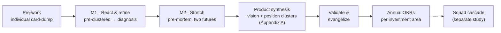

# Long-Term Product Vision for a Data Platform

> Exploring techniques to collaboratively build a long-term (2–3 year) product vision
> for platforms — Engineering and Product together — as the basis for a North Star (or
> OKR set) per investment area. The squad-level cascade is a separate study.

- **Topic:** Product Management
- **Date:** 2026-06-18
- **Status:** draft

## Context

This study explores better techniques to **collaboratively create a long-term product
vision for platforms**, with Engineering and Product working together rather than in
isolation. The central question: how do you run a process that produces a genuine
2–3 year vision — one strong enough to steer many autonomous squads toward annual OKRs
— while keeping the conversation out of short-term, service-activation mode and still
surfacing the real pains and concerns of the people in the room?


## References

Grouped by the role each source plays in the study. Each entry has a link, a brief
explanation, how it can inspire the consolidation of the proposal, and — where it
applies — a caveat on fit.

### Vision & strategy

- **Good Strategy / Bad Strategy — Richard Rumelt** ([Profile Books](https://profilebooks.com/work/good-strategy-bad-strategy/))
  — a real strategy has a *kernel*: diagnosis → guiding policy → coherent action; a
  list of goals is not a strategy.
  *Inspires:* the discipline that keeps the vision from becoming a wish list — every
  investment area should trace back to a diagnosed problem.

- **Product Vision — Marty Cagan / SVPG** ([Product Vision FAQ](https://www.svpg.com/product-vision-faq/), *INSPIRED* / *EMPOWERED*)
  — vision as an inspiring 2–3 year narrative, not a technical doc; empowered squads
  decide the "how".
  *Inspires:* the vision statement format ("what it's like to use our platform in
  2028") and the autonomy-respecting handoff to squads.

- **North Star Framework — Amplitude / John Cutler** ([amplitude.com/north-star](https://amplitude.com/north-star))
  — one metric capturing the value delivered, with 3–5 *input metrics* teams can move.
  *Inspires:* the spine that connects vision → annual KRs → squad initiatives; the
  inputs are what squads own.
  *Caveat:* a single North Star is hard for a platform serving many consumer types
  (squads, risk, analysts) — may need a small metric tree rather than one number.

- **Radical Focus — Christina Wodtke** ([eleganthack.com / Radical Focus](https://eleganthack.com/the-art-of-the-okr/))
  — how vision and a few committed objectives cascade into disciplined OKRs.
  *Inspires:* the explicit handoff from workshop *direction* to staff-distilled annual
  KRs, without turning the workshop itself into an OKR-writing session.

- **Now-Next-Later roadmap — Janna Bastow / ProdPad** ([prodpad.com](https://www.prodpad.com/blog/invented-now-next-later-roadmap/))
  — direction by horizon instead of dates.
  *Inspires:* giving the 11+ squads direction on investment areas without promising
  dates or micromanaging.

### Collaboration & facilitation

- **Pre-mortem — Gary Klein** ([HBR](https://hbr.org/2007/09/performing-a-project-premortem))
  — imagine the project has already failed, then explain why.
  *Inspires:* the Block 1 dynamic to surface the real, unspoken concerns; invert it
  for the success story that feeds the vision.

- **Product Vision Board — Roman Pichler** ([romanpichler.com](https://www.romanpichler.com/tools/product-vision-board/))
  — a single-canvas, workshop-friendly way to capture vision, target group, needs, and
  value (a lighter alternative to a prose narrative for a cross-functional room).
  *Inspires:* an alternative one-page output format for Block 2 — easier to co-create
  live than Cagan's narrative.

- **Wardley Mapping — Simon Wardley** ([learnwardleymapping.com](https://learnwardleymapping.com/))
  — position components on maturity (genesis → commodity) vs. value to the user.
  *Inspires:* deciding where to invest vs. commoditize/buy — separates differentiators
  (governance, self-service) from commodity infra.
  *Caveat:* high facilitation cognitive load; risky to run cold in a 1-day session with
  first-timers — pre-teach it or assign a confident facilitator, or move it to a
  follow-up.

- **Opportunity Solution Tree — Teresa Torres** ([producttalk.org](https://www.producttalk.org/opportunity-solution-tree/))
  — start from a desired outcome, map opportunities (problems) before jumping to
  solutions.
  *Inspires:* the core anti-short-term rule — no solution discussed before the problem
  is mapped; every action gets bounced back to "what long-term problem does this
  attack?"
  *Caveat:* native habitat is *continuous discovery* for a single team against one
  outcome — borrowed here as a principle, not as the vision-setting instrument itself.

### Platform & data-domain context

- **Team Topologies — Skelton & Pais** ([teamtopologies.com](https://teamtopologies.com/))
  — platform teams exist to reduce cognitive load for stream-aligned teams; "thinnest
  viable platform" and platform-as-a-product.
  *Inspires:* framing the platform's purpose around enabling consuming squads, not
  shipping services — the "platform vs. pile of services" distinction.

- **Data as a Product / Data Mesh — Zhamak Dehghani** ([martinfowler.com](https://martinfowler.com/articles/data-monolith-to-mesh.html))
  — treat data domains as products with owners, SLAs, and consumers.
  *Inspires:* data-platform North Star candidates (e.g., time-to-trustworthy-data) and
  what "a platform vs. a pile of services" means in a data context.
  *Caveat:* a contested *architecture* paradigm — use it as domain context for
  outcomes, not as a vision; don't let an architecture pattern pre-decide the strategy.

### National (PT-BR) sources

- **Como construir a visão do produto em 6 etapas — PM3** ([pm3.com.br](https://pm3.com.br/blog/como-construir-a-visao-do-produto/))
  — a 6-step method: understand company/market → understand product → benchmark →
  draft → validate → evangelize.
  *Inspires:* the **benchmarking** pre-work step and the post-workshop **validation +
  evangelization** phase (both missing from the original dynamic).

- **Plataformas de engenharia como produto — PM3** ([pm3.com.br](https://pm3.com.br/blog/plataformas-de-engenharia-como-produto/))
  — platform-as-a-product in a PT-BR context, citing the Thoughtworks Tech Radar and
  developer experience (DX).
  *Inspires:* national reinforcement of the platform-as-product framing and an explicit
  internal-customer / DX lens for the "platform vs. pile of services" question.

- **Do zero ao Data Product: playbook em 7 passos — Target** ([targetsolucoes.com.br](https://targetsolucoes.com.br/do-zero-ao-data-product-um-playbook-estrategico-em-7-passos/))
  — introduces a **Data Product Canvas** (consumers, success metrics, sources, SLOs,
  access interfaces) and starts from the business decision, not the available data.
  *Inspires:* a concrete, data-specific Block 2 artifact — sketch a flagship data
  product per investment area in consumer/SLO/metric terms.

- **Visão de produto: a bússola para decisões estratégicas — Tera** ([somostera.com](https://somostera.com/blog/visao-de-produto-a-bussola-para-decisoes-estrategicas))
  — vision as a compass for decisions; recommends Roman Pichler's Product Vision Board.
  *Inspires:* reinforces the Vision Board as a workshop-friendly artifact (already
  offered above). *Note: client-rendered page — URL resolves but loads via JS.*

## Proposed dynamic (consolidation)

**In-person by default — the only async step is an individual card-dump.** Focus is
fragile and group homework rarely gets done, so *all synthesis and decisions happen in
the room*. The one exception is a solo, private brain-dump before the session (see
**Pre-work** below): it's individual and bounded, so it doesn't suffer the failure mode
of async group work, and it buys ~30 min of room time for the parts that need the room.
Where independent thinking matters (to avoid anchoring on the most senior voice), we
protect it by keeping those submissions private until the room and by having the room
actively re-shape the facilitator's draft clusters.

**Designed for flow, not stations.** The cross-functional room is **2 continuous
movements** that build on a *single growing wall*, instead of a sequence of cold-start
sessions. The room's job is to *surface and align* — diagnosis, fears/ambitions, and
candidate investment areas; **forming the vision and positioning the clusters is a
separate Product-team step afterward** (see *After the room*). The energy mechanics
matter as much as the content:

- **1‑2‑4‑All** ([Liberating Structures](https://www.liberatingstructures.com/1-2-4-all/))
  replaces round-robin read-outs — everyone is always active; sharing is compressed.
- **Gallery walk + silent dot-voting** replaces verbal read-outs — people stand, move,
  read, and vote with dots. Movement is energy, and it converges faster.
- **One evolving artifact** — the same wall is enriched movement after movement, so the
  room sees momentum rather than restarting.
- **Mixed Product+Engineering** in every pair and foursome — collaboration is the point.

**Format:** the cross-functional room is short (~1.5–2h: M1 + M2, plus the pre-work);
the Product-team synthesis happens separately afterward. Use a single sitting, or split
if there's
political tension or many divergent Product/Engineering views. Group: the RT key
positions. One confident facilitator + one scribe. **The single rule, stated up front
and enforced all day:** *no solution may be named until the problem behind it is on the
wall.*

**Flow at a glance:**



The two movements are the cross-functional workshop (in the room). Everything from
*Product synthesis* onward happens *after* and is not facilitated live.

### Pre-work — individual card-dump (async, before the room)

- Each participant **individually** submits cards via a form/Miro on three prompts:
  *(a)* how an internal customer (squad, risk, analyst) would describe the platform in
  its ideal state 3 years out; *(b)* the biggest pains today that will *get worse* if we
  don't act; *(c)* one external data platform they admire, benchmark. Deadline + a personal
  nudge so it actually gets done.
- **Submissions stay private** (not visible to peers) until the room — this preserves
  independent thinking and prevents people anchoring on each other in advance.
- Facilitator + scribe then **merge duplicates, normalize wording, and arrange the cards
  into 5–8 draft "starter clusters"** with deliberately neutral names. Outliers and
  dissent are parked visibly, never discarded.

### Movement 1 — React, refine, diagnose (≈45 min)

The room walks in to a **pre-clustered wall** and spends its energy on judgment, not
generation. The starter clusters are framed as *a draft to be broken*.

- **Orient + the one rule (5 min).** Show the starter clusters; state out loud that they
  are a draft the room is expected to challenge, and *no solution before the problem is
  on the wall.*
- **Challenge & refine — foursomes + gallery walk (20 min).** Move mis-grouped cards,
  rename clusters, and **add anything missing** (this also covers anyone who skipped the
  pre-work). Talking only to resolve overlaps. This active re-shaping is the anchoring
  antidote — the room owns the clusters, not the facilitator's draft. The result is the
  set of **candidate investment areas** (aim for 4–6).
- **Dot-vote (10 min).** The room walks the wall and dot-votes the themes that will hurt
  most over the long run. The facilitator reads the dot pattern aloud.
- **Diagnosis (10 min).** From the top-voted themes, the room writes *one sentence*: the
  single biggest obstacle between us and the 3-year ideal (the **Rumelt kernel**).
  Everything later must trace back to it; the clusters on the wall are the trace-back,
  so no separate gate is needed.

### Movement 2 — Stretch to two futures (≈50 min)

The pre-mortem, run as one storytelling beat that feeds the same wall.

- **Set the scene (3 min).** "It's 2029. We're going to tell two stories of this same
  platform — one where it failed, one where it won."
- **Pairs write both stories back-to-back (22 min).** Each mixed pair writes the
  *failure* headline + its top 3 causes, then immediately the *success* headline + the
  3 things that made it true. One continuous arc, not two exercises.
- **Post + silent scan (15 min).** Pairs post straight onto the wall in two columns;
  the room does a quick silent gallery scan and the facilitator surfaces a few
  recurring patterns — no full verbal read-out.
- **Link to the clusters (10 min).** Mark which success-conditions map to Movement-1
  clusters, and add any new cluster the futures surfaced.

```text
   FAILURE CAUSES            |   SUCCESS CONDITIONS
   (what we fear)            |   (what must be true)
   -------------------------- | --------------------------
   • siloed data, no trust    | • one trusted, governed layer
   • squads reinvent pipelines| • self-service, reused assets
   • platform = ticket queue  | • platform consumed as a product
```

**Workshop output (what the room produced).** The cross-functional room stops here —
it does *not* write the vision. It hands off three things: the **diagnosis** (one
sentence), the **two-futures wall** (failure causes vs. success conditions), and a set
of **4–6 candidate investment areas** the room owns and aligned on.

### After the room (not facilitated live)

- **Product Team synthesis — form the vision & position the areas.** Forming the vision
  and positioning the investment-area clusters is the **Product team's** job, not a
  whole-room activity. Working from the workshop output, Product unifies everything into
  the long-term vision document — the template in **Appendix A** — by:
  - **Writing the vision.** A 2–3 year narrative (Cagan style: "what it's like to build
    on / consume our platform in 2029"), or a
    [Product Vision Board](https://www.romanpichler.com/tools/product-vision-board/).
  - **Setting a goal per investment area.** Give *each* investment area its own
    **North Star metric — or an OKR set** (objective + key results) — the long-term
    outcome that area must move. These per-area goals *are* the point of the exercise;
    a single platform-wide number is not the aim. (How squads then pursue these goals —
    the squad-level cascade — is a **separate study**, out of scope here.)
  - **Positioning the clusters (Wardley).** Place each investment area on *evolution*
    (genesis → commodity) × *value to user* to decide **invest vs. commoditize/buy**.

     ```text
     value to user
       ^
       |  governance        self-service
       |  (differentiate)   (differentiate)
       |
       |        data catalog        compute/infra
       |        (build)             (buy/commoditize)
       +------------------------------------------> evolution
         genesis   custom   product   commodity
     ```

  - **Linking the areas (Now-Next-Later).** Place the investment areas across horizons
    — **no dates** — to give 11+ squads direction without micromanaging.

     ```text
     NOW            |  NEXT           |  LATER
     (in motion)    |  (validated)    |  (needs discovery)
     -------------- | --------------- | ----------------
     governance v1  | self-service    | ML feature store
     trust metrics  | data catalog    | cross-domain mesh
     ```


### Downstream — to detail later

Steps beyond this study's current scope, to be fleshed out in a later iteration:

1. **Define next-year OKRs from the investment areas.** Based on the main areas of
   investment, define the OKRs for the following year.
2. **Squads define their initiatives.** Based on those OKRs, each squad defines the
   initiatives that pursue them.

## Open questions / next iterations

### ▶ Next steps — resume here

- [x] **1. Rework the dynamic for flow & engagement.** ~~Too much pause-and-continue.~~
  Done (2026-06-18): cross-functional room rebuilt as 2 continuous movements (React &
  refine → Stretch) on one growing wall, using 1‑2‑4‑All + gallery walk + dot-voting
  instead of read-outs; M1 fed by an individual card-dump pre-work; vision-forming and
  cluster positioning moved to a separate Product-team synthesis step (Appendix A).
  *Revisit if it still feels heavy after a dry run.*
- [ ] **2. Fix the inverted pre-mortem's short-term bias.** As written it likely surfaces
  *short-term* pains, not the *long-term* pains and concerns we actually want. Find a
  technique (or reframe the pre-mortem) that forces a long-horizon lens.
- [ ] **3. (After the study is finished) Propose tooling for future studies.** Ask Claude
  to propose **agents, skills, or workflows** that support running further studies the
  same way we built this one — so the framework becomes repeatable/natural.
- [ ] **4. Review the 3-year plan template** (see *Appendix A*) — validate it as the
  output artifact.

### Standing open questions

- Decide on format (1 day vs. distributed) and the size of the KP group to calibrate
  timeboxes.
- Possible next artifact: a detailed facilitator guide (minute-by-minute timeboxes,
  per-station questions, ready-to-paste Miro/board templates) and the pre-work forms.

## Appendix A — Long-term vision & annual-plan document template

The workshop above produces *direction*; this is the **output artifact** that captures
it — a living document a platform org can maintain year over year. The skeleton below
is distilled from a real-world data-platform annual vision/plan (internal codenames
removed) and deliberately mirrors the study's chain:
**Diagnosis → Vision → a North Star (or OKR set) per investment area → position/link the
areas (Wardley + Now-Next-Later) → validate/evangelize → annual OKRs per area.**
(The squad-level cascade is a separate study and is not part of this template.)

> Conventions
> - Replace every `[ … ]` placeholder.
> - Each Objective maps to an **investment area**; keep it **outcome-oriented**, opening
>   with *Why* (the diagnosed problem from the diverge session), not a solution.
> - Success Metrics are the area's **North Star / key results** (the outcome the area
>   must move); state a baseline and a target with a date.
> - Initiatives are area-level direction, not dated commitments or squad task lists —
>   pair with Now-Next-Later.

```markdown
# [Platform] — Long-Term Product Vision & Annual Plan ([year])

> Status: draft | in-review | committed
> Owners: [Product lead] · [Engineering lead]
> Last updated: [YYYY-MM-DD] (see Appendix #1 — Changelog)

## 1) Vision and BHAG

- **Vision (2–3 year narrative):** [What it's like to use the platform in [year+2] —
  written from the internal customer's point of view, Cagan style.]
- **Diagnosis (Rumelt kernel):** [The single biggest obstacle this plan attacks.]
- **BHAG:** [One audacious, multi-year goal that the annual objectives ladder up to.]
- **North Star (or small metric tree):** [The metric(s) capturing value delivered,
  e.g. time-to-trustworthy-data] — baseline [x], ambition [y].

## 2) Investment Areas — North Star, Annual OKRs & Initiatives ([year])

### Investment area [N]: [Outcome-framed title]
- **Why:** [The diagnosed problem and the business value of solving it.]
- **North Star (area-level):** [The long-term outcome metric for this area] —
  baseline [x], ambition [y].
- **Annual OKRs ([year]):**
  - **Objective:** [Outcome for this year]
  - **KR:** [Metric] — baseline [x] → target [y] by [date]
  - **KR:** …
- **Initiatives (area-level bets, not squad task lists):**
  - [Initiative — the bet, not a dated deliverable]
  - [Initiative — …]

<!-- Repeat per investment area (the source doc carried four). -->

## 3) Objectives Below the Line & Critical Trade-offs

- **Below the line (not funded this cycle):**
  - [Objective/initiative consciously deferred — and why.]
- **Headcount / capacity asks:** [What the plan above requires; what's not staffed.]
- **Critical trade-offs (including tech debt):**
  - [What we are *choosing not* to do, and the technical/operational debt accepted as
    a result — make the cost explicit.]

## 4) Key Risks to the Plan

- **[Risk — e.g. product-fit / user buy-in]:** [Description] · *Mitigation:* […]
- **[Risk — e.g. maintaining two platforms during migration]:** … · *Mitigation:* …
- **[Risk — e.g. accelerated expansion / changing scope]:** … · *Mitigation:* …

## 5) Appendices

### Appendix #1 — Annual Plan Changelog

| Date         | Editor   | Description                                  |
|--------------|----------|----------------------------------------------|
| [YYYY-MM-DD] | [Author] | [Initial draft]                              |
| [YYYY-MM-DD] | [Author] | [Revised objective N / removed mention of …] |

### Appendix #2 — Tentative Timeline for [legacy platform] Retirement

- [Milestone] — [target quarter] — [status / dependency]
- [Milestone] — …
```
