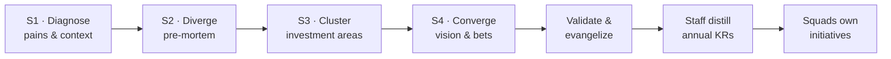

# Long-Term Product Vision for a Data Platform

> Exploring techniques to collaboratively build a long-term (2–3 year) product vision
> for platforms — Engineering and Product together — as the basis for annual OKRs and
> squad-level initiatives.

- **Topic:** Product Management
- **Date:** 2026-06-18
- **Status:** draft

## Context

This study explores better techniques to **collaboratively create a long-term product
vision for platforms**, with Engineering and Product working together rather than in
isolation. The central question: how do you run a process that produces a genuine
2–3 year vision — one strong enough to steer many autonomous squads toward annual OKRs
— while keeping the conversation out of short-term, service-activation mode and still
surfacing the real pains and concerns of the people in the room?


## References

Grouped by the role each source plays in the study. Each entry has a link, a brief
explanation, how it can inspire the consolidation of the proposal, and — where it
applies — a caveat on fit.

### Vision & strategy

- **Good Strategy / Bad Strategy — Richard Rumelt** ([Profile Books](https://profilebooks.com/work/good-strategy-bad-strategy/))
  — a real strategy has a *kernel*: diagnosis → guiding policy → coherent action; a
  list of goals is not a strategy.
  *Inspires:* the discipline that keeps the vision from becoming a wish list — every
  investment area should trace back to a diagnosed problem.

- **Product Vision — Marty Cagan / SVPG** ([Product Vision FAQ](https://www.svpg.com/product-vision-faq/), *INSPIRED* / *EMPOWERED*)
  — vision as an inspiring 2–3 year narrative, not a technical doc; empowered squads
  decide the "how".
  *Inspires:* the vision statement format ("what it's like to use our platform in
  2028") and the autonomy-respecting handoff to squads.

- **North Star Framework — Amplitude / John Cutler** ([amplitude.com/north-star](https://amplitude.com/north-star))
  — one metric capturing the value delivered, with 3–5 *input metrics* teams can move.
  *Inspires:* the spine that connects vision → annual KRs → squad initiatives; the
  inputs are what squads own.
  *Caveat:* a single North Star is hard for a platform serving many consumer types
  (squads, risk, analysts) — may need a small metric tree rather than one number.

- **Radical Focus — Christina Wodtke** ([eleganthack.com / Radical Focus](https://eleganthack.com/the-art-of-the-okr/))
  — how vision and a few committed objectives cascade into disciplined OKRs.
  *Inspires:* the explicit handoff from workshop *direction* to staff-distilled annual
  KRs, without turning the workshop itself into an OKR-writing session.

- **Now-Next-Later roadmap — Janna Bastow / ProdPad** ([prodpad.com](https://www.prodpad.com/blog/invented-now-next-later-roadmap/))
  — direction by horizon instead of dates.
  *Inspires:* giving the 11+ squads direction on investment areas without promising
  dates or micromanaging.

### Collaboration & facilitation

- **Pre-mortem — Gary Klein** ([HBR](https://hbr.org/2007/09/performing-a-project-premortem))
  — imagine the project has already failed, then explain why.
  *Inspires:* the Block 1 dynamic to surface the real, unspoken concerns; invert it
  for the success story that feeds the vision.

- **Product Vision Board — Roman Pichler** ([romanpichler.com](https://www.romanpichler.com/tools/product-vision-board/))
  — a single-canvas, workshop-friendly way to capture vision, target group, needs, and
  value (a lighter alternative to a prose narrative for a cross-functional room).
  *Inspires:* an alternative one-page output format for Block 2 — easier to co-create
  live than Cagan's narrative.

- **Wardley Mapping — Simon Wardley** ([learnwardleymapping.com](https://learnwardleymapping.com/))
  — position components on maturity (genesis → commodity) vs. value to the user.
  *Inspires:* deciding where to invest vs. commoditize/buy — separates differentiators
  (governance, self-service) from commodity infra.
  *Caveat:* high facilitation cognitive load; risky to run cold in a 1-day session with
  first-timers — pre-teach it or assign a confident facilitator, or move it to a
  follow-up.

- **Opportunity Solution Tree — Teresa Torres** ([producttalk.org](https://www.producttalk.org/opportunity-solution-tree/))
  — start from a desired outcome, map opportunities (problems) before jumping to
  solutions.
  *Inspires:* the core anti-short-term rule — no solution discussed before the problem
  is mapped; every action gets bounced back to "what long-term problem does this
  attack?"
  *Caveat:* native habitat is *continuous discovery* for a single team against one
  outcome — borrowed here as a principle, not as the vision-setting instrument itself.

### Platform & data-domain context

- **Team Topologies — Skelton & Pais** ([teamtopologies.com](https://teamtopologies.com/))
  — platform teams exist to reduce cognitive load for stream-aligned teams; "thinnest
  viable platform" and platform-as-a-product.
  *Inspires:* framing the platform's purpose around enabling consuming squads, not
  shipping services — the "platform vs. pile of services" distinction.

- **Data as a Product / Data Mesh — Zhamak Dehghani** ([martinfowler.com](https://martinfowler.com/articles/data-monolith-to-mesh.html))
  — treat data domains as products with owners, SLAs, and consumers.
  *Inspires:* data-platform North Star candidates (e.g., time-to-trustworthy-data) and
  what "a platform vs. a pile of services" means in a data context.
  *Caveat:* a contested *architecture* paradigm — use it as domain context for
  outcomes, not as a vision; don't let an architecture pattern pre-decide the strategy.

### National (PT-BR) sources

- **Como construir a visão do produto em 6 etapas — PM3** ([pm3.com.br](https://pm3.com.br/blog/como-construir-a-visao-do-produto/))
  — a 6-step method: understand company/market → understand product → benchmark →
  draft → validate → evangelize.
  *Inspires:* the **benchmarking** pre-work step and the post-workshop **validation +
  evangelization** phase (both missing from the original dynamic).

- **Plataformas de engenharia como produto — PM3** ([pm3.com.br](https://pm3.com.br/blog/plataformas-de-engenharia-como-produto/))
  — platform-as-a-product in a PT-BR context, citing the Thoughtworks Tech Radar and
  developer experience (DX).
  *Inspires:* national reinforcement of the platform-as-product framing and an explicit
  internal-customer / DX lens for the "platform vs. pile of services" question.

- **Do zero ao Data Product: playbook em 7 passos — Target** ([targetsolucoes.com.br](https://targetsolucoes.com.br/do-zero-ao-data-product-um-playbook-estrategico-em-7-passos/))
  — introduces a **Data Product Canvas** (consumers, success metrics, sources, SLOs,
  access interfaces) and starts from the business decision, not the available data.
  *Inspires:* a concrete, data-specific Block 2 artifact — sketch a flagship data
  product per investment area in consumer/SLO/metric terms.

- **Visão de produto: a bússola para decisões estratégicas — Tera** ([somostera.com](https://somostera.com/blog/visao-de-produto-a-bussola-para-decisoes-estrategicas))
  — vision as a compass for decisions; recommends Roman Pichler's Product Vision Board.
  *Inspires:* reinforces the Vision Board as a workshop-friendly artifact (already
  offered above). *Note: client-rendered page — URL resolves but loads via JS.*

## Proposed dynamic (consolidation)

**Fully in-person. No async pre-work** — focus is fragile and homework rarely gets
done, so every activity happens live in the room. Where independent thinking matters
(to avoid anchoring on the most senior voice), we get it through *silent solo writing*
inside the session, not before it.

**Format:** one intense day (~7h with breaks), or three half-day sessions if there's
political tension or many divergent Product/Engineering views. Group: the RT key
positions (Product + Engineering). One facilitator + one scribe.

**Flow at a glance:**



The first four sessions are the workshop (in the room). The last three happen *after*
and are not facilitated live.

### Session 1 — Diagnose pains & context (90 min)

Goal: get every real concern on the wall and name the core problem — without anyone
proposing solutions yet.

1. **(10 min) Frame the rule.** State out loud: *no solution may be named until the
   problem behind it is on the wall.* Appoint someone to call it out when broken.
2. **(15 min) Silent solo writing.** Everyone, in silence, writes on sticky notes
   (one idea per note), answering three prompts:
   - In its ideal state 3 years out, how would an internal customer (consuming squad,
     risk, analyst) describe our platform?
   - The 3 biggest pains today that will *get worse* if we don't act.
   - One external data platform / bank you admire and what's good about it (benchmark).
3. **(30 min) Round-robin read-out.** Each person reads their notes onto the wall —
   no debate, just clarifying questions. Silent solo first, then share: this is what
   replaces async and still prevents anchoring.
4. **(20 min) Name the diagnosis (Rumelt kernel).** As a group, write *one sentence*:
   the single biggest obstacle standing between us and the 3-year ideal. This is the
   anchor everything later must trace back to.
5. **(15 min) Sanity check.** Does every loud pain connect to the diagnosis? Park
   anything that doesn't.

### Session 2 — Diverge with an inverted pre-mortem (75 min)

Goal: surface the unspoken fears, then flip them into a picture of success.

1. **(5 min) Set the scene.** "It's 2029. The platform initiative has failed badly."
2. **(20 min) Failure headlines in pairs.** Each pair writes the newspaper headline of
   the failure + its top 3 causes. Pairs mix Product with Engineering deliberately.
3. **(15 min) Read-out & cluster causes.** Post all causes; group the recurring ones.
4. **(20 min) Invert it.** "It's 2029 and we were a clear success — what happened?"
   Same pairs, success headline + the 3 things that made it true.
5. **(15 min) Two columns on the wall.** Failure-causes vs. success-conditions, side by
   side. This pairing is the raw material for the vision.

```text
   FAILURE CAUSES            |   SUCCESS CONDITIONS
   (what we fear)            |   (what must be true)
   -------------------------- | --------------------------
   • siloed data, no trust    | • one trusted, governed layer
   • squads reinvent pipelines| • self-service, reused assets
   • platform = ticket queue  | • platform consumed as a product
```

### Session 3 — Cluster into investment areas (45 min)

Goal: turn the wall into 4–6 candidate investment areas.

1. **(20 min) Affinity mapping.** Silently move related notes (pains, success
   conditions, benchmarks) together; see [NN/g affinity method](https://www.nngroup.com/articles/affinity-diagram/).
   Talking starts only to resolve overlaps.
2. **(15 min) Name the clusters.** Give each cluster a short, outcome-oriented name —
   these become **candidate investment areas** (aim for 4–6).
3. **(10 min) Trace-back test.** For each cluster, confirm it attacks the Session-1
   diagnosis. Drop or merge clusters that don't.

### Session 4 — Converge on vision & bets (120 min)

Goal: produce the one-page direction.

1. **(25 min) Metric.** Define a **North Star — or a small metric tree** if one number
   can't serve squads + risk + analysts — plus 3–5 *input metrics* squads can move.
2. **(30 min) Vision statement.** Write a 2–3 year narrative (Cagan style: "what it's
   like to build on / consume our platform in 2029"). For a more workshop-friendly
   canvas, fill a [Product Vision Board](https://www.romanpichler.com/tools/product-vision-board/) instead.
3. **(25 min) Wardley Map of the clusters.** Place each investment area on
   *evolution* (genesis → commodity) × *value to user* to decide **invest vs.
   commoditize/buy**. Facilitator must pre-teach the axes; if the room is cold on
   Wardley, defer this to a follow-up rather than burn time.

   ```text
   value to user
     ^
     |  governance        self-service
     |  (differentiate)   (differentiate)
     |
     |        data catalog        compute/infra
     |        (build)             (buy/commoditize)
     +------------------------------------------> evolution
       genesis   custom   product   commodity
   ```

4. **(20 min, optional · data-specific) Data Product Canvas.** For one flagship data
   product per investment area, sketch consumers, success metric, sources, SLOs, and
   access interface — grounds the vision in real consumer terms.
5. **(20 min) Now-Next-Later.** Place the investment areas across horizons — **no
   dates** — to give 11+ squads direction without micromanaging.

   ```text
   NOW            |  NEXT           |  LATER
   (in motion)    |  (validated)    |  (needs discovery)
   -------------- | --------------- | ----------------
   governance v1  | self-service    | ML feature store
   trust metrics  | data catalog    | cross-domain mesh
   ```

**One-page output of the workshop:** Diagnosis · Vision · North Star (or metric tree)
+ input metrics · 4–6 investment areas · Now-Next-Later per area.

### After the room (not facilitated live)

- **Validate & evangelize (PM3 steps 5–6, Cagan).** Only the KPs were present, but the
  vision must steer 11+ squads who weren't. Walk the draft through squad leads, gather
  reactions, and evangelize it broadly *before* anything is locked.
- **Distill annual KRs.** Staff translate the validated direction into KRs — *after*
  validation, not in the workshop (the workshop produces direction, not OKRs).
- **Squads own initiatives.** Each squad defines the initiatives that move the input
  metrics — they decide the "how".

## Takeaways

- Separate the horizons of conversation and forbid solutions before problems are
  mapped — this is the single biggest lever against short-term drift.
- The inverted pre-mortem is the mechanism to surface the real, unspoken concerns.
- The chain that makes it actionable: **Diagnosis → Vision → North Star (or metric
  tree) + input metrics → investment areas (Now-Next-Later) → validate/evangelize →
  annual KRs → squad initiatives.**
- The workshop produces *direction*; it must be validated and evangelized with the
  squads who weren't in the room *before* OKRs are distilled by staff; squads own the
  "how".

## Open questions / next iterations

### ▶ Next steps — resume here

- [ ] **1. Rework the dynamic for flow & engagement.** It still has too much friction —
  too much pause-and-continue / stop-start. Redesign toward a continuous, engaging flow
  that keeps energy up, instead of a sequence of discrete timeboxed stations.
- [ ] **2. Fix the inverted pre-mortem's short-term bias.** As written it likely surfaces
  *short-term* pains, not the *long-term* pains and concerns we actually want. Find a
  technique (or reframe the pre-mortem) that forces a long-horizon lens.
- [ ] **3. (After the study is finished) Propose tooling for future studies.** Ask Claude
  to propose **agents, skills, or workflows** that support running further studies the
  same way we built this one — so the framework becomes repeatable/natural.
- [ ] **4. Review the 3-year plan template** (see *Appendix A*) — validate it as the
  output artifact.

### Standing open questions

- Decide on format (1 day vs. distributed) and the size of the KP group to calibrate
  timeboxes.
- Possible next artifact: a detailed facilitator guide (minute-by-minute timeboxes,
  per-station questions, ready-to-paste Miro/board templates) and the pre-work forms.

## Appendix A — Long-term vision & annual-plan document template

The workshop above produces *direction*; this is the **output artifact** that captures
it — a living document a platform org can maintain year over year. The skeleton below
is distilled from a real-world data-platform annual vision/plan (internal codenames
removed) and deliberately mirrors the study's chain:
**Diagnosis → Vision → North Star (or metric tree) + input metrics → investment areas
(Now-Next-Later) → validate/evangelize → annual KRs → squad initiatives.**

> Conventions
> - Replace every `[ … ]` placeholder.
> - Keep the document **outcome-oriented**: each Objective opens with *Why* (the
>   diagnosed problem from the diverge session), not a solution.
> - Success Metrics are the *input metrics* squads can actually move; state a baseline
>   and a target with a date.
> - Initiatives are direction, not dated commitments — pair with Now-Next-Later.

```markdown
# [Platform] — Long-Term Product Vision & Annual Plan ([year])

> Status: draft | in-review | committed
> Owners: [Product lead] · [Engineering lead]
> Last updated: [YYYY-MM-DD] (see Appendix #1 — Changelog)

## 1) Vision and BHAG

- **Vision (2–3 year narrative):** [What it's like to use the platform in [year+2] —
  written from the internal customer's point of view, Cagan style.]
- **Diagnosis (Rumelt kernel):** [The single biggest obstacle this plan attacks.]
- **BHAG:** [One audacious, multi-year goal that the annual objectives ladder up to.]
- **North Star (or small metric tree):** [The metric(s) capturing value delivered,
  e.g. time-to-trustworthy-data] — baseline [x], ambition [y].

## 2) Objectives, Success Metrics & Initiatives ([year])

### Objective [N]: [Outcome-framed title]
- **Why:** [The diagnosed problem and the business value of solving it.]
- **Success Metrics (input metrics):**
  - [Metric] — baseline [x] → target [y] by [date]
  - [Metric] — …
- **Initiatives:**
  - [Initiative — the bet, not a dated deliverable]
  - [Initiative — …]

<!-- Repeat per objective (the source doc carried four). -->

## 3) Objectives Below the Line & Critical Trade-offs

- **Below the line (not funded this cycle):**
  - [Objective/initiative consciously deferred — and why.]
- **Headcount / capacity asks:** [What the plan above requires; what's not staffed.]
- **Critical trade-offs (including tech debt):**
  - [What we are *choosing not* to do, and the technical/operational debt accepted as
    a result — make the cost explicit.]

## 4) Key Risks to the Plan

- **[Risk — e.g. product-fit / user buy-in]:** [Description] · *Mitigation:* […]
- **[Risk — e.g. maintaining two platforms during migration]:** … · *Mitigation:* …
- **[Risk — e.g. accelerated expansion / changing scope]:** … · *Mitigation:* …

## 5) Appendices

### Appendix #1 — Annual Plan Changelog

| Date         | Editor   | Description                                  |
|--------------|----------|----------------------------------------------|
| [YYYY-MM-DD] | [Author] | [Initial draft]                              |
| [YYYY-MM-DD] | [Author] | [Revised objective N / removed mention of …] |

### Appendix #2 — Tentative Timeline for [legacy platform] Retirement

- [Milestone] — [target quarter] — [status / dependency]
- [Milestone] — …
```
