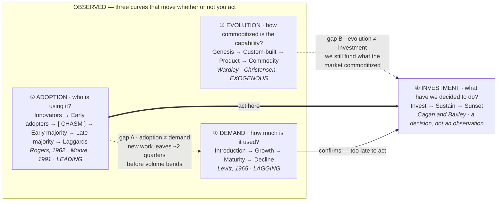
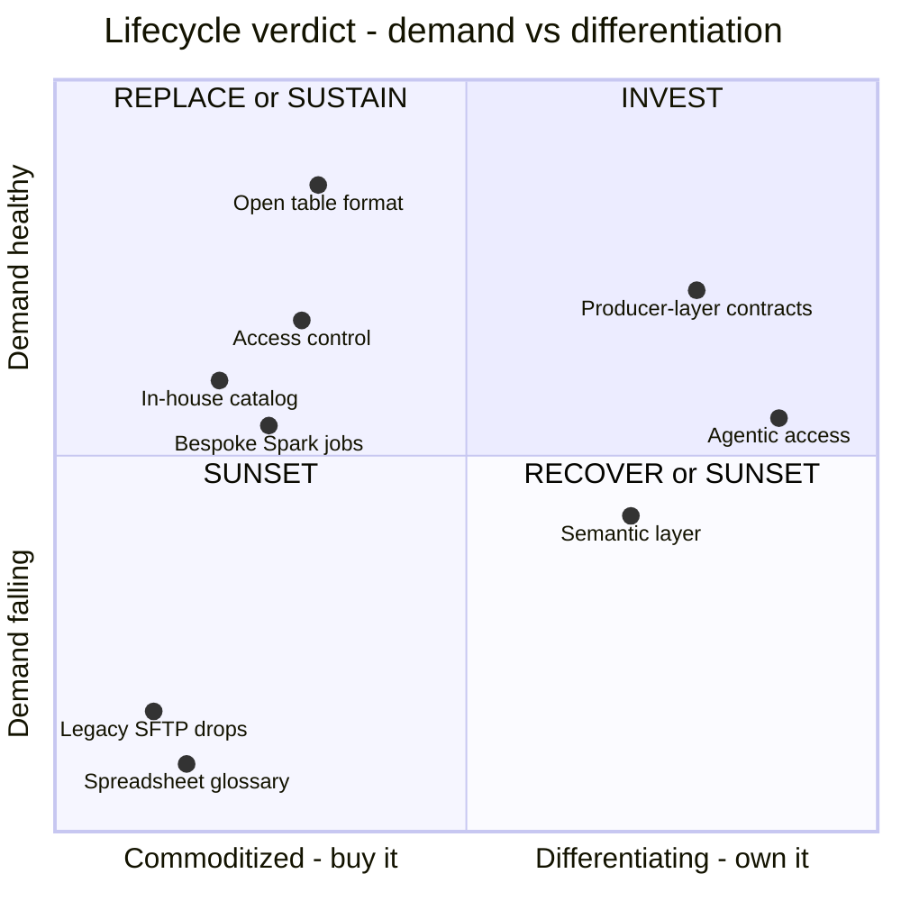

# Product Lifecycle — and How to Map Obsolescence in a Data Platform

> A study of what the product lifecycle actually is (four different curves that get collapsed
> into one), what each phase demands, and a proposed artifact — the **Lifecycle & Obsolescence
> Board** — for placing every capability of a data platform on its curve and deciding what to
> invest in, sustain, replace, or sunset.

- **Topic:** Product Management
- **Date:** 2026-08-28
- **Status:** draft

> *The words written here are all AI-generated, but all the content was critically reviewed
> and validated by me — the use of AI is to accelerate the knowledge searching and narrative
> building.*

## Contents

1. [Context](#context)
2. [The lifecycle is four curves, not one](#1-the-lifecycle-is-four-curves-not-one)
3. [The seven phases, in detail](#2-the-seven-phases-in-detail)
4. [Why an internal data platform distorts the curve](#3-why-an-internal-data-platform-distorts-the-curve)
5. [The four kinds of obsolescence](#4-the-four-kinds-of-obsolescence)
6. [Proposed artifact — the Lifecycle & Obsolescence Board](#5-proposed-artifact--the-lifecycle--obsolescence-board)
7. [Takeaways](#takeaways)
8. [References](#references)

## Context

The question behind this study is narrow and practical: **how do we see, at a glance, where
each piece of our data platform sits on its lifecycle — and which pieces are going obsolete?**

The motivation is that obsolescence in a data platform is rarely announced. Nothing churns.
Revenue does not fall, because there is no revenue. A capability keeps running, keeps costing,
keeps paging someone at 3am, and keeps appearing in the architecture diagram long after the
teams it was built for quietly stopped choosing it. The classic product lifecycle curve —
introduction, growth, maturity, decline — is the right instinct, but applied naively to an
internal platform it reads the wrong signals and reads them too late.

So this study does two things. First, it separates the lifecycle into **the four distinct
curves** that the single textbook S-shape actually collapses together, because obsolescence
almost always shows up as a *divergence between those curves* before it shows up in usage.
Second, it proposes a concrete artifact that makes the placement visible per stage of the data
platform journey, with the signals and thresholds that move an item from one band to the next.

**A note on the evidence.** Two of the primary sources this study leans on hardest —
`svpg.com` (Marty Cagan / Bob Baxley) and `producttalk.org` (Teresa Torres) — were **blocked by
the network egress proxy in this session**. Their arguments below are reconstructed from search
result summaries of those exact articles plus the published books, and the framing is mine.
Treat the direct attributions to *Portfolio Grooming* and *Product Scorecard Stages* as
**paraphrase, not verified quotation**, and re-check them against the source before quoting this
note as authoritative. Everything else was reachable and is cited inline.

## 1. The lifecycle is four curves, not one

The textbook lifecycle — introduction → growth → maturity → decline, popularized by Theodore
Levitt's *Exploit the Product Life Cycle* (HBR, 1965) and still the core of every modern
restatement ([MasterClass](https://www.masterclass.com/articles/product-life-cycle-explained),
[Creately](https://creately.com/guides/product-life-cycle/)) — plots one thing: sales over
time. That is a useful *summary* and a terrible *instrument*, because by the time the sales
curve bends, the decision was already made for you.

What is really happening is four curves running at once, each with its own clock:

The four curves, and the different question each one answers:

1. **The demand curve** — *how much is it used?* Volume, revenue, workloads. **Lagging.** It is
   the curve everyone reports and the last one to move.
2. **The adoption curve** — *who is using it, and where are they in the population?* Rogers'
   diffusion categories (innovators 2.5%, early adopters 13.5%, early majority 34%, late
   majority 34%, laggards 16% —
   [Rogers curve](https://umbrex.com/resources/frameworks/strategy-frameworks/rogers-diffusion-of-innovations-curve/)),
   with Moore's chasm cut into it between the early adopters and the pragmatic early majority
   ([Crossing the Chasm](https://geoffreyamoore.com/book/crossing-the-chasm/)). **Leading.**
   Composition changes before volume does.
3. **The evolution curve** — *how commoditized is the underlying capability?* Wardley's
   genesis → custom-built → product → commodity
   ([evolution stages](https://www.wardleymaps.com/glossary/evolution-stages)), which is the
   market-level version of Christensen's S-curve where a new entrant's technology improves
   until it is *good enough* and takes the incumbent's ground
   ([The Innovator's Dilemma](https://en.wikipedia.org/wiki/The_Innovator%27s_Dilemma)).
   **Exogenous.** This curve moves whether or not you do anything, which is exactly what makes
   it dangerous.
4. **The investment curve** — *what have we decided to do about it?* Cagan and Baxley's
   portfolio grooming: every effort is either an area of **active investment**, reduced to
   **sustaining** to free up people for active investments, or **phased out** because it is no
   longer contributing ([Portfolio Grooming](https://www.svpg.com/portfolio-grooming/)). This
   is the only one of the four that is a *decision* rather than an observation.

**The central claim of this study: obsolescence lives in the gaps between these curves, not on
any one of them.** Three gaps are worth naming, because each is a different kind of trouble:

- **Adoption ≠ demand.** Usage is flat but every *new* workload is choosing something else. The
  demand curve will not show this for two to four quarters. This is the single most valuable
  early signal an internal platform has, and §5 turns it into a measured field
  (*new-workload share*).
- **Evolution ≠ investment.** You are still actively investing in something the market has
  commoditized underneath you. You are now paying to maintain a worse version of a thing you
  could buy — Christensen's dilemma, arriving as a build-vs-buy question you did not schedule.
- **Adoption ≠ evolution.** A capability sitting at *commodity* on the evolution curve but still
  stuck pre-chasm on adoption is not "early" — it is failing, and the commodity alternative is
  what your teams will reach for while you decide.

Two supporting instruments are worth keeping nearby, because they are widely understood and
map cleanly onto the curves above. Gartner's Hype Cycle — innovation trigger, peak of inflated
expectations, trough of disillusionment, slope of enlightenment, plateau of productivity
([methodology](https://www.gartner.com/en/research/methodologies/gartner-hype-cycle)) — is a
*sentiment* overlay on the evolution curve, useful for arguing against adopting something at
its peak. And Thoughtworks' Technology Radar rings — adopt, trial, assess, **hold** — are the
industry's most legible way to publish an investment posture, where "hold" means *don't start
anything new with this, though there's no harm in existing projects*
([Radar FAQ](https://www.thoughtworks.com/en-us/radar/faq)). That definition of *hold* is
almost exactly Cagan's *sustaining*, arrived at from the other direction, and §5 borrows it.

## 2. The seven phases, in detail

Merging the four curves gives seven phases with distinct physics. The classic four are noted in
each heading so the mapping back is obvious.

### Phase 1 — Incubation *(pre-"Introduction")*

- **What it is:** the capability does not exist as a product yet. There is a spike, a POC, or
  one team's script. No commitment has been made.
- **Dominant question:** *is there a real, valuable, repeated problem here?* Cagan's four risks
  — value, usability, feasibility, business viability — are all open, and value is the one that
  kills you.
- **Discovery posture (Torres):** maximum. This is where the opportunity solution tree earns
  its keep: a clear outcome at the top, opportunities (unmet needs) beneath it, then candidate
  solutions, then assumption tests — and the rule that you *test the assumptions your idea
  depends on, not the idea itself*
  ([OST overview](https://www.chameleon.io/blog/opportunity-solution-tree)).
- **Investment posture:** small, explicitly time-boxed, explicitly killable.
- **Failure mode:** promoting a POC to "platform capability" because it worked once, for one
  team, in one shape. Every zombie in §4 started here.

### Phase 2 — Early adoption *(Introduction)*

- **What it is:** first real users. In Rogers' terms the innovators and early adopters — the
  2.5% + 13.5% who are *venturesome* and buy into the vision, and who will tolerate rough edges
  and do integration work themselves.
- **Dominant question:** *does this work outside the room it was built in?*
- **What to watch:** whether the users are enthusiasts or pragmatists. Early adopters
  self-select and forgive; their satisfaction is real evidence about the problem and almost no
  evidence about the solution's readiness for everyone else.
- **Investment posture:** invest, but on the *whole-product* gap, not on more features.
- **Failure mode:** reading early-adopter delight as product/market fit and scaling headcount
  against it. This is the setup for Phase 3.

### Phase 3 — The chasm *(the gap the classic curve doesn't draw)*

- **What it is:** Moore's gap between the visionaries who bought the vision and the **pragmatists
  of the early majority** who want it *proven first* — in use cases they themselves have, with
  reference customers they know and trust
  ([Crossing the Chasm summary](https://www.productcompass.pm/p/crossing-the-chasm)). The early
  adopters' endorsement carries no weight with them, which is why the curve breaks here rather
  than bending.
- **Dominant question:** *what is the complete solution for one specific segment?*
- **The two moves Moore prescribes:**
  - **The beachhead** — pick one narrow segment and dominate it, rather than spreading thin
    across every interested party.
  - **The whole product** — the core thing plus everything required to actually solve the
    problem end to end: support, integrations, documentation, training, migration path. The
    pragmatist buys the whole product or does not buy.
- **Investment posture:** invest — but almost entirely in completeness, references, and
  reducing the adopter's own integration burden.
- **Failure mode:** the classic one is adding features for the visionaries while the pragmatists
  wait for the whole product that never arrives. The internal-platform variant is **substituting
  a mandate for the whole product** (§3).

### Phase 4 — Scaling *(Growth)*

- **What it is:** the beachhead falls, and adjacent segments fall with it — Moore's **bowling
  alley**, where knocking down one pin knocks down the neighbours — potentially tipping into the
  **tornado** of mass adoption
  ([Inside the Tornado](https://www.catchthetornado.com/blog/inside-the-tornado-book)).
- **Dominant question:** *can we take the ground fast enough, and will it hold?*
- **The reversal to expect:** Moore's sharpest point is that when a market tips, *the rules
  reverse* — the niche-focused, customer-intimate playbook that won the early innings becomes
  the one that loses the championship. Standardization, throughput, and shipping beat intimacy
  and bespoke work.
- **Investment posture:** heaviest investment of the whole curve. This is where under-investing
  is most expensive, because share taken here is what you live on for years.
- **Failure mode:** staying artisanal — hand-holding each new adopter — while demand outruns the
  team, so adoption stalls at exactly the moment it was cheapest to win.

### Phase 5 — Standard *(Maturity)*

- **What it is:** the default choice. Peak share, peak leverage, and the point at which returns
  on new features start diminishing.
- **Dominant question:** *is this still the right default, and what is it costing to keep?*
- **Discovery posture:** this is where teams wrongly stop doing discovery. Torres's habit —
  continuous, at-least-weekly contact with users by the product trio, tied to a clear outcome
  ([Continuous Discovery Habits](https://www.shortform.com/blog/teresa-torres-opportunity-solution-tree/))
  — matters *more* here, not less, because maturity is where the leading indicators of decline
  first appear and where nobody is looking for them.
- **Investment posture:** Cagan and Baxley's **sustaining** level is defined precisely for this
  phase: keep the product operating at the level that holds its KPIs steady and delivers its
  return — fix the big bugs, add nothing new except what compliance or law forces — and move the
  freed capacity to areas of active investment.
- **Failure mode:** treating "sustaining" as an insult and defending headcount with a roadmap of
  features nobody asked for. The opposite failure is real too: cutting to sustaining while the
  thing is still the growth engine.

### Phase 6 — Decline *(Decline)*

- **What it is:** the curve bends. Note that decline has two very different causes, and they
  need different responses: **demand fell** (the problem changed or went away) or **the ground
  moved** (something commoditized underneath you — §4).
- **Dominant question:** *is this recoverable, or is it terminal?*
- **What to watch:** the leading signals from §1 — new-workload share, workaround rate,
  cost-to-serve per active consumer — not the volume number.
- **Investment posture:** decide explicitly, on a date. Recoverable → one bounded investment
  with a defined outcome and a hard stop. Terminal → move to Phase 7 and *say so publicly*.
- **Failure mode:** the ambiguous middle — not enough investment to recover, too much to be
  honest about sustaining. Cagan and Baxley name the cause plainly: efforts that **continue
  mainly due to inertia** in companies that have been around a while.

### Phase 7 — Sunset *(after the classic curve ends)*

- **What it is:** deliberate retirement. Deprecate → migrate → decommission → archive.
- **Dominant question:** *what does every consumer need in order to leave, and by when?*
- **How to do it:** the practice is well-established and the failure mode is well-documented — a
  30-day deprecation window on a developer-facing capability is a trust-destroying move, and
  best-in-class teams invest as much in sunset communication as in a launch
  ([deprecation practice](https://slicedbrand.com/insights/posts/product-deprecation-pr-how-to-communicate-a-feature-sunset-without-losing-customer-trust)).
  For data specifically, Dehghani's data-as-a-product principle already carries the machinery:
  a data product has a lifecycle of **versioned changes, deprecation windows, and sunset**
  ([Data Mesh](https://www.thoughtworks.com/en-us/insights/books/data-mesh)).
- **Investment posture:** sunset is *funded work*, not an absence of work. The migration is the
  deliverable; the decommission is the definition of done.
- **Failure mode:** announcing a deprecation without funding the migration, which produces a
  capability that is officially dead and operationally immortal.

## 3. Why an internal data platform distorts the curve

Everything above was written for products sold to a market. A data platform is bought by nobody
and used by colleagues, and four things break as a result. This section is the reason the
artifact in §5 measures what it measures.

**There is no price signal, so demand is never revealed.** In a market, a customer who stops
valuing something stops paying, and the demand curve moves. Internally, the cost sits in a
central budget, consumption is free at the point of use, and the *only* thing the volume metric
tells you is that pipelines someone wrote two years ago are still running. Usage is not demand;
it is often just inertia with a scheduler attached.

**Users are captive, so decline shows up as workarounds instead of churn.** A team that has lost
faith in a platform capability usually cannot leave. So they stay, and route around: a shadow
pipeline, a direct warehouse query bypassing the semantic layer, a copy of the dataset in a
team-owned bucket, an exception request against the governance standard. **The workaround rate
is the internal equivalent of churn**, and unlike churn it is observable long before the volume
metric moves.

**The chasm still exists, and a mandate cannot cross it.** This is the load-bearing point. The
temptation with an internal platform is to skip Phase 3 by decree — *everyone must use the new
ingestion framework* — and the result is compliance, not adoption: teams do the minimum, keep
their old path warm, and the whole-product gap that caused the chasm never gets closed. Evan
Bottcher's definition of a platform is the standing correction here — *a foundation of
self-service APIs, tools, services, knowledge and support, arranged as a compelling internal
product* — and the point that platforms **must be compelling and cannot stand on a mandate
alone** ([platform prerequisites](https://martinfowler.com/articles/platform-prerequisites.html)),
later codified in Team Topologies along with the *thinnest viable platform*. A mandated
capability with a high workaround rate is pre-chasm wearing a Phase-5 badge, and §5 is designed
to expose exactly that.

**The evolution curve is set by a vendor market you do not control.** This is the dominant
obsolescence driver for data platforms specifically, and it has nothing to do with your users.
The custom-built thing you were right to build in 2023 gets absorbed into a managed product in
2026 — table format handling, catalog, lineage, orchestration, CDC, semantic layers have all
been moving right along Wardley's axis at speed. Your adoption curve can look perfectly healthy
while the evolution curve quietly reclassifies your differentiated capability as undifferentiated
heavy lifting. Nothing in your usage telemetry will ever tell you this. It has to be reviewed
deliberately, on a cadence, against the outside market — which is why *evolution stage* is a
first-class column in §5 rather than a footnote.

## 4. The four kinds of obsolescence

"Obsolete" is used for four different conditions that need four different decisions. Separating
them is most of the value of the board.

| # | Kind | What happened | Diagnostic signal | Right response |
|---|------|---------------|-------------------|----------------|
| 1 | **Demand obsolescence** | The problem changed or went away. Fewer people need this at all. | Active consumers *and* new-workload share both falling; no viable alternative gaining. | Sunset. There is nothing to migrate to because there is nothing to do. |
| 2 | **Technology obsolescence** | The capability commoditized. A managed or open alternative now covers the use case at lower total cost. | Demand steady, but evolution stage has moved to *product*/*commodity* and new workloads are choosing the alternative. | **Replace**, then sunset the old. This is a migration project, not a shutdown. |
| 3 | **Architectural obsolescence** | The thing still works but no longer fits the platform's contracts, governance model, or layering. It survives on exceptions. | Standing exception requests; cannot satisfy current contract/lineage/access requirements without special-casing. | Either invest to bring it into contract, or sunset. Never leave it on a permanent exception. |
| 4 | **Orphaned** | Nobody owns it. It has consumers and no team, no on-call, no roadmap. | No named owner; changes only happen when it breaks. | Assign an owner *or* sunset — deciding which requires kinds 1–3 above. Never leave it in this state. |

Kind 2 is the one this study exists for, and the one the classic lifecycle curve is worst at
detecting: **every demand-side metric looks healthy right up until the migration becomes
urgent and expensive.** Kind 4 is not a lifecycle stage at all — it is an ownership failure that
masquerades as one, and it is worth surfacing separately because a board full of orphans is a
different problem from a board full of declining products.

## 5. Proposed artifact — the Lifecycle & Obsolescence Board

The artifact has **three parts**, in order: an *inventory* of what exists and how healthy it is
(§5.1–5.3), a *board* placing each item on its curve per journey stage — this is "the curve"
made visible (§5.4) — and a *verdict* saying what we are doing about it, with a date (§5.5).
The board is the part you put on a wall; the other two are what make it honest.

### 5.1 Unit of analysis

One row per **platform capability a consumer can choose or refuse** — not per repo, per service,
or per tool. The test is: *could a team plausibly solve this need another way?* If yes, it is a
capability and it belongs on the board with its own curve. If no, it is an implementation detail
of one. This keeps the board at roughly 20–40 rows for a mid-size platform, which is the size a
group of people can actually review in an hour.

Each capability is anchored to one **journey stage** of the platform:

| # | Journey stage | What it covers |
|---|---------------|----------------|
| J1 | **Produce & Ingest** | Source contracts, CDC, batch and streaming ingestion, the producer boundary |
| J2 | **Store & Format** | Object storage, open table formats, technical catalog |
| J3 | **Transform & Model** | Medallion layers, transformation framework, orchestration |
| J4 | **Govern & Contract** | Data contracts, quality, lineage, access control, cataloguing |
| J5 | **Serve & Consume** | Semantic layer, query engines, BI, data APIs |
| J6 | **Activate** | ML features, reverse ETL, agentic access |

### 5.2 The record — fields per capability

| Field | Type | Why it is here |
|-------|------|----------------|
| Capability | text | The thing a consumer chooses |
| Journey stage | J1–J6 | Where it sits in the platform journey |
| Owner | team + named person | Empty owner ⇒ **orphaned** (§4, kind 4), regardless of everything else |
| **Lifecycle phase** | P1–P7 (§2) | The placement — the demand + adoption read |
| **Evolution stage** | genesis / custom / product / commodity | The market read, reviewed against the outside, not telemetry |
| **Investment posture** | invest / sustain / sunset | The decision (Cagan & Baxley); publishable as Radar rings — *adopt / trial / hold* |
| Obsolescence score | 0–16 (§5.3) | The measured risk |
| Obsolescence kind | 1–4 or none (§4) | Determines which response applies |
| Last discovery contact | date | Torres's habit, made auditable — a Phase-5 capability nobody has talked to a user about in six months is not being managed |
| Verdict + review date | text + date | No row leaves the board without both |

### 5.3 The obsolescence score — eight signals

Each signal scores **0 (healthy) / 1 (watch) / 2 (red)**, for a total of 0–16 across eight
signals. The first two are the leading indicators and carry the most weight in practice; the
rest explain *why*.

| # | Signal | How to measure | Watch (1) | Red (2) |
|---|--------|----------------|-----------|---------|
| S1 | **New-workload share** | Of new workloads started in the last 90 days in this journey stage, the % that chose this capability | 10–30% | < 10% |
| S2 | **Workaround rate** | Consumers with a documented bypass, shadow path, or standing exception, ÷ total consumers | 10–25% | > 25% |
| S3 | **Active consumers trend** | Distinct teams with real use, quarter over quarter | flat, 2 quarters | falling, 2 quarters |
| S4 | **Commoditization gap** | Does a managed/open alternative cover ≥ 80% of the use case? | emerging | yes, and adopted elsewhere in the org |
| S5 | **Cost-to-serve** | Run cost ÷ active consumers, trend | rising, usage flat | rising, usage falling |
| S6 | **Toil load** | Incidents + support requests per active consumer, trend | rising | rising and on-call is degraded |
| S7 | **Contract fit** | Satisfies current governance/contract/lineage standards? | with exceptions | only with permanent exceptions |
| S8 | **Ownership** | Named owner with on-call and roadmap | owner but no roadmap | no named owner |

**S1 and S2 are the ones to instrument first.** They are the only two that move *before* the
demand curve, they are exactly the internal substitutes for "new sales" and "churn," and
together they detect kind-2 obsolescence — the expensive kind — roughly two to four quarters
earlier than usage volume will.

### 5.4 The board — the curve, per journey stage

This is the visual deliverable. Rows are the journey stages; columns are the lifecycle phases.
Each capability is placed in exactly one cell, annotated with its obsolescence score. The shape
of each row *is* the curve for that stage of the platform journey.

| Journey stage | P1 Incubation | P2 Early adoption | P3 Chasm | P4 Scaling | P5 Standard | P6 Decline | P7 Sunset |
|---|---|---|---|---|---|---|---|
| **J1** Produce & Ingest | | | Producer-layer contracts `4` | Managed CDC `1` | Batch ingestion fwk `2` | Legacy SFTP drops `11` | Hand-rolled connectors `13` |
| **J2** Store & Format | | Iceberg v3 features `2` | | Open table format `3` | Object storage `0` | Team-owned Parquet zones `9` | Legacy warehouse tier `14` |
| **J3** Transform & Model | | | | Orchestrator (managed) `2` | Transformation fwk `1` | Bespoke Spark jobs `10` | Cron-driven scripts `12` |
| **J4** Govern & Contract | Policy-as-code `—` | Contract enforcement `3` | Lineage `6` | | Access control `2` | In-house catalog `12` | Spreadsheet glossary `15` |
| **J5** Serve & Consume | | | Semantic layer `5` | Query engine `2` | BI platform `3` | Extract-based dashboards `10` | |
| **J6** Activate | Agentic access `—` | Feature serving `3` | Reverse ETL `6` | | | | |

*Illustrative placements — the numbers are example obsolescence scores (0–16), not measurements
from any real platform. `—` marks pre-instrumentation items where a score would be false
precision.*

Three things this view makes visible that a list cannot:

- **Rows with nothing left of P5** are stages where the platform has stopped renewing itself —
  everything is mature or declining, and the next commoditization wave will land on all of it at
  once. J2 above is the mild case; a row with entries *only* in P5–P7 is the alarm.
- **High scores sitting in P4–P5** are the kind-2 obsolescence trap: officially healthy, quietly
  losing new work. The in-house catalog at `12` in P6 is already understood; a `9` sitting in P5
  is the one nobody has noticed yet.
- **Rows crowded on the left** (J6 here) are stages carrying real delivery risk, not just
  novelty — several unproven capabilities and no default yet, which means consumers are choosing
  for themselves and the chasm is ahead, not behind.

### 5.5 The verdict — from score to decision

Placement and score feed one 2×2, which produces the investment posture. The X axis is the
**evolution read** (is this still differentiating for us, or has it commoditized?); the Y axis
is the **demand read** (are consumers still choosing it?).

The top-left quadrant carries two different situations that share one answer — *use what the
market standardized*. If you are already on the commodity (open table format, access control
above), the verdict is **sustain**. If you are running a home-grown equivalent (the in-house
catalog, the bespoke Spark jobs), the verdict is **replace, then sunset the old** — this is
kind-2 obsolescence from §4, and it is the quadrant where healthy demand hides the most
expensive decision on the board.

The decision rules, in the order they are applied:

1. **No named owner → stop.** Assign an owner or open a sunset decision. An orphan cannot be
   scored honestly, because there is nobody to ask.
2. **Score ≥ 10 → the verdict must be `replace` or `sunset`**, with a migration owner and a
   decommission date. Not "monitor."
3. **Score 5–9 → a bounded decision with a hard stop.** One quarter, one named outcome, and a
   pre-agreed decision at the end. This is the band where Cagan and Baxley's *inertia* does its
   damage, so the stop date is the control.
4. **Score ≤ 4 in P5 → `sustain`**, explicitly: hold the KPIs, fix the big bugs, ship nothing
   new except compliance, and move the freed capacity to a P3/P4 row. Publish it as *hold* on
   the internal radar so nobody starts new work against it by accident.
5. **P3 with a mandate in place → treat as pre-chasm regardless of usage**, and invest in the
   whole product. A high S2 (workaround rate) alongside a mandate is the tell (§3).

### 5.6 Cadence and ownership

The board is worthless as a one-off audit and valuable as a standing instrument:

- **Quarterly review**, one hour, platform leadership plus the capability owners. Every row gets
  a verdict and a review date; nothing is allowed to leave without both.
- **S1 and S2 instrumented and reported monthly** — these are the leading signals and they are
  the reason the review has anything new to discuss.
- **Evolution stage re-read against the outside market once per quarter**, deliberately. This is
  the only column that cannot be derived from internal telemetry, and the only one that will
  never update itself.
- **Sunsets are funded work** with a migration owner, a deprecation window sized to the
  consumers' release cycles (not to your convenience), and a decommission date on the roadmap.
- **Publish the postures** as radar rings — *adopt / trial / hold* — so the board changes what
  teams start, not just what leadership knows.

## Takeaways

- **The single lifecycle curve is a summary, not an instrument.** Demand, adoption, evolution,
  and investment run on four different clocks; obsolescence appears in the gaps between them
  well before it appears on any one of them.
- **The chasm is the phase the classic curve omits and the one internal platforms most reliably
  fail.** A mandate produces compliance, not adoption — and a mandated capability with a high
  workaround rate is pre-chasm no matter what its usage says.
- **Inside a platform, workaround rate is churn and new-workload share is new sales.** They are
  the two signals worth instrumenting first, because they are the only ones that lead the volume
  metric.
- **Technology obsolescence is the expensive kind and the hardest to see**, because every
  demand-side metric stays healthy while the ground commoditizes underneath you. It can only be
  caught by reviewing the outside market on a cadence.
- **"Sustaining" is a legitimate, deliberate posture — the ambiguous middle is not.** Efforts
  that continue on inertia are the real cost, and a hard stop date on the 5–9 score band is the
  control that removes them.
- **Sunset is funded work.** A deprecation without a funded migration produces a capability that
  is officially dead and operationally immortal.

## References

- **Portfolio Grooming — Marty Cagan & Bob Baxley / SVPG** ([svpg.com](https://www.svpg.com/portfolio-grooming/))
  — every product effort is either an area of active investment, reduced to *sustaining* to free
  capacity for active investments, or phased out; sustaining means holding KPIs steady, fixing
  big bugs, and adding nothing new beyond compliance. Names *inertia* as the reason dead efforts
  continue in older companies.
  *Inspires:* the investment curve (§1, curve ④), the sustaining posture in Phase 5, and
  decision rules 3–4 in §5.5. **Source blocked this session — paraphrased from search summaries.**

- **Product Scorecard Stages — Marty Cagan / SVPG** ([svpg.com](https://www.svpg.com/product-scorecard-stages/))
  — a product's scorecard should be *stage-relevant*: what you measure depends on where the
  product is in its lifecycle, not on a fixed metric set.
  *Inspires:* the per-phase "what to watch" in §2 and the decision to score signals rather than
  compare all capabilities on one metric. **Source blocked this session — paraphrased.**

- **Crossing the Chasm — Geoffrey A. Moore** ([geoffreyamoore.com](https://geoffreyamoore.com/book/crossing-the-chasm/),
  [summary](https://www.productcompass.pm/p/crossing-the-chasm))
  — the chasm between visionary early adopters and pragmatists who want proof from references
  they know; the *beachhead* segment and the *whole product* as the two moves that cross it.
  *Inspires:* Phase 3 in its entirety, the mandate-cannot-cross-the-chasm argument in §3, and
  decision rule 5.

- **Inside the Tornado — Geoffrey A. Moore** ([summary](https://www.catchthetornado.com/blog/inside-the-tornado-book))
  — the post-chasm phases: bowling alley, tornado, Main Street — and the reversal where the
  niche-intimate playbook that won the early market becomes the one that loses the mass market.
  *Inspires:* Phase 4's "reversal to expect" and its failure mode.

- **Continuous Discovery Habits — Teresa Torres** ([producttalk.org](https://www.producttalk.org/),
  [OST overview](https://www.chameleon.io/blog/opportunity-solution-tree))
  — the product trio in weekly contact with customers; the opportunity solution tree linking
  outcome → opportunities → solutions → assumption tests; *test the assumptions your idea
  depends on, not the idea*; outcomes over outputs, with product outcomes as the leading
  indicator of lagging business outcomes.
  *Inspires:* the discovery posture in Phases 1 and 5, the argument that maturity is where
  discovery is wrongly abandoned, and the *last discovery contact* field in §5.2.
  **producttalk.org blocked this session — paraphrased from summaries and the book.**

- **Diffusion of Innovations — Everett M. Rogers** ([curve explained](https://umbrex.com/resources/frameworks/strategy-frameworks/rogers-diffusion-of-innovations-curve/))
  — the adopter categories and their proportions (2.5 / 13.5 / 34 / 34 / 16) that Moore's chasm
  is cut into.
  *Inspires:* the adoption curve (§1, curve ②) and the composition-before-volume argument.

- **The Innovator's Dilemma — Clayton Christensen** ([overview](https://en.wikipedia.org/wiki/The_Innovator%27s_Dilemma))
  — value follows an S-curve; incumbents win at sustaining innovation and lose to disruptive
  entrants whose technology becomes *good enough*, precisely because they listen to their best
  customers.
  *Inspires:* kind-2 (technology) obsolescence in §4 and why healthy demand metrics conceal it.

- **Wardley Maps — Simon Wardley** ([evolution stages](https://www.wardleymaps.com/glossary/evolution-stages))
  — components evolve genesis → custom-built → product → commodity; invest where you
  differentiate, buy where the market has standardized.
  *Inspires:* the evolution curve (§1, curve ③), the *evolution stage* field, and the X axis of
  the verdict quadrant.

- **Hype Cycle methodology — Gartner** ([gartner.com](https://www.gartner.com/en/research/methodologies/gartner-hype-cycle))
  — innovation trigger, peak of inflated expectations, trough of disillusionment, slope of
  enlightenment, plateau of productivity.
  *Inspires:* the sentiment overlay noted at the end of §1 — useful against adopting at peak hype.

- **Technology Radar — Thoughtworks** ([radar FAQ](https://www.thoughtworks.com/en-us/radar/faq))
  — the adopt / trial / assess / **hold** rings, where hold means "don't start anything new with
  this, no harm in existing projects."
  *Inspires:* publishing investment postures as rings (§5.2, §5.6) — *hold* is Cagan's
  *sustaining* stated for consumers rather than for the portfolio.

- **What I Talk About When I Talk About Platforms — Evan Bottcher, and Team Topologies —
  Skelton & Pais** ([platform prerequisites](https://martinfowler.com/articles/platform-prerequisites.html))
  — a platform is self-service APIs, tools, services, knowledge and support arranged as a
  *compelling internal product*; it must be compelling and cannot stand on a mandate alone.
  *Inspires:* §3 in full, particularly the mandate-versus-adoption argument and the workaround
  rate as the internal substitute for churn.

- **Data Mesh — Zhamak Dehghani** ([thoughtworks.com](https://www.thoughtworks.com/en-us/insights/books/data-mesh))
  — data as a product, owned by a domain, with a real lifecycle: versioned changes, deprecation
  windows, sunset.
  *Inspires:* treating platform capabilities as products with owners (§5.1–5.2) and the sunset
  machinery in Phase 7.

- **Product deprecation and sunset communication** ([SlicedBrand](https://slicedbrand.com/insights/posts/product-deprecation-pr-how-to-communicate-a-feature-sunset-without-losing-customer-trust))
  — short deprecation windows on developer-facing capabilities destroy trust; sunset
  communication deserves launch-level investment.
  *Inspires:* Phase 7's deprecation-window guidance and the "sunsets are funded work" rule.

- **Exploit the Product Life Cycle — Theodore Levitt, HBR (1965)**; modern restatements at
  [MasterClass](https://www.masterclass.com/articles/product-life-cycle-explained) and
  [Creately](https://creately.com/guides/product-life-cycle/)
  — the canonical introduction / growth / maturity / decline framing.
  *Inspires:* the demand curve (§1, curve ①) and the classic-stage mapping in each Phase heading.

### Related studies in this repo

- [Movements in Data-Layer Architecture — a 2026 market scan](../data-platform/producer-layer-and-contract-gated-democratization.md)
  — the layer vocabulary (producer layer, contracts, semantic layer) used for the J1–J6 journey
  stages.
- [Data Platforms in 2029](../data-platform/data-platforms-in-2029.md) — the forward view of
  which capabilities are commoditizing, which is the input the evolution-stage column needs.
- [Product Development Roles and Responsibilities](./product-roles-and-tracks-map.md) — who owns
  the verdict; the PM/TL/CX convergence that a quarterly board review depends on.
