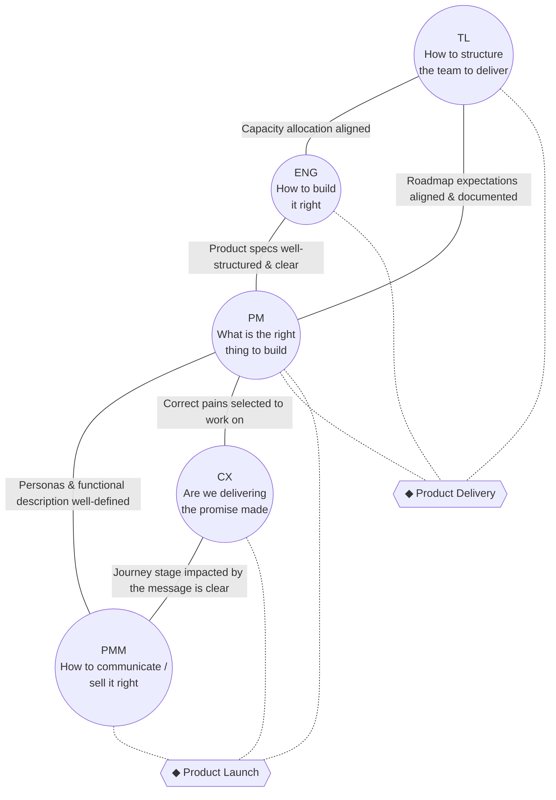

# Product Development Roles and Responsibilities

> A quick-reference roles-and-responsibilities guide for a product discovery and delivery
> structure: who owns what, how the key roles correlate, and where they depend on each other.

- **Topic:** Product Management
- **Date:** 2026-07-09
- **Status:** draft

> *The words written here are all AI-generated, but all the content was critically reviewed
> and validated by me — the use of AI is to accelerate the knowledge searching and narrative
> building.*

## Context

This study is a **roles-and-responsibilities reference** for the key positions in a product
development team — Product Manager, Tech Lead, Engineering, Design/CX, and Product
Marketing — operating within a **product discovery and delivery structure**. It exists to
let anyone on the team quickly answer two questions: *"what is my role actually accountable
for (and not for)?"* and *"whose work does mine depend on?"*

## Quick correlation between the roles

Five roles, each anchored to one core question, connected by the artifact that keeps each
pair aligned. Two points mark where three roles must converge at once: **Product Delivery**
(Engineering ships it) and **Product Launch** (the market receives it).

- **Product Delivery** = TL + ENG + PM converge: the team is structured, capacity is
  allocated, specs are clear, and the roadmap is agreed — the thing gets shipped.
- **Product Launch** = PM + CX + PMM converge: the right pain was solved, the experience
  keeps the promise, and the message matches it — the market receives the thing correctly.
- **PM sits at the center of both convergences** — it is the only role present in each.

## Roles Description

### PM — Product Manager
- **Responsible for:** deciding *what* is the right thing to build; owning the roadmap and
  its priorities; writing clear, structured product specs; defining personas and the
  functional description handed to Marketing; selecting which customer pains are worth
  solving; owning the outcome (value) and business viability of what ships.
- **Not responsible for:** how the team is structured or staffed (Tech Lead); the technical
  architecture or implementation (Engineering); the visual/interaction design of the
  experience (CX); writing positioning, messaging, or running launch campaigns (PMM);
  acting as a project manager who just tracks tickets and dates.

### TL — Tech Lead
- **Responsible for:** structuring the engineering team to deliver the roadmap; allocating
  capacity; owning technical feasibility and architecture risk; surfacing what a request
  actually costs so roadmap expectations stay realistic and documented.
- **Not responsible for:** deciding product priorities or what gets built (PM); the
  customer-facing promise or experience design (CX); go-to-market messaging (PMM); writing
  every line of code personally instead of enabling the team to deliver.

### ENG — Engineering
- **Responsible for:** building the thing *right* — implementation, code quality,
  estimates, and technical execution against the specs the PM hands over.
- **Not responsible for:** deciding what gets built or why (PM); how the team is organized
  or resourced across initiatives (TL); how the product is positioned or sold (PMM).

### CX — Design / Customer Experience
- **Responsible for:** validating that the pain selected is the correct one; designing an
  experience that keeps the promise made to the customer; usability and journey-mapping;
  clarifying which stage of the customer journey a piece of communication touches.
- **Not responsible for:** technical feasibility or implementation (Engineering); final
  roadmap prioritization (PM decides, informed by CX); sales enablement or running the
  launch campaign itself (PMM).

### PMM — Product Marketing
- **Responsible for:** positioning and messaging; defining how to communicate and sell the
  product the right way; leading launch communication and sales enablement; making sure the
  message matches the journey stage it's meant to hit.
- **Not responsible for:** deciding what gets built or the roadmap (PM); the technical
  build or feasibility (ENG/TL); designing or validating the product experience itself (CX).

## Interdependence

No role here delivers value alone — each core question only gets answered correctly if the
adjacent role's output is trustworthy:

- **TL ↔ ENG:** if capacity isn't honestly allocated, either the team overcommits or
  under-builds; ENG's estimates are only as good as TL's read on team structure.
- **TL ↔ PM:** if roadmap expectations aren't documented and aligned with TL, the roadmap
  promises things the team isn't structured to deliver.
- **ENG ↔ PM:** unclear or unstructured specs from PM force ENG to guess, producing rework;
  ENG's technical constraints should in turn shape what PM commits to.
- **PM ↔ CX:** if PM selects the wrong pain, CX designs a beautiful experience for the
  wrong problem; if CX doesn't validate the pain, PM's roadmap is built on assumption.
- **PM ↔ PMM:** fuzzy personas or functional descriptions from PM produce a launch message
  that doesn't match what actually shipped; PMM's read on the market should also inform
  what PM prioritizes.
- **CX ↔ PMM:** if CX doesn't clarify which journey stage is impacted, PMM's message can
  target the wrong moment in the customer's experience — technically true but practically
  useless.

Two systemic consequences follow:

- **Product Delivery only holds if TL, ENG, and PM stay aligned *simultaneously*** — it's a
  three-way convergence, not three separate two-way relationships. A weak link in any one
  pair (e.g. PM↔ENG specs) breaks delivery even if the other two pairs are healthy.
- **Product Launch only holds if PM, CX, and PMM stay aligned *simultaneously***, on the
  same logic — the promise (CX), the message (PMM), and the definition of the customer
  (PM) all have to describe the same product.
- **PM is the load-bearing role in both convergences.** Every dependency chain in this map
  routes through PM at least once, which is also why weak PM output (vague specs, fuzzy
  personas, wrong pain selected) is the single most common way both convergences break.

## References

- **Empowered — Marty Cagan / SVPG** ([svpg.com](https://www.svpg.com/empowered-product-teams/))
  — splits product risk across the trio: PM owns *value* and *viability*, the designer owns
  *usability*, the tech lead owns *feasibility*.
  *Inspires:* the responsible/not-responsible split between PM, CX, and TL in this study.

- **Escaping the Build Trap — Melissa Perri** ([O'Reilly](https://www.oreilly.com/library/view/escaping-the-build/9781491973783/))
  — names the failure modes of PM-as-project-manager and PM-as-backlog-administrator: a PM
  with no decision-making power just ushers others' ideas through.
  *Inspires:* the explicit "PM is not a project manager" line in the PM's *not responsible
  for* bullets.

- **Dual-Track Agile — Marty Cagan / SVPG** ([svpg.com](https://www.svpg.com/dual-track-agile/))
  — discovery (deciding *what*) and delivery (building it) run continuously, in parallel,
  not as sequential phases, with discovery's outputs feeding delivery.
  *Inspires:* framing this team as a discovery-and-delivery structure in the Context section.

- **Continuous Discovery Habits — Teresa Torres** ([producttalk.org](https://www.producttalk.org/))
  — names the **product trio** (PM, Design, Engineering) as the unit that runs discovery
  together, with weekly customer contact.
  *Inspires:* CX's responsibility for validating the pain alongside PM, not after the fact.

- **Team Topologies — Skelton & Pais** ([teamtopologies.com](https://teamtopologies.com/))
  — team shape and cognitive load are a first-class design problem; stream-aligned teams
  own delivery end-to-end.
  *Inspires:* the Tech Lead's responsibility for structuring the team, separate from what
  gets built.

- **Product Manager vs. Product Marketing Manager — ProductPlan** ([productplan.com](https://www.productplan.com/learn/product-manager-vs-product-marketing-manager))
  — PM owns what gets built; PMM owns go-to-market — positioning, messaging, launch
  leadership — while PM stays accountable for product readiness.
  *Inspires:* the PM/PMM division of responsibility and their shared dependency on personas
  and the functional description.

- **Obviously Awesome — April Dunford** ([aprildunford.com](https://www.aprildunford.com/))
  — positioning defines go-to-market: the target customer, the category, and the
  meaningful difference versus the obvious alternative.
  *Inspires:* what "communicate/sell it the right way" concretely means for PMM's
  responsibilities.
