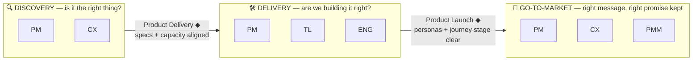

# Product Development Roles — A Quick Track Map

> A one-glance map of who owns what on a product team, and which track(s) — Discovery,
> Delivery, Go-to-Market — each role sits in. Built from an Excalidraw sketch of 5
> overlapping roles; evolved into 3 named tracks so each person can place themselves fast.

- **Topic:** Product Management
- **Date:** 2026-07-09
- **Status:** draft

> *The words written here are all AI-generated, but all the content was critically reviewed
> and validated by me — the use of AI is to accelerate the knowledge searching and narrative
> building.*

## Context

The starting point is a 5-circle Venn (ENG, TL, PM, PMM, CX) each labeled with its core
question, with arrows calling out the artifact that keeps each *pair* aligned, and two
markers — **Product Delivery** and **Product Launch** — sitting where three circles meet.
It's accurate but takes a beat to parse. The goal here is the opposite: a **quick
reference** — no long role descriptions — where a person can look at it and immediately
say *"I'm on this/these track(s), and here's who I sync with at the edges."*

## Notes

### The original 5 roles, as-is

| Role | Core question |
| --- | --- |
| **ENG** — Engineering | How do we build the thing *right*? |
| **TL** — Tech Lead | How do we structure the team to deliver it? |
| **PM** — Product Manager | What is the *right* thing to build? |
| **CX** — Design / Customer Experience | Are we delivering on the promise we made? |
| **PMM** — Product Marketing | How do we communicate / sell it the *right* way? |

PM sits in the middle overlapping all four — the connective role. The two named
convergence points are where three circles meet at once: **Product Delivery** (ENG ∩ TL ∩
PM) and **Product Launch** (PM ∩ CX ∩ PMM).

### The evolution: name the tracks, not just the overlaps

Those two convergence points are already, implicitly, **track boundaries**. Making the
tracks explicit — instead of leaving them as emergent Venn overlaps — is what turns this
into a fast self-ID tool. This also matches how the field already names this split:
**dual-track agile** splits Discovery from Delivery ([Cagan/SVPG](https://www.svpg.com/dual-track-agile/)),
and a third, **go-to-market** track is a well-attested extension for teams that treat
launch as its own parallel stream (e.g. Caroli's *Triple-Track Development* below).

*(PM1/PM2/PM3 and CX1/CX2 are the same person in each case — split only so the diagram
reads left-to-right; PM spans all three tracks, CX spans Discovery and Go-to-Market.)*

### Quick self-ID table

| Role | Track(s) | Sync with, at the boundary |
| --- | --- | --- |
| **PM** | Discovery + Delivery + Go-to-Market | Everyone — the one role present in all three |
| **CX / Design** | Discovery + Go-to-Market | PM on *which pains are correct to work on*; PMM on *which journey stage the message hits* |
| **TL** | Delivery (+ feasibility input to Discovery) | ENG on *capacity allocation*; PM on *roadmap expectations, documented* |
| **ENG** | Delivery | TL on *capacity*; PM on *clear, structured specs* |
| **PMM** | Go-to-Market | PM on *personas + functional description*; CX on *journey-stage clarity* |

The **six boundary artifacts** from the original arrows still hold — they're just now
grouped by which track transition they guard, rather than floating between circles:

- **Into Delivery:** capacity allocation aligned (TL↔ENG) · specs well-structured and clear
  (ENG↔PM) · roadmap expectations aligned and documented (TL↔PM)
- **Into Go-to-Market:** personas and functional description well-defined (PM↔PMM) ·
  correct pains selected (PM↔CX) · journey stage impacted by the message is clear (CX↔PMM)

## Takeaways

- **PM is the only role native to all three tracks** — that's *why* the original Venn puts
  PM in the center overlapping everyone else.
- **CX bridges Discovery and Go-to-Market**, not Delivery — its job is "are we solving the
  right pain" up front and "does the message match the promise" at the back end.
- **TL and ENG live in Delivery**; TL's extra job is shaping the team *before* Delivery
  starts, which is why it also touches capacity/roadmap conversations with Discovery.
- Treat the **two (now three) named handoff points** — not the role boxes — as the thing to
  actually manage: that's where alignment breaks in practice, not inside any single role.
- This map is deliberately shallow. If a role's *day-to-day* responsibilities need
  spelling out, that's a separate, longer study — this one stays a one-page lookup.

## References

- **Dual-Track Agile — Marty Cagan / SVPG** ([svpg.com](https://www.svpg.com/dual-track-agile/))
  — the original Discovery/Delivery split: discovery decides *what*, delivery builds it,
  and they run continuously in parallel, not as sequential phases.
  *Inspires:* the Discovery/Delivery boundary and its "Product Delivery" handoff.

- **Continuous Discovery Habits — Teresa Torres** ([producttalk.org](https://www.producttalk.org/))
  — names the **product trio** (PM, Design, Engineering) as the unit that runs discovery
  together, weekly, with real customers.
  *Inspires:* CX's seat in the Discovery track alongside PM, and TL/ENG's feasibility voice.

- **Triple-Track Development — Paulo Caroli** ([age-of-product.com summary](https://age-of-product.com/food-for-agile-thought-420-triple-track-development-outcome-roadmaps-building-trust-productops-guide/))
  — extends dual-track with a third parallel track; the source pairs Discovery/Delivery
  with **Business Strategy**, not Go-to-Market.
  *Inspires:* the *shape* of a third track running in parallel — adapted here to
  **Go-to-Market**, since that's what the PM∩CX∩PMM "Product Launch" convergence in the
  original image actually represents for this team.

- **Team Topologies — Skelton & Pais** ([teamtopologies.com](https://teamtopologies.com/))
  — stream-aligned teams own delivery end-to-end; team shape and cognitive load are a
  first-class design problem, not an afterthought.
  *Inspires:* TL's role as "how do we structure the team to deliver" inside Delivery.

- **Product Manager vs. Product Marketing Manager — ProductPlan** ([productplan.com](https://www.productplan.com/learn/product-manager-vs-product-marketing-manager))
  — PM owns what gets built; PMM owns go-to-market — positioning, messaging, launch
  leadership — with PM staying accountable for readiness.
  *Inspires:* PMM's scope inside Go-to-Market and the PM↔PMM handoff artifact (personas +
  functional description).

- **Obviously Awesome — April Dunford** ([aprildunford.com](https://www.aprildunford.com/))
  — positioning is the definition of go-to-market: who it's for, the category, the
  meaningful difference vs. the obvious alternative.
  *Inspires:* what "communicate/sell it the right way" concretely means for PMM.
